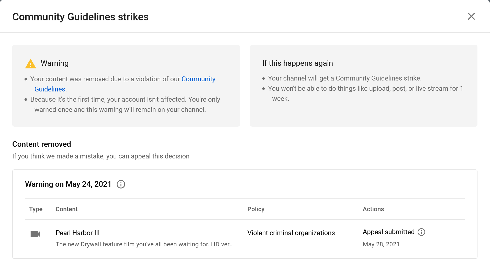

# Pearl Harbor III's YouTube Community Guidelines Strike

On May 24, 2021, the old Drywall film *Pearl Harbor III* received a Community Guidelines strike, citing its "[Violent criminal organizations](https://support.google.com/youtube/answer/9229472?hl=en)" policy. 

On May 28th, 2021, I submitted the following appeal:

> No act of violence is depicted in this work *aside from* a brief clip of one of the tower strikes from the 9/11 attack. This film is abstract and frankly I don't know if I would create it again, today, but it *does not glorify violence* or anything in particular, for that matter: it should be interpreted as *a critique of the United States' glorification of violence*, in fact.
>
> I support this policy and don't think this content *needs* to be on YouTube, but I also do not believe the policy was violated. 
>
> Thank you for your consideration and your time.