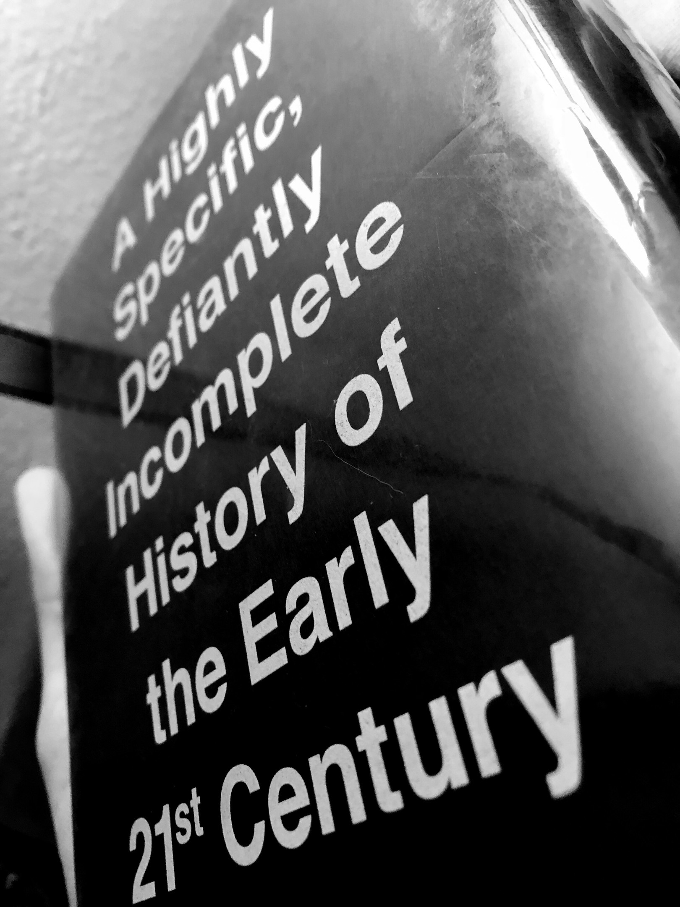

# Chuck Klosterman Is in Control

`legacy`

*  “Your life is a boat, the sails are your emotions, and drugs are the wind.” - James Murphy as interviewed by Chuck Klosterman

*  “Real people inevitably behave more erratically than fictional constructions.” - Chuck Klosterman, _The Invisible Man_

*  What I’m trying to determine here: how relevant should Chuck Klosterman be to readers in their 20s?

*  Klosterman’s confidence in the face of _X_’s subjects are reassuring to a host of terrified non-fiction writers.
*  I’m just glad his “or whatever” habit doesn’t carry over into his writing, but he did even bring it on [morning television](https://youtu.be/NMzPX-MERbU)…
*  “[_NYT Mag_](https://www.adweek.com/digital/ny-times-mag-drops-chuck-klosterman/)[ Drops Chuck Klosterman](https://www.adweek.com/digital/ny-times-mag-drops-chuck-klosterman/)” - _AdWeek_
*  “[No One Agrees with Chuck Klosterman's Ethicist Answers](https://www.theatlantic.com/entertainment/archive/2012/07/no-one-agrees-chuck-klostermans-ethicist-answers/325730/)” - _The Atlantic_

*  “[I Am the Author of the Open Letter to Chuck Klosterman Regarding the R-word](https://www.huffingtonpost.com/kari-wagnerpeck/i-am-the-author-of-the-op_b_4319577.html)” - _HuffPost_
*  “[An Open Letter to Chuck Klosterman, The New York Times, Ethicist](https://atypicalson.com/2013/11/07/an-open-letter-to-chuck-klosterman-the-new-york-times-ethicist/)” - _a typical son_
*  “[Chuck Klosterman Is Effectively Narcissistic, And You Should Read His Essays](https://www.pastemagazine.com/articles/2017/05/x-chuck-klosterman.html)” - _Paste Magazine_
*  “[Sportswriter and rock n roll philosopher treading two sides of opposite worlds](https://www.washingtonpost.com/opinions/sportswriter-and-rock-n-roll-philosopher-treading-two-sides-of-opposite-worlds/2017/06/30/3aba0fb8-23a5-11e7-bb9d-8cd6118e1409_story.html)” - _The Washington Post_

*  “[Why Grantland mattered to journalism](https://www.washingtonpost.com/news/the-fix/wp/2015/10/30/why-grantland-mattered-to-journalism/)” - _The Washington Post_
*  “[Looking back at Chuck Klosterman’s](https://theoutline.com/post/4959/chuck-klosterman-sex-drugs-and-cocoa-puffs-15th-anniversary-interview)[‘Sex,](https://theoutline.com/post/4959/chuck-klosterman-sex-drugs-and-cocoa-puffs-15th-anniversary-interview)[ Drugs, and Cocoa Puffs](https://theoutline.com/post/4959/chuck-klosterman-sex-drugs-and-cocoa-puffs-15th-anniversary-interview)’” - _The Outline_
*  “[Q&A: Chuck Klosterman on Taylor Swift, Harry Potter, and LCD Soundsystem](http://www.mtv.com/news/3021102/interview-chuck-klosterman-taylor-swift-lcd-soundsystem/)” - _MTV_
* [_WTFPodcast _](https://youtu.be/qHfg1mnZN3Y)[with Marc Maron #276](https://youtu.be/qHfg1mnZN3Y)
*  “[Chuck Klosterman: An Awesomely Long Interview](http://thenervousbreakdown.com/tdushane/2011/11/chuck-klosterman-an-awesomely-long-interview/)” - _The Nervous Breakdown_
*  “[The Good, the True, the Beautiful and Chuck Klosterman](https://www.nytimes.com/2016/07/03/books/review/chuck-klosterman-but-what-if-were-wrong.html)” - _The New York Times_

* “[Looking back at Chuck Klosterman’s](https://theoutline.com/post/4959/chuck-klosterman-sex-drugs-and-cocoa-puffs-15th-anniversary-interview?zd=1&zi=5jtfwhg2)[‘Sex,](https://theoutline.com/post/4959/chuck-klosterman-sex-drugs-and-cocoa-puffs-15th-anniversary-interview?zd=1&zi=5jtfwhg2)[ Drugs, and Cocoa Puffs’](https://theoutline.com/post/4959/chuck-klosterman-sex-drugs-and-cocoa-puffs-15th-anniversary-interview)” - _The Outline_

*  “[Death by Harry Potter](https://www.esquire.com/entertainment/a3556/klosterman1107/)” - _Esquire_
*  “[A Night With the World’s Most Hated Bands](http://grantland.com/features/taking-concert-doubleheader-creed-nickelback-world-most-hated-bands/)” - _Grantland_
*  The only reason I’m able to ask you these questions is because I’m a reporter and I can ask you questions now that I probably wouldn’t feel comfortable asking you if we were friends, so I’m not going to pretend that we are and I’m not going to create some fake thing where we’re going to have a relationship beyond this conversation. I’m just going to ask you the things I want to know about and I hope that you respect the fact that I’m just being straight with you.” I find that that works much better.
*  It seems strange to me to be into music for its coolness outside of high school. That seems like that’s the only time when you’re a young person and you’re using art basically to create a personality because you don’t have a real personality yet.

*  This is the cultural conditions in which I was raised under and which I pursued journalism under. That was part of the thing that drew me to the idea of being a reporter was I was like, this is something I can do, I think. My ability to detach my personal emotions from what I am investigating, while not perfect, I can do this. And now it turns out that the opposite is what’s desirable. I think it’s really going to change the kind of person who goes into media going forward.

*  Part of the reason I became a writer is because it was this completely controlled reality where I could do this thing by myself where you’d go out and you’d do the interviews and stuff, but then you’re back by yourself, transcribing and then writing. Then, when the story is done and you send it off, that’s the end. Now that’s the middle. Now it’s like, when the story is published, it’s the middle of the process very often because the consumer feels differently now.
*  Media is not a one-way relationship. It’s this two-way relationship where many people feel the reason they’re consuming media is to respond to it, that it’s not for the content. It’s so that they can use that content to have their response, their reader response. It’s not something to even criticize. It’s just how it is now. That is the expectation.

*  There are certain kinds of things that - because the audience is small - _do _have greater longevity because the type of individual drawn toward that kind of thinking or that kind of work is small enough that they can collect and collate all of it.

*  This is another thing that has changed in my lifetime. Just the anger people have toward what they perceive to be attempts at objectivity. They just hate it, and what they just want are people who are going to completely support their preexisting bias as news.
*  Klosterman is the _only_ figure I know who uses “back in my day…” as a reasonable and worthwhile perspective.

*  ”[The Jonathan Franzen Award for Jaw-Dropping Literary Genius Goes to... Jonathan Franzen](https://www.gq.com/story/jonathan-franzen-profile-chuck-klosterman-freedom)” - _GQ_

**Social**

“More than any other writer of his demographic, Chuck Klosterman has a close, wary relationship with the everchanging contextual boundaries of public expression.”

---

Thanks to [an episode of Peter Kafka's ](https://www.recode.net/2017/8/22/16184520/transcript-writer-chuck-klosterman-music-sports-recode-media)[_Recode Media_](https://www.recode.net/2017/8/22/16184520/transcript-writer-chuck-klosterman-music-sports-recode-media), I've just now discovered that former _New York Times Magazine_ Ethicist, author of _Sex, Drugs, and Cocoa Puffs_, and longtime men's interest media-affiliated sports and music columnist Chuck Klosterman pronounces his surname _kloa-ster-men_ instead of _klaw-ster-men _as I have been, shamefully – even in the presence of others on a handful of occasions. I am willing to submit myself for punishment for these transgressions under the single condition that I be allowed to call him _Cuck Klusterfuck_ the next time he ends a spoken sentence with "or whatever" in an interview - a terrible habit he's maintained for years. If my own byline had any pedigree in the world of literary criticism, I would now collect his penance simply by including those hateful, 90s stoner-kid buzzwords in every quote, unedited, but it most certainly does not. I've searched moderately hard for any reason to bother with any criticism of books or their authors and returned with very little. I've read _The Broom of the System_ and _White Girls _this year, yes, but I'd have to be a [Fuck Boy](http://www.revelist.com/books/books-fuckboys-read/3289) to write anything about David Foster Wallace, and [Hilton Als’ elegant, genre-busting masterpiece](https://www.interviewmagazine.com/culture/hilton-als-white-girls) is so far beyond both my societal rights and perceptive ability that I wouldn't dare utter a single editorialized peep about it - aside from a log line-length recommendation - even under immediate threat of certain death.

Given my recent voluntary relocation to Portland, Oregon and the word-y pursuits on which I choose to spend all of my money and energy, I should adore everything about Chuck Klosterman and in turn he should be completely invisible across the under-30 demographic, yet I’ve found a special originality in his voice since first exploring it and I think it might be worth requalification. A good friend of mine once dug his [first novel ](https://www.nytimes.com/2009/01/04/books/review/Meehan-t.html)[_Downtown Owl_](https://www.nytimes.com/2009/01/04/books/review/Meehan-t.html) out of a bulk box of bargain books she’d bought as a preteen, long ago and became an enthusiastic fan of his perspective and a harsh, but fond critic of his persona. It was her copy of his second that I read first: [_The Visible Man_](https://www.npr.org/2011/10/04/141015210/visible-man-asks-what-if-no-one-were-watching) – ultimately a surprisingly-original take on the _psychologist of a gifted outcast _tale that classically exemplifies the easy-to-digest yet thoughtfully-exploratory reputation of his craft. Thanks to her library card, I was able to follow it up immediately with Chuck’s latest, most topical work – an anthology of past essays written for publications like _The Guardian_, _Grantland_, and _GQ_ entitled _X: A Highly Specific, Defiantly Incomplete History of the Early 21st Century_, which proved an impossibly entertaining, even more polished execution of The Quaint Chuck’s Explanations in non-fiction form, beginning at onset with refreshing brevity in its [introduction](http://bit.ly/ckintro).

“I’m not fully accredited by either side of the professional equation (sportswriters think I’m too pretentious and music writers don’t think I’m pretentious enough,) but I’m able to write about whatever I want, as long as it actually happened.”

Using “pretentious” even when just vaguely and loosely expressing other readers’ thoughts about your work is the first of many miniscule technical infractions against convention laid down in _X_’s arrangement which proves to act toward the benefit of its experience. If you substitute _car nerds_ for _sportswriters_, I’d personally identify with this picoautobiography in a big way, but more importantly as a _reader_ I had never encountered anything written about sports which I would describe as _pretentious_, per se, and that realization could very well have birthed enough curiosity to land the sale, had I been skimming in a bookshop, which I would’ve eventually been pleased with.

Now, during what we should hope to be the first dawn of a new microera of sincerity, we must recognize how valuable it is for Klosterman as an observer to be comfortably engaged with his subjects, emotionally, and confident in the value of his commentary in middle-age without the need to insist upon his eccentricity, as so many cringey, culturally-daft Dads do, these days. He uses keywords in his writing and spoken publicity that _should_ dismiss him immediately as one of these – a nostalgic, out-of-time dork – but are instead somehow magically manipulated to _serve _him in articulating reasonable, even profoundly-innovative insight. As I have explored his bibliography and his publicly-expressed thoughts, I have been caught up and hinged on a single supposition: **Chuck Klosterman is the only white, 46-year-old bearded Portland Dad you should be reading**. Do mind that I am in no way exempt from this lens, but it’s still my job to determine his viability as an intellectual – a “thought-leader,” even – for those of us who were conceived around the same time he was wrapping up his collegiate sentence at the University of North Dakota.

For a solid hunk of the American reading audience, a quick, elemental vector of quality and mastery we look for in an essayist is the ability to “transcend” their subject matter for even the most presumptuous and conceited among us, usually to deliver a more abstract sentiment to leave with. Here, Klosterman’s significant career experience is irrefutably evident – in _X_, he achieves this transcendence organically to a degree I’ve never before witnessed. We can already check a single box: convincing even a young professional twenty-something to shell out for a physical hardback of contemporary non-fiction requiring any sort of academic effort to consume is going to be nigh-impossible, even though _X_ happens to be the best-looking specimen of print product design I have ever handled across cover, type, and layout. It’s been difficult having to convince myself to give this copy back.

In the interest of full disclosure, I must take special care to emphasize [just how highly](http://www.extratone.com/?s=recode%20media) I regard Peter Kafka as editor and interviewer extraordinaire within the Media beat – well-proven to be capable of hitting consistently hard on both [novel](https://www.recode.net/2017/8/10/16115548/patreon-jack-conte-fan-pledges-subscription-paywall-recode-media-peter-kafka-podcast) and [old guard](https://www.recode.net/2018/2/1/16957324/wired-paywall-nick-thompson-magazine-advertising-subscription-peter-kafka-recode-media-podcast) industry personalities with refined, [seemingly unimpeachable](https://www.recode.net/2018/5/22/17380908/youtube-music-launch-10-lyor-cohen-interview-peter-kafka-recode-media-kanye-west-childish-gambino) stone-faced skepticism. However, this Chuck Klosterman interview for _Recode Media_ is an uncharacteristically disarmed display of serious admiration: he introduces _X_ with an outright confession: "It’s great. I bought it. I bought a signed copy," which is an unexpected oddity (though not an unwelcome one – I’m glad Peter enjoys his life.) Their conversation dips briefly in personal history (Chuck and his wife moved to Portland from Brooklyn for its proximity to family) before plopping down upon the substance of his clearly superb and matter-of-fact interview technique.

The only reason I’m able to ask you these questions is because I’m a reporter and I can ask you questions now that I probably wouldn’t feel comfortable asking you if we were friends, so I’m not going to pretend that we are and I’m not going to create some fake thing where we’re going to have a relationship beyond this conversation. I’m just going to ask you the things I want to know about and I hope that you respect the fact that I’m just being straight with you.” I find that that works much better.

From the broadest possible pop cultural lens, Chuck's most spectacular and widely-circulated work, demographically (I assume) is his [2015 interview and cover story](https://www.gq.com/story/taylor-swift-gq-cover-story) for _GQ_ with Taylor Swift, then "the most popular human alive." Yes, it really _is_ worth dwelling on the image: _this guy_... this very Dorky Dad, just hanging out with the most highly-demanded teen idol who's ever lived, sitting awkwardly next to her in the backseat of her car as she excitedly accepts a call from Justin Timberlake. When one Chucks such a distinguished contrast upon such a high-profile contemporary medium, the weight of the potential scrutiny becomes palpable, but Klosterman anticipates and braces for this (very risky) business in the only manner he can: acknowledging it over and over and _over_ again in the second paragraph of his every interview appearance.

* It doesn’t matter if it was complimentary or insulting necessarily. It would seem as though I wasn’t taking her seriously as a musical artist, and the idea is that I do. That’s why I’m writing about her is because I do think she’s a meaningful, significant artist. It’s not worth the risk of having the story then get shifted by other people who perhaps just perceive themselves as somebody who’s a watchdog for certain signifiers or certain elements of the culture and that their job is to be on the watch for this. If your story then gets moved into that silo, that’s all it’s going to be remembered for... It’s a touchier thing now. It’s a more dangerous thing.

In the [print itself](http://bit.ly/ckswiftpreface), the cover story is prefaced by a very short but uncomfortably-telling complaint about changing expectations for culture writers. One might reasonably suggest that Klosterman regards the practice of calling out or remarking on “creepy misogyny” as “dumb” – nothing but the byproduct of changing “times.”

* Something you may notice in the following 2015 feature on Taylor Swift is that I never describe what she looks like or how she was dressed, even though I almost always do that with any celebrity I cover... If I did, it would be reframed as creepy misogyny and proof that I didn't take the woman seriously as an artist. It would derail everything else about the story. It would _become_ the story.

But… _is it_? Note how desperately close his language comes to the _common white guy whining about feminism_ classification without _actually _fitting the bill. Right…? It _doesn’t_? Surely, it must be certified Awake through some combination of keywords or format I’m unfamiliar with or unable to visually register because Klosterman’s ass would have long been grass, otherwise. These 224 words are _X_’s most contentious, which you could call impressive, all things considered – he appears to care enough about his public image to curate it somewhat diligently. When a motherhood blogger published [an open letter](https://atypicalson.com/2013/11/07/an-open-letter-to-chuck-klosterman-the-new-york-times-ethicist/) in 2013 citing three very ableist uses of the R-word in his work, it only took him two days to [respond](https://www.huffingtonpost.com/kari-wagnerpeck/i-am-the-author-of-the-op_b_4319577.html): “I was wrong. You are right.”

More than any other writer of his demographic, **Chuck Klosterman has a close, wary relationship with the everchanging contextual boundaries of public expression**. He knows when to be transparent with his feelings on progression, and he's careful to avoid what could be "problematic" for the sake of functioning better as a writer (I assume.) For _Slate_'s _I Have to Ask _podcast, he managed to [speak extensively](https://slate.com/news-and-politics/2018/02/chuck-klosterman-on-how-the-approach-to-cultural-criticism-has-completely-flipped.html) about these mechanisms for nearly an hour without bellowing anything definitively cringey.

I can’t say it’s better or worse. It’s just different, and because it’s different, it makes me feel uncomfortable, but there’s actually like an adversarial relationship with the history of anything, and that somehow that history is seen as oppressive. And you shouldn’t even know about it. It’s better to live in now.

A quick jaunt from pretty horrendous to almost-ideal, then. If we are to place our faith in Chuck as our last bearded champion, we must hope that last sentence is sincerely intended to be his lens to the changing world. Granted – even if it _is_ the truth – it’s not as if persistent acknowledgement of one’s position can miraculously wash away any systematic patriarchal dynamics involved in authoring (or reading, for that matter) a high-profile feature of a young woman on cover of a magazine which explicitly seeks most to speak to "[all](http://www.condenast.com/brands/gq/)[ sides of the male equation](http://www.condenast.com/brands/gq/)," (are you _sure about__that_, Condé Nast?) especially considering how unlikely it would've been for me to read anything about Taylor Swift outside of this very white man's anthology. Fundamental themes of power and control are threaded throughout both his fiction and non-fiction, which is especially prevalent in the Macho Big Boy cultures of the athletics and music industries. In profiling Taylor Swift – the undisputed apex of the latter in 2015 – Klosterman provided a firsthand account of the grueling maintenance of a public and private personality under tremendous strain from said factors as they were magnified to the max by the most extreme celebrity.

* Here we see Swift’s circuitous dilemma: Any attempt to appear less calculating scans as even more calculated. Because Swift’s professional career has unspooled with such precision, it’s assumed that her social life is no less premeditated.

I’m right there with Chuck: I’ve even found a fundamental pillar in Power and Control relationships supporting my own fiction experiments: **how we attain them**, **how we lose them**, and **how best to make use of them** – all of which had apparently been quite problematic for Taylor Swift for most of her adult life, though we wouldn’t be allowed to _really_ comprehend how deep her inner turmoil had drilled until it overwhelmed even her expertly-designed self-control four years later, [boiling over entirely](https://youtu.be/3tmd-ClpJxA) with such unexpected violence that all of America’s pseudorural glam-pop-country-glossy-chode-hipsters let out a simultaneous, dangerously-alarmed holler of _OH FOR PETE’S SAKE_ that was actually heard and recorded from the overflying orbit of the International Space Station.

* It’s somehow different when the hub of the wheel is Swift. People get skeptical. Her famous friends are marginalized as acquisitions, selected to occupy specific roles, almost like members of the Justice League (“the ectomorph model,” “the inventive indie artist,” “the informed third-wave feminist,” etc.). Such perceptions perplex Swift, who is genuinely obsessed with these attachments.

No, it’s not _only _worthwhile as an exercise in superbly athletic self-awareness – the Taylor profile is profound. I’d recommend reading and treasuring it with or without the rest of the anthology because bizarre intersections like these are rare to come by from anybody else.  

Short, sharp, and occasionally somewhat petty notions are what Chuck Klosterman does best and most originally. Thanks to a digression of Kafka’s beginning with “you and I are about the same age…,” he arrives (by way of REM, believe it or not) at a significant statement about youth and identity.

“It seems strange to me to be into music for its coolness outside of high school. That seems like that’s the only time when you’re a young person and you’re using art basically to create a personality because you don’t have a real personality yet.”

Klosterman is debatably exempt from the traditional academic abstract of “objectivity” for the vast majority of his notable work in its stated primary subject: his “interior life,” which perhaps developed an existential muscle – a unique perspective – from which he’s been able to reflect particularly clearly on the profession in tandem with the experience he’s accumulated over the course of his career.

“You know, when you’re young, you’re a real emotional writer if you’re a writer… If I was a young person now, I would be incredibly attracted to the idea that when you’re 22 you can be a national writer, which was impossible when I was 22.”

In a way, Klosterman surmises that it _is_ indeed its objectivity that media has lost, and that writing is no longer a “one-way relationship.”

* It’s this two-way relationship where many people feel the reason they’re consuming media is to respond to it, that it’s not for the content. It’s so that they can use that content to have their response, their reader response. It’s not something to even criticize. It’s just how it is now. That is the expectation.

My favorite chapter in _X_ is a 2500-word personal essay (which you can read publicly [on ](http://grantland.com/features/space-time-dvr-mechanics/)[_Grantland_](http://grantland.com/features/space-time-dvr-mechanics/)) constructed to answer a single incongruity: “Why is watching a prerecorded sporting event less pleasurable than watching the same game live?” Some form of this question has at least mildly troubled every American since the 1960s, including myself, and Klosterman manages to provide an entertaining and concise analysis of this plight through his own wisdom. Its preface in the volume was written “in 2008, in Europe, when [Chuck] was pretend depressed.”

---

Last weekend I was in a hashish bar in Amsterdam. It was post-dusk, pre-night. The music was terrible (fake reggae, late-period Eric Clapton, Sublime deep cuts.) I was sitting next to a British stranger with a shaved head and a speech impediment. Our conversation required subtitles, so I imagined them in my mind. He told me he had lost three family members within the past year: his mother, who was sixty-six; his uncle, who was fifty-six; and his sister, who was forty-six. He said he’d just turned thirty-six. He asked if I saw a pattern developing. “Yes,” I said. “But only numerically.”

I asked what he did for a living. He said he was a housepainter. He asked me the same question about myself. “I manufacture opinions,” I said.

“Really?” he asked. “How do you know if you’re any good at that?”

“By the number of people who agree or disagree,” I said in response. “If a large number of strangers seem to think one of my opinions is especially true or wildly wrong, there is somehow a perception that I am succeeding at this vocation.”

“That’s interesting,” said the bald British man who could barely speak. “I guess house painting is a totally different thing.”

---

You’ll notice that his entire answer to the live television debacle is – again – entirely about control (or the lack thereof.) In fact, a desire for control also contributed to his choice of profession.

* Part of the reason I became a writer is because it was this completely controlled reality where I could do this thing by myself where you’d go out and you’d do the interviews and stuff, but then you’re back by yourself, transcribing and then writing. Then, when the story is done and you send it off, that’s the end. Now that’s the middle. Now it’s like, when the story is published, it’s the middle of the process very often because the consumer feels differently now.

Rarely are situations or discussions that begin with _back in my day _actually constructive in any sense, but Chuck Klosterman appears to be the exception. If you’re willing to indulge him, you may find yourself reassured. He now writes from a remote cabin (with WiFi,) was tortured – like all of us – in sifting through and compiling his old work for _X_, and finds its index to be his favorite part.

“Exploring the index from a book you created is like having someone split your head open with an axe so that you can peruse the contents of your brain.”

He is [willfully and completely ignorant of the ](https://www.esquire.com/entertainment/a3556/klosterman1107/)[_Harry Potter_](https://www.esquire.com/entertainment/a3556/klosterman1107/)[ franchise](https://www.esquire.com/entertainment/a3556/klosterman1107/), yet able to sincerely [witness and convey](http://grantland.com/features/taking-concert-doubleheader-creed-nickelback-world-most-hated-bands/) the nuances of back-to-back Creed and Nickelback concerts in a confident, fascinating technique of which any other music or culture writer would deprive you. He is “almost embarrassed” by his [emotional attachment](http://bit.ly/exrfastnet) to the Charlie Brown peanuts. ([+Chuck Klosterman on Charlie Brown](https://paper.dropbox.com/doc/7jHNnij3saNFwtHt9Nika))

”I haven't watched _A Charlie Brown  Christmas_ in at least twenty-five years, solely because I can't emotionally reconcile the final scene”

Perhaps indescribably so, he is a modern scholar of American identity, through-and-through, and is in this way more equipped to tackle the unnerving conundrum of our country’s culture as it stands than any other non-fiction author I’ve recently read. Rather than give in to fear or loathing, Klosterman depends on his practiced curiosity (or apathy, as he repeatedly claims) to expertly channel his experiences within his familiar ESPN-watching, rock-listening, and daydreaming sphere through both quaint and profound truths.

While Klosterman’s voice is pleasant to someone like me, neither it nor himself necessarily belong to The People  

In his [_X _](https://www.pastemagazine.com/articles/2017/05/x-chuck-klosterman.html)[review for ](https://www.pastemagazine.com/articles/2017/05/x-chuck-klosterman.html)[_Paste Magazine_](https://www.pastemagazine.com/articles/2017/05/x-chuck-klosterman.html), B. David Zarley proclaims essays to be “a love letter to a moment,” concluding that Chuck is “’effectively narcissistic,’ proving that culture essays can teach us something about ourselves _and_ the people around us.” [For ](https://www.washingtonpost.com/opinions/sportswriter-and-rock-n-roll-philosopher-treading-two-sides-of-opposite-worlds/2017/06/30/3aba0fb8-23a5-11e7-bb9d-8cd6118e1409_story.html)[_The Washington Post_](https://www.washingtonpost.com/opinions/sportswriter-and-rock-n-roll-philosopher-treading-two-sides-of-opposite-worlds/2017/06/30/3aba0fb8-23a5-11e7-bb9d-8cd6118e1409_story.html), Justin Wm. Moyer notes “it’s hard to think of another writer who could make a 30-page, deeply reported essay about a North Dakota junior-college basketball game interesting,” suggesting that this new collection marks Klosterman’s ascendance from critic to philosopher. From what I’ve read to date, I would counter that he has always fulfilled the term to the extent of its usefulness in the 21st century, and is even now beginning to redefine it. 

Last January, he braved the “dystopic” Google Gates to [speak critically for a crowd of Googlers](https://youtu.be/HhGA9e-OiFY), describing them as “an umbrella over the entire culture,” and urging caution and reflection in the coming future to keep them from doing “something bad.” His engagement with them – especially during [the Q&A](https://youtu.be/HhGA9e-OiFY?t=36m35s) – is a fascinating insight into the Greater Google Mind, and I would encourage any invested parties in Chuck Klosterman’s role as a philosopher to watch the talk in full.

I was unfamiliar with “the boat-sails-wind analogy” before I read [James Murphy’s interview](https://www.theguardian.com/music/2010/apr/24/lcd-soundsystem-this-is-happening) for LCD Soundsystem’s “last album.”

“Your life is a boat, the sails are your emotions, and drugs are the wind. When you're a kid, your boat is small and your sail is huge, and drugs are like a hurricane.”

**Control x Time = the Klosterman beat**. I suppose this must be what other entertainment writers are referring to when they [accuse Chuck of nostalgia trafficking](http://www.dallasobserver.com/arts/pop-culture-critic-chuck-klosterman-talks-about-his-new-essay-collection-x-9559383), but I can’t be so sure. Though I’d like to think my own snout for the stuff is especially well-tuned, I am undeniably from a different planet - even auditorally. All but one or two of the musicians interviewed throughout _X_ were entirely unknown to me by name, which Klosterman’s voice managed to make even more compelling – _not to mention_ the included stories of athletes and the sports industry, which include stories of the human ego, paranoia, and complex drama that always manage to transcend their setting when articulated with such dexterity.
