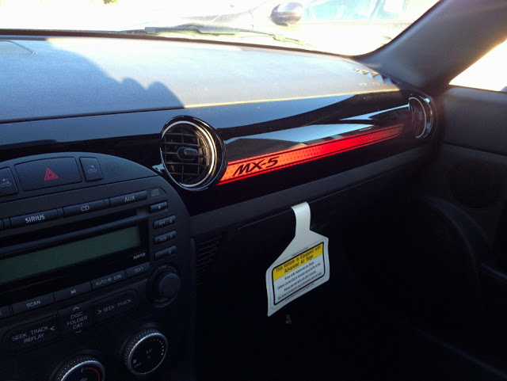
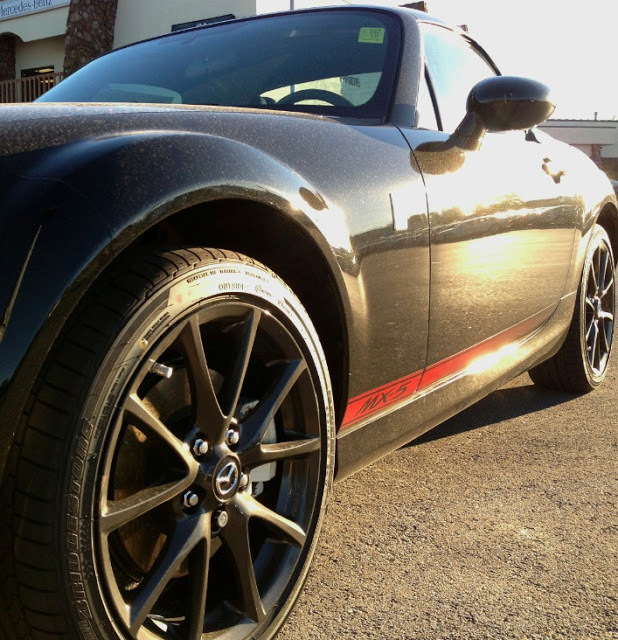
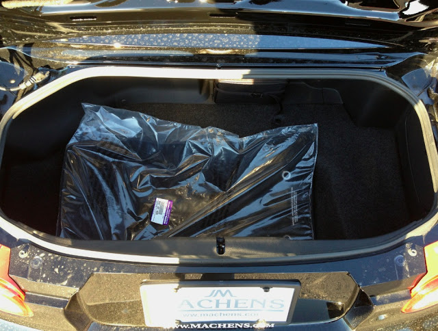
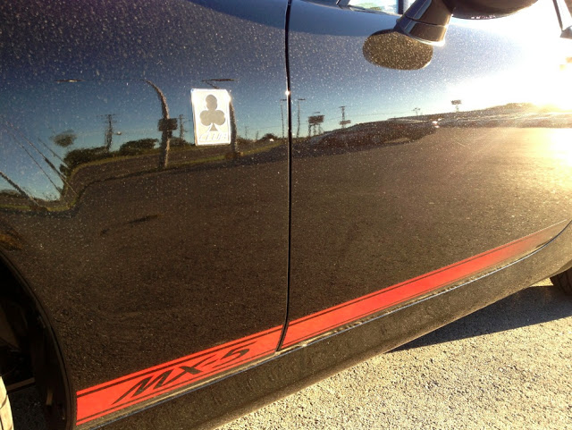
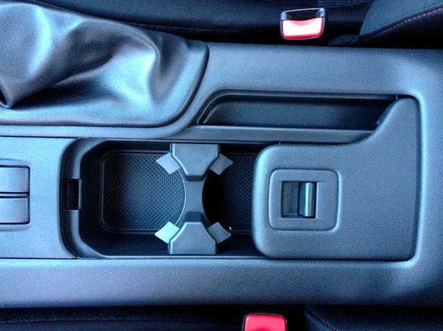
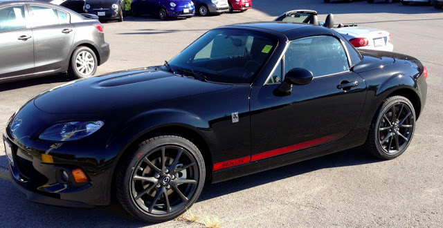
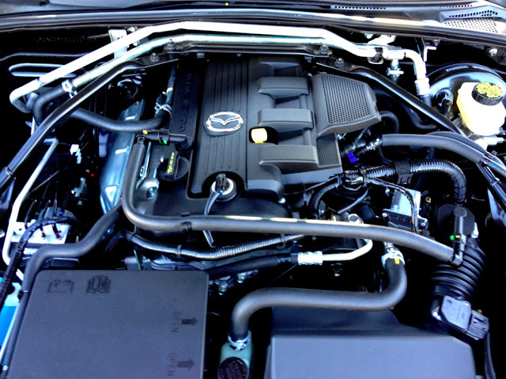

# Driven - 2013 Mazda MX5

`legacy`

* [Home](http://www.speedmonkey.co.uk/)
* [Road test index](http://www.speedmonkey.co.uk/p/road-tests_5.html)
* [News](http://www.speedmonkey.co.uk/search/label/New)
* [Motorcycles](http://www.speedmonkey.co.uk/search/label/Motorcycles)
* [Advice](http://www.speedmonkey.co.uk/search/label/Advice)
* [Blogs](http://www.speedmonkey.co.uk/search/label/Blogs)
* [About](http://www.speedmonkey.co.uk/p/about.html)
* [Site Stats](http://www.speedmonkey.co.uk/p/1-million-views.html)
* [SM YouTube](https://www.youtube.com/user/mattberkshire/videos)

## 11 Oct 2012

### Driven - 2013 Mazda MX5

I recently had the chance to drive the facelifted 2013 Mazda MX-5. This is the first time the looks of the perky roadster have changed since the front-mounted smile became an all-out grin of insanity in 2008. They have once again dulled it to what I would call a smirk. The new front end blends with the rest of car more than it has in the past. It seems to have grown a bit more serious. In fact, with black 17-inch alloys on a glossy black (creatively called "Brilliant Black,") this example is the most aggressive-looking of any Miata I have seen. 

That's not to say it's aggressive in the slightest, even in such a scheme. This car is in the “Club” trim replacing the previous “Touring” designation as the top-of-the-line option. This selection adds ridiculous three-leaf clover side badges, red stitching on the seats, red stripes on the dash and sides, along with a price tag very near 30,000 USD.

So I present you with my first problem with this particular car....it's a contradiction. The MX-5 was never intended to look serious. That grin was there to convey the primary attribute aspired to by its creators; joy. It's designed to be joyful in driving and the exterior of previous generations did a good job of communicating what the car is all about. Unfortunately, it seems they have decided that it's time for the roadster to grow up. Frankly, that's not going to work.

Now, to the drive.

For this year, the car has been lightened, the braking response quickened, as well as the throttle response in manual-equipped cars. Unfortunately, I was only able to drive the 6-speed automatic with optional pattle-shifters. Given that this is my first drive in an NC (third generation) MX-5, I can only compare it to my own NB.

Immediately, my passenger and chaperon, Perry Cunningham of Joe Machens Mitsubishi/Fiat starts the process of opening the optional retractable hard top. Open air is this car's natural environment, and it appears that somebody got busy making sure its occupants never notice. Wind buffeting has been drastically reduced. Perry and I were able to maintain conversation beyond 70mph without necessitating shouting thanks to a much taller wind brake behind our seats. Unfortunately, I couldn't really hear much of anything from the 158-hp 2.0L 4 up front, even with liberal amounts of right foot burying. It would seem the optional dual exhaust outlets are rather pointless then.

Getting in the car, I had expected the experience to be ruined by the 6-speed auto. Buying a Miata with an automatic is sort of like going on a scenic vacation without a camera. It doesn't necessarily ruin the immediate experience but you'll always have some regret regarding the subject in the future. The pattles add some of the fun back in, but I prefer the Golf GTI's arrangement of right side-shift up, left side-shift down, while the MX-5 has both functions on either side of the wheel. 

It took some deliberate self-coaching to get used to, but it won't effect your daily driving experience. Another plus; when in manual shift mode, it is truly manual, meaning the transmission will allow you to exceed the redline. It may sound trivial, but being nannied when you're first told that you're in control can be a major annoyance. (Looking at you, Kia Forte.) It's disappointing that Mazda chose only to up throttle response in manual-equipped cars. This one most certainly needed it.

The original Miata was built on a philosophy of communication between driver and machine, summarized in the Japanese phrase “Jinba Ittai,” meaning “rider and horse are one.” Being an MX-5 owner, this philosophy is very important to me, thus my expectations for the steering were very high. It was very disappointing, then, to discover that it has been very nearly ruined. 

The leather-wrapped steering wheel was comfortable, yes, but not very generous in revealing the road. In corners it felt jumpy, imprecise, and unsure of itself. The same lack of self-confidence was noticeable in a straight line as well, along with a nervous fidget. Keep in mind, I am comparing this to roadsters of the past, not to other automobiles currently on the market. It would take a global nuclear war to make the MX-5 less fun to drive than a Toyota Camry.

Though it has lost communication and soul, the Miata has gained a more comfortable suspension and oodles of storage space. The trunk is massive for a roadster of this size, and the example I drove was equipped with an optional storage compartment extending behind the seats, especially handy for CDs, candy, and the like. The center console contains two reasonably-sized cupholders obscured by a sliding door that will inevitably lead to annoyance in single-drink occasions. Mr. Cunningham also pointed out to me that the track on which the door slides appears vulnerable to crumbs. Only time will tell, I suppose.

In general, being inside the car is a much more comfortable experience, albeit a boring one. It seems to me that the MX-5 has “grown up,” forgoing fun for comfort and practicality. And is that not exactly the opposite of the direction it should be moving? It was never meant to be an aggressive-looking performance car, and it will never do well as one. It will never be luxurious enough to be a true touring car, either.

Its soul has made it the top-selling roadster of all time, and I'm afraid it's losing it, bit by bit. To be honest, if you're attracted by the values on which the original Miata was built, I would recommend a Subaru BRZ/Toyota GT 86/Scion FR-S. The recommendation does not come lightly or easily.

Until Mazda gets wise about what it's doing to the beloved little car, I'm afraid it's headed down a path that will mean losing a grip on the niche it's held for so long, and that's quite saddening.

A very hearty thanks to Mr. Perry Cunningham and Joe Machens Mitsubishi-Fiat.

Article by [David Blue](http://theautobully.tumblr.com/)

Labels:[David](http://www.speedmonkey.co.uk/search/label/David),[Road tests](http://www.speedmonkey.co.uk/search/label/Road%20tests)

[Newer Post](http://www.speedmonkey.co.uk/2012/10/winter-fun-ideal-cars-for-those-low.html)[Older Post](http://www.speedmonkey.co.uk/2012/10/honda-in-f1-will-they-return.html)[Home](http://www.speedmonkey.co.uk/)

|||
|

||

## Total Pageviews

3,797,405

## Recent Articles

* 
* 
* 
* 
* 
* 
* 
* 
* 
* 
* 
* 
* 
* 
*
[ Subscribe to this Feed

](http://feeds.feedburner.com/co/wnQtj)

## Translate

Powered by [Translate

](https://translate.google.com/)

## Subscribe

|||

## Labels

[Advice](http://www.speedmonkey.co.uk/search/label/Advice)(65)(65)[Alex](http://www.speedmonkey.co.uk/search/label/Alex)(4)(4)[Alfa Romeo](http://www.speedmonkey.co.uk/search/label/Alfa%20Romeo)(14)(14)[Alpine](http://www.speedmonkey.co.uk/search/label/Alpine)(2)(2)[Andrew](http://www.speedmonkey.co.uk/search/label/Andrew)(1)(1)[Angela](http://www.speedmonkey.co.uk/search/label/Angela)(15)(15)[Aston](http://www.speedmonkey.co.uk/search/label/Aston)(30)(30)[Audi](http://www.speedmonkey.co.uk/search/label/Audi)(107)(107)[Autosport](http://www.speedmonkey.co.uk/search/label/Autosport)(6)(6)[Ben](http://www.speedmonkey.co.uk/search/label/Ben)(3)(3)[Bentley](http://www.speedmonkey.co.uk/search/label/Bentley)(12)(12)[Best Blogs](http://www.speedmonkey.co.uk/search/label/Best%20Blogs)(110)(110)[Bill](http://www.speedmonkey.co.uk/search/label/Bill)(1)(1)[Blacktop](http://www.speedmonkey.co.uk/search/label/Blacktop)(3)(3)[blog](http://www.speedmonkey.co.uk/search/label/blog)(5)(5)[Blogs](http://www.speedmonkey.co.uk/search/label/Blogs)(563)(563)[BMW](http://www.speedmonkey.co.uk/search/label/BMW)(73)(73)[Book](http://www.speedmonkey.co.uk/search/label/Book)(3)(3)[Bradley](http://www.speedmonkey.co.uk/search/label/Bradley)(2)(2)[Cabriolets reviewed](http://www.speedmonkey.co.uk/search/label/Cabriolets%20reviewed)(1)(1)[Car Buyers](http://www.speedmonkey.co.uk/search/label/Car%20Buyers)(1)(1)[Car review](http://www.speedmonkey.co.uk/search/label/Car%20review)(203)(203)[CarFest](http://www.speedmonkey.co.uk/search/label/CarFest)(2)(2)[Castrol](http://www.speedmonkey.co.uk/search/label/Castrol)(1)(1)[Caterham](http://www.speedmonkey.co.uk/search/label/Caterham)(3)(3)[Chevrolet](http://www.speedmonkey.co.uk/search/label/Chevrolet)(9)(9)[Chris](http://www.speedmonkey.co.uk/search/label/Chris)(6)(6)[Citroen](http://www.speedmonkey.co.uk/search/label/Citroen)(16)(16)[Classic cars](http://www.speedmonkey.co.uk/search/label/Classic%20cars)(5)(5)[Colin](http://www.speedmonkey.co.uk/search/label/Colin)(41)(41)[Dacia](http://www.speedmonkey.co.uk/search/label/Dacia)(4)(4)[Dakar](http://www.speedmonkey.co.uk/search/label/Dakar)(7)(7)[David](http://www.speedmonkey.co.uk/search/label/David)(6)(6)[DriverVibe](http://www.speedmonkey.co.uk/search/label/DriverVibe)(4)(4)[Ducati](http://www.speedmonkey.co.uk/search/label/Ducati)(4)(4)[F1](http://www.speedmonkey.co.uk/search/label/F1)(152)(152)[Ferrari](http://www.speedmonkey.co.uk/search/label/Ferrari)(21)(21)[Fiat](http://www.speedmonkey.co.uk/search/label/Fiat)(4)(4)[Fleet](http://www.speedmonkey.co.uk/search/label/Fleet)(41)(41)[Ford](http://www.speedmonkey.co.uk/search/label/Ford)(31)(31)[ForzaAuto](http://www.speedmonkey.co.uk/search/label/ForzaAuto)(1)(1)[Geneva Motor Show](http://www.speedmonkey.co.uk/search/label/Geneva%20Motor%20Show)(16)(16)[Geoff](http://www.speedmonkey.co.uk/search/label/Geoff)(10)(10)[George](http://www.speedmonkey.co.uk/search/label/George)(2)(2)[Goodwood](http://www.speedmonkey.co.uk/search/label/Goodwood)(50)(50)[HeadBoltz](http://www.speedmonkey.co.uk/search/label/HeadBoltz)(46)(46)[Honda](http://www.speedmonkey.co.uk/search/label/Honda)(33)(33)[Hot hatch review](http://www.speedmonkey.co.uk/search/label/Hot%20hatch%20review)(18)(18)[Hybrid](http://www.speedmonkey.co.uk/search/label/Hybrid)(2)(2)[Infiniti](http://www.speedmonkey.co.uk/search/label/Infiniti)(3)(3)[IOMTT](http://www.speedmonkey.co.uk/search/label/IOMTT)(12)(12)[Jaguar](http://www.speedmonkey.co.uk/search/label/Jaguar)(128)(128)[James](http://www.speedmonkey.co.uk/search/label/James)(6)(6)[Jeep](http://www.speedmonkey.co.uk/search/label/Jeep)(3)(3)[joel](http://www.speedmonkey.co.uk/search/label/joel)(1)(1)[Joseph](http://www.speedmonkey.co.uk/search/label/Joseph)(1)(1)[Josh](http://www.speedmonkey.co.uk/search/label/Josh)(3)(3)[karting](http://www.speedmonkey.co.uk/search/label/karting)(1)(1)[Kia](http://www.speedmonkey.co.uk/search/label/Kia)(3)(3)[Kimi](http://www.speedmonkey.co.uk/search/label/Kimi)(6)(6)[Lamborghini](http://www.speedmonkey.co.uk/search/label/Lamborghini)(11)(11)[Landrover](http://www.speedmonkey.co.uk/search/label/Landrover)(55)(55)[Le Mans](http://www.speedmonkey.co.uk/search/label/Le%20Mans)(38)(38)[Leah](http://www.speedmonkey.co.uk/search/label/Leah)(3)(3)[Lexus](http://www.speedmonkey.co.uk/search/label/Lexus)(3)(3)[Living with](http://www.speedmonkey.co.uk/search/label/Living%20with)(44)(44)[LM2014](http://www.speedmonkey.co.uk/search/label/LM2014)(5)(5)[Lotus](http://www.speedmonkey.co.uk/search/label/Lotus)(27)(27)[Maserati](http://www.speedmonkey.co.uk/search/label/Maserati)(18)(18)[Max](http://www.speedmonkey.co.uk/search/label/Max)(12)(12)[Mazda](http://www.speedmonkey.co.uk/search/label/Mazda)(16)(16)[McLaren](http://www.speedmonkey.co.uk/search/label/McLaren)(23)(23)[Meme](http://www.speedmonkey.co.uk/search/label/Meme)(1)(1)[Mercedes](http://www.speedmonkey.co.uk/search/label/Mercedes)(105)(105)[MG](http://www.speedmonkey.co.uk/search/label/MG)(5)(5)[Mike](http://www.speedmonkey.co.uk/search/label/Mike)(22)(22)[MikeT](http://www.speedmonkey.co.uk/search/label/MikeT)(5)(5)[Mini](http://www.speedmonkey.co.uk/search/label/Mini)(5)(5)[Mistubishi](http://www.speedmonkey.co.uk/search/label/Mistubishi)(1)(1)[mitsubishi](http://www.speedmonkey.co.uk/search/label/mitsubishi)(9)(9)[Morgan](http://www.speedmonkey.co.uk/search/label/Morgan)(11)(11)[Motorcycles](http://www.speedmonkey.co.uk/search/label/Motorcycles)(128)(128)[New](http://www.speedmonkey.co.uk/search/label/New)(555)(555)[News](http://www.speedmonkey.co.uk/search/label/News)(97)(97)[Nissan](http://www.speedmonkey.co.uk/search/label/Nissan)(12)(12)[PEldred](http://www.speedmonkey.co.uk/search/label/PEldred)(3)(3)[Peugeot](http://www.speedmonkey.co.uk/search/label/Peugeot)(17)(17)[podcast](http://www.speedmonkey.co.uk/search/label/podcast)(1)(1)[Polestar](http://www.speedmonkey.co.uk/search/label/Polestar)(10)(10)[Porsche](http://www.speedmonkey.co.uk/search/label/Porsche)(161)(161)[POTD](http://www.speedmonkey.co.uk/search/label/POTD)(34)(34)[Racing](http://www.speedmonkey.co.uk/search/label/Racing)(79)(79)[Radical](http://www.speedmonkey.co.uk/search/label/Radical)(2)(2)[Renault](http://www.speedmonkey.co.uk/search/label/Renault)(33)(33)[Rico](http://www.speedmonkey.co.uk/search/label/Rico)(1)(1)[Road tests](http://www.speedmonkey.co.uk/search/label/Road%20tests)(230)(230)[Rolls Royce](http://www.speedmonkey.co.uk/search/label/Rolls%20Royce)(14)(14)[Royal Enfield](http://www.speedmonkey.co.uk/search/label/Royal%20Enfield)(5)(5)[RR Restoration](http://www.speedmonkey.co.uk/search/label/RR%20Restoration)(4)(4)[Saab](http://www.speedmonkey.co.uk/search/label/Saab)(1)(1)[Safety](http://www.speedmonkey.co.uk/search/label/Safety)(34)(34)[Sean](http://www.speedmonkey.co.uk/search/label/Sean)(12)(12)[Seat](http://www.speedmonkey.co.uk/search/label/Seat)(2)(2)[Sharon](http://www.speedmonkey.co.uk/search/label/Sharon)(28)(28)[Skoda](http://www.speedmonkey.co.uk/search/label/Skoda)(7)(7)[Sports cars reviewed](http://www.speedmonkey.co.uk/search/label/Sports%20cars%20reviewed)(38)(38)[Spotted](http://www.speedmonkey.co.uk/search/label/Spotted)(56)(56)[Spy shots](http://www.speedmonkey.co.uk/search/label/Spy%20shots)(16)(16)[Stuart](http://www.speedmonkey.co.uk/search/label/Stuart)(4)(4)[Subaru](http://www.speedmonkey.co.uk/search/label/Subaru)(25)(25)[Supercars](http://www.speedmonkey.co.uk/search/label/Supercars)(151)(151)[SUV](http://www.speedmonkey.co.uk/search/label/SUV)(24)(24)[Suzuki](http://www.speedmonkey.co.uk/search/label/Suzuki)(5)(5)[Tash](http://www.speedmonkey.co.uk/search/label/Tash)(4)(4)[Tax The Rich 100](http://www.speedmonkey.co.uk/search/label/Tax%20The%20Rich%20100)(1)(1)[Tesla](http://www.speedmonkey.co.uk/search/label/Tesla)(1)(1)[Tokyo Motor Show](http://www.speedmonkey.co.uk/search/label/Tokyo%20Motor%20Show)(6)(6)[Top](http://www.speedmonkey.co.uk/search/label/Top)(22)(22)[Top Gear](http://www.speedmonkey.co.uk/search/label/Top%20Gear)(1)(1)[Torque Affair](http://www.speedmonkey.co.uk/search/label/Torque%20Affair)(1)(1)[Toyota](http://www.speedmonkey.co.uk/search/label/Toyota)(22)(22)[Trident](http://www.speedmonkey.co.uk/search/label/Trident)(1)(1)[Triumph](http://www.speedmonkey.co.uk/search/label/Triumph)(18)(18)[Vauxhall](http://www.speedmonkey.co.uk/search/label/Vauxhall)(33)(33)[Video](http://www.speedmonkey.co.uk/search/label/Video)(251)(251)[Volvo](http://www.speedmonkey.co.uk/search/label/Volvo)(59)(59)[VW](http://www.speedmonkey.co.uk/search/label/VW)(55)(55)[WRC](http://www.speedmonkey.co.uk/search/label/WRC)(3)(3)[Yamaha](http://www.speedmonkey.co.uk/search/label/Yamaha)(3)(3)

All content is copywrite Matt Hubbard. Powered by [Blogger](https://www.blogger.com/).

This site uses cookies from Google to deliver its services, to personalize ads and to analyze traffic. Information about your use of this site is shared with Google. By using this site, you agree to its use of cookies.[Learn More](https://www.blogger.com/go/blogspot-cookies)[Got it](http://www.speedmonkey.co.uk/2012/10/driven-2013-mazda-mx5.html#)

ShareThis Copy and Paste
