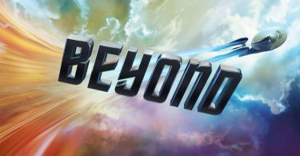
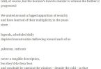
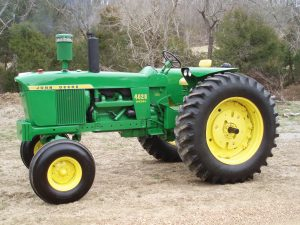
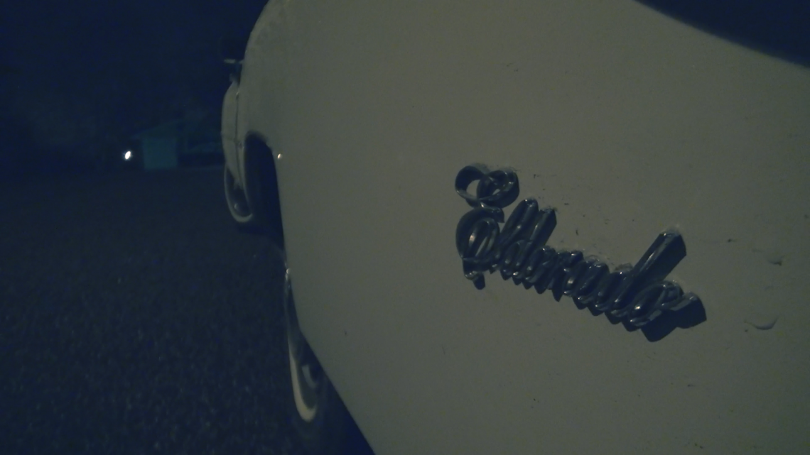
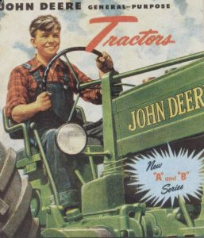
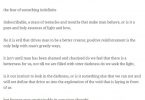

# Lessons in Luxury - Extratone

`legacy`

[__]()
[New](http://www.extratone.com/new/)    

[Spectacle](http://www.extratone.com/spectacle/)    

[Words](http://www.extratone.com/words/)    [News](http://www.extratone.com/words/news/)
    [Prose](http://www.extratone.com/words/prose/)
    [Titles](http://www.extratone.com/shop/)    [Info Wars II](http://www.extratone.com/words/infowars/)
        [The Third Brain](http://www.extratone.com/words/thirdbrain/)
        [Words of David Blue in Red](http://www.extratone.com/words/inred/)
        [Feebles in Night](http://www.extratone.com/feebles/)

[Visuals](http://www.extratone.com/visual/)    [Honk](http://www.extratone.com/visual/honk/)
    [Photography](http://www.extratone.com/visual/photo/)
    

[Audio](http://www.extratone.com/audio/)    [The New](http://www.extratone.com/audio/thenew/)
    [Drycast](http://www.extratone.com/audio/drycast/)
    [The Muncher](http://www.extratone.com/audio/muncher/)
    

[Meta](http://www.extratone.com/meta/)    [About](http://www.extratone.com/about/)
    [Staff](http://www.extratone.com/staff/)
    [Announcements](http://www.extratone.com/meta/announcements/)
    [Editor’s Letters](http://www.extratone.com/meta/freq/)
    [✒︎](http://www.extratone.com/account)    [Forums](http://www.extratone.com/members/admin/forums/)
        [Activity](http://www.extratone.com/members/admin/activity/)
        [Profile](http://www.extratone.com/members/admin/profile/)
        [Messages](http://www.extratone.com/members/admin/messages/)
        [Friends](http://www.extratone.com/members/admin/friends/)
        [Groups](http://www.extratone.com/members/admin/groups/)
        [Settings](http://www.extratone.com/members/admin/settings/)
        [Log Out]()
    
    [Donate](http://www.extratone.com/donate/)

[__]()

[♬](http://www.extratone.com/tag/music/)

[✒︎](http://www.extratone.com/words/inred/)

[☏](https://discord.gg/0b9KQUKP85952Ovk)

[Twitter](http://twitter.com/extratone)
[YouTube](http://youtube.com/Drywallmusic)
[Vine](https://vine.co/asphaltapostle)
[Instagram](http://instagram.com/AsphaltApostle)
[Facebook](http://facebook.com/extratonemedia)
[Tumblr](http://asphaltapostle.tumblr.com/)
[Snapchat](https://www.snapchat.com/add/mommilitia)

[__]()
Rediscovering Relevance

[New](http://www.extratone.com/new/)    

[Spectacle](http://www.extratone.com/spectacle/)    

[Words](http://www.extratone.com/words/)    [News](http://www.extratone.com/words/news/)
    [Prose](http://www.extratone.com/words/prose/)
    [Titles](http://www.extratone.com/shop/)    [Info Wars II](http://www.extratone.com/words/infowars/)
        [The Third Brain](http://www.extratone.com/words/thirdbrain/)
        [Words of David Blue in Red](http://www.extratone.com/words/inred/)
        [Feebles in Night](http://www.extratone.com/feebles/)

[Visuals](http://www.extratone.com/visual/)    [Honk](http://www.extratone.com/visual/honk/)
    [Photography](http://www.extratone.com/visual/photo/)
    

[Audio](http://www.extratone.com/audio/)    [The New](http://www.extratone.com/audio/thenew/)
    [Drycast](http://www.extratone.com/audio/drycast/)
    [The Muncher](http://www.extratone.com/audio/muncher/)
    

[Meta](http://www.extratone.com/meta/)    [About](http://www.extratone.com/about/)
    [Staff](http://www.extratone.com/staff/)
    [Announcements](http://www.extratone.com/meta/announcements/)
    [Editor’s Letters](http://www.extratone.com/meta/freq/)
    [✒︎](http://www.extratone.com/account)    [Forums](http://www.extratone.com/members/admin/forums/)
        [Activity](http://www.extratone.com/members/admin/activity/)
        [Profile](http://www.extratone.com/members/admin/profile/)
        [Messages](http://www.extratone.com/members/admin/messages/)
        [Friends](http://www.extratone.com/members/admin/friends/)
        [Groups](http://www.extratone.com/members/admin/groups/)
        [Settings](http://www.extratone.com/members/admin/settings/)
        [Log Out]()
    
    [Donate](http://www.extratone.com/donate/)

[__]()

[Honk](http://www.extratone.com/visual/honk/)•[Old](http://www.extratone.com/old/)•[Words of David Blue in Red](http://www.extratone.com/words/inred/)# Lessons in Luxury

1 min ago
[Add Comment](http://www.extratone.com/?p=1158#respond)
by [David Blue](http://www.extratone.com/author/admin/)

Written by [David Blue](http://www.extratone.com/author/admin/)

The marque I’d known for most of my life as “Cadillac” blended with the rest of the American auto industry – a culture that smelled overwhelmingly of _after_ and ever-shorter leaps to grasp ideals that seemed so opaque amid the rotten brainflesh of that last bitter Detroit generation. Their prolonged refusal to die created an omnipresent state of ruin; an afterworld littered with endless rattling plastic parts bin trimpieces, sun-faded hood ornaments and tired, oil-burning powerplants. Cars have always been the cultural expressions which I’ve understood most clearly, so coming of age at the turn of the century in the bleakness of the Midwest – where aspiration had all but abandoned – led me to believe that America was certainly in its last days, if not already just a twitching corpse.

Everything was exhausted – the oil, the vigor, and the hope for anything better, ever. Meanwhile at home and in school, I was constantly reading about the _Golden Era_ – the 50s and 60s, when everything was new. Having old parents fed it, too; both were born in 1950, and all of their favorite automotive experiences were at least three decades behind them.

_Fifty-seven Chevy_ was one of the first things I could reliably say.

I went to classic car shows, thrasher’s unions, and vintage tractor pulls. A state or county fair was literally nothing to me without at least one of them.

The only die-casts I ever paid any mind were all recreations of products designed before 1970, certainly.

The first life goal I remember having was to operate a John Deere 4020 – the ’57 Chevrolet of tractors, if you will. It came from a time when even agricultural companies had design departments. My Uncle helped me realize the dream on what must have been – in reflection – a very strange weekend visit. My cousin – his son – and I were about ten. He recalled later that I didn’t want to do anything remotely fun the night before; I just repeatedly spouted off abstracts about the history of John Deere until the 4020, and a few core specifications.

In the morning, my Uncle brought me along as he carried the bodies of five dead hogs some distance away to their waiting mass grave in the mounted front loader’s bucket. It wasn’t a disturbing experience at all, though, just a mildly amusing curiosity atop the significance of my triumph.

The object I dreamed most of owning was a John Deere Model A. I had a reprint of its owner’s and service manuals that I used to read on the toilet. They inspired some of my first stories. I also had a reprinted Corvette owner’s manual from 1961. I’ve probably owned more reprinted owner’s manuals than anyone under fifty, come to think of it.

Even after my departure from rural life, I maintained an acutely pro-nostalgic sentiment until I went to high school, where I was told about the _rest_ of the happenings in the mid-20th century. Because of my first real exposure to non-white narratives – and my total overexposure to the culture in childhood, the whole lot now makes me very uncomfortable. Fifty-seven Chevies give me the willies.

I did not understand the function of music until I listened to black music. No exaggeration – feeling had never occurred to me before. My introduction to Houston rap culture came amid my abruptly-shifting image of the _olden days_, and had a profound effect on my development as a young man. [UGK]()’s _Super Tight_ was the first CD I was lent, Junior Year. It cast off my pilgrimage from the composed and sentimental truths of the East coast (which is an unquestionable cliche for the white suburban adolescent hip-hop enthusiast) to the noble, uncompromising aspiration radiating from the South, where I have and will forever remain.

It’s difficult to articulate the relevance because I hadn’t come close to comprehending it until recently. We started off listening only because it was so _different_ from anything around us; anything we’d ever known. What was an amusing fixation on excess became a clarion call for determination. In the most trying time of adolescence, I realized that the verses I’d heard as brags were proverbs – an exaltation of the human spirit which I had never experienced.

[__Bed Bath & Star Trek Beyond

](http://www.extratone.com/audio/startrekbeyond/)

### You may also like

[Honk](http://www.extratone.com/visual/honk/)•[Words](http://www.extratone.com/words/)•[Words of David Blue in Red](http://www.extratone.com/words/inred/)## [CrossCabriolet: The Ego Divide](http://www.extratone.com/words/inred/crosscabriolet/)

[New](http://www.extratone.com/new/)•[Words](http://www.extratone.com/words/)•[Words of David Blue in Red](http://www.extratone.com/words/inred/)## [IF We Never Forget](http://www.extratone.com/words/inred/ifweneverforget/)

[News](http://www.extratone.com/words/news/)•[Old](http://www.extratone.com/old/)•[Words of David Blue in Red](http://www.extratone.com/words/inred/)## [Swiss Cowboys: Solar Aviation, Bagpipes, and Akon](http://www.extratone.com/words/news/solarimpulse/)

[__

](http://www.extratone.com/visual/photo/prariehomefair/)
[Old](http://www.extratone.com/old/)•[Photography](http://www.extratone.com/visual/photo/)•[Visuals](http://www.extratone.com/visual/)•[Words of David Blue in Red](http://www.extratone.com/words/inred/)## [The Prairie Home Fair](http://www.extratone.com/visual/photo/prariehomefair/)

[Old](http://www.extratone.com/old/)•[Prose](http://www.extratone.com/words/prose/)•[Words](http://www.extratone.com/words/)## [No Man’s Land](http://www.extratone.com/words/prose/nomansland/)

[Old](http://www.extratone.com/old/)•[Prose](http://www.extratone.com/words/prose/)•[Words](http://www.extratone.com/words/)## [On the Elders](http://www.extratone.com/words/prose/ontheelders/)

### About the author

#### David Blue

David Blue is the Founder and Editor-in-Chief of Extratone and the originator of "Drywall," the counter-counterculture from which it formed. His work has thus far been defined by his chronologically-inappropriate use of the phrase "good morning."

[View all posts](http://www.extratone.com/author/admin/)

### Leave a Comment 

Logged in as [David Blue](http://www.extratone.com/wp-admin/profile.php). [Log out?]()

Comment

**© E X T R A T O N E 2016**

[%!(EXTRA markdown.ResourceType=, string=, string=)

](http://www.extratone.com/?s=news/)
[%!(EXTRA markdown.ResourceType=, string=, string=)

](http://www.extratone.com/tag/film/)
[♬](http://www.extratone.com/tag/music/)
[%!(EXTRA markdown.ResourceType=, string=, string=)

](http://www.extratone.com/tag/auto/)
[✒︎](http://www.extratone.com/words/inred/)
[%!(EXTRA markdown.ResourceType=, string=, string=)

](http://www.extratone.com/tag/download/)
[☏](https://discord.gg/0b9KQUKP85952Ovk)
[%!(EXTRA markdown.ResourceType=, string=, string=)

](http://www.extratone.com/tag/poetry/)

[__]()[Skip to toolbar]()%!(EXTRA markdown.ResourceType=, string=, string=)

[About WordPress](http://www.extratone.com/wp-admin/about.php)    [About WordPress](http://www.extratone.com/wp-admin/about.php)
    [WordPress.org](https://wordpress.org/)
    [Documentation](https://codex.wordpress.org/)
    [Support Forums](https://wordpress.org/support/)
    [Feedback](https://wordpress.org/support/forum/requests-and-feedback)

[Extratone](http://www.extratone.com/wp-admin/)    [Dashboard](http://www.extratone.com/wp-admin/)
    [Themes](http://www.extratone.com/wp-admin/themes.php)
    [Widgets](http://www.extratone.com/wp-admin/widgets.php)
    [Menus](http://www.extratone.com/wp-admin/nav-menus.php)

[Customize](http://www.extratone.com/wp-admin/customize.php?url=http://www.extratone.com/?p=1158&preview=true)
[00 comments awaiting moderation](http://www.extratone.com/wp-admin/edit-comments.php)
[New](http://www.extratone.com/wp-admin/post-new.php)    [Post](http://www.extratone.com/wp-admin/post-new.php)
    [Media](http://www.extratone.com/wp-admin/media-new.php)
    [Page](http://www.extratone.com/wp-admin/post-new.php?post_type=page)
    [Forum](http://www.extratone.com/wp-admin/post-new.php?post_type=forum)
    [Topic](http://www.extratone.com/wp-admin/post-new.php?post_type=topic)
    [Reply](http://www.extratone.com/wp-admin/post-new.php?post_type=reply)
    [Product](http://www.extratone.com/wp-admin/post-new.php?post_type=product)
    [Order](http://www.extratone.com/wp-admin/post-new.php?post_type=shop_order)
    [Coupon](http://www.extratone.com/wp-admin/post-new.php?post_type=shop_coupon)
    [User](http://www.extratone.com/wp-admin/user-new.php)

[Edit Post](http://www.extratone.com/wp-admin/post.php?post=1158&action=edit)
[SEO

](http://www.extratone.com/wp-admin/admin.php?page=wpseo_dashboard)    Keyword Research
        [AdWords External](http://adwords.google.com/keywordplanner)
        [Google Trends](https://www.google.com/trends/explore#q=)
        [SEO Book](http://tools.seobook.com/keyword-tools/seobook/?keyword=)
    
    
    Analyze this page
        [Check Inlinks (OSE)](http://moz.com/researchtools/ose/links?site=http://www.extratone.com/?p=1158)
        [Check Keyword Density](http://www.zippy.co.uk/keyworddensity/index.php?url=http://www.extratone.com/?p=1158&keyword=)
        [Check Google Cache](http://webcache.googleusercontent.com/search?strip=1&q=cache:http://www.extratone.com/?p=1158)
        [Check Headers](http://quixapp.com/headers/?r=http://www.extratone.com/?p=1158)
        [Check Rich Snippets](http://www.google.com/webmasters/tools/richsnippets?q=http://www.extratone.com/?p=1158)
        [Facebook Debugger](http://developers.facebook.com/tools/debug/og/object?q=http://www.extratone.com/?p=1158)
        [Pinterest Rich Pins Validator](http://developers.pinterest.com/rich_pins/validator/?link=http://www.extratone.com/?p=1158)
        [HTML Validator](http://validator.w3.org/check?uri=http://www.extratone.com/?p=1158)
        [CSS Validator](http://jigsaw.w3.org/css-validator/validator?uri=http://www.extratone.com/?p=1158)
        [Google Page Speed Test](http://developers.google.com/speed/pagespeed/insights/?url=http://www.extratone.com/?p=1158)
        [Modern IE Site Scan](http://www.modern.ie/en-us/report#http://www.extratone.com/?p=1158)
        [Mobile-Friendly Test](https://www.google.com/webmasters/tools/mobile-friendly/?url=http://www.extratone.com/?p=1158)
    
    
    SEO Settings
        [Dashboard](http://www.extratone.com/wp-admin/admin.php?page=wpseo_dashboard)
        [Titles & Metas](http://www.extratone.com/wp-admin/admin.php?page=wpseo_titles)
        [Social](http://www.extratone.com/wp-admin/admin.php?page=wpseo_social)
        [XML Sitemaps](http://www.extratone.com/wp-admin/admin.php?page=wpseo_xml)
        [Advanced](http://www.extratone.com/wp-admin/admin.php?page=wpseo_advanced)
        [Tools](http://www.extratone.com/wp-admin/admin.php?page=wpseo_tools)
        [Search Console](http://www.extratone.com/wp-admin/admin.php?page=wpseo_search_console)
        [Extensions](http://www.extratone.com/wp-admin/admin.php?page=wpseo_licenses)

[Theme Options](http://www.extratone.com/wp-admin/admin.php?page=vce_options)
Search

[Howdy, David Blue%!(EXTRA markdown.ResourceType=, string=, string=)

](http://www.extratone.com/members/admin/profile/edit/)    [David BlueDavidBlue%!(EXTRA markdown.ResourceType=, string=, string=)
    
    
    ](http://www.extratone.com/members/admin/profile/edit/)
    [Edit My Profile](http://www.extratone.com/members/admin/profile/edit/)
    [Log Out]()
    [Activity](http://www.extratone.com/members/admin/activity/)    [Personal](http://www.extratone.com/members/admin/activity/)
        [Mentions](http://www.extratone.com/members/admin/activity/mentions/)
        [Favorites](http://www.extratone.com/members/admin/activity/favorites/)
        [Friends](http://www.extratone.com/members/admin/activity/friends/)
        [Groups](http://www.extratone.com/members/admin/activity/groups/)
    
    
    [Profile](http://www.extratone.com/members/admin/profile/)    [View](http://www.extratone.com/members/admin/profile/)
        [Edit](http://www.extratone.com/members/admin/profile/edit/)
        [Change Profile Photo](http://www.extratone.com/members/admin/profile/change-avatar/)
        [Change Cover Image](http://www.extratone.com/members/admin/profile/change-cover-image/)
    
    
    [Notifications](http://www.extratone.com/members/admin/notifications/)    [Unread](http://www.extratone.com/members/admin/notifications/)
        [Read](http://www.extratone.com/members/admin/notifications/read/)
    
    
    [Messages](http://www.extratone.com/members/admin/messages/)    [Inbox](http://www.extratone.com/members/admin/messages/)
        [Starred](http://www.extratone.com/members/admin/messages/starred/)
        [Sent](http://www.extratone.com/members/admin/messages/sentbox/)
        [Compose](http://www.extratone.com/members/admin/messages/compose/)
        [All Member Notices](http://www.extratone.com/members/admin/messages/notices/)
    
    
    [Friends](http://www.extratone.com/members/admin/friends/)    [Friendships](http://www.extratone.com/members/admin/friends/)
        [No Pending Requests](http://www.extratone.com/members/admin/friends/requests/)
    
    
    [Groups](http://www.extratone.com/members/admin/groups/)    [Memberships](http://www.extratone.com/members/admin/groups/)
        [No Pending Invites](http://www.extratone.com/members/admin/groups/invites/)
        [Create a Group](http://www.extratone.com/groups/create/)
    
    
    [Forums](http://www.extratone.com/members/admin/forums/)    [Topics Started](http://www.extratone.com/members/admin/forums/topics/)
        [Replies Created](http://www.extratone.com/members/admin/forums/replies/)
        [Favorite Topics](http://www.extratone.com/members/admin/forums/favorites/)
        [Subscribed Topics](http://www.extratone.com/members/admin/forums/subscriptions/)
    
    
    [Settings](http://www.extratone.com/members/admin/settings/)    [General](http://www.extratone.com/members/admin/settings/)
        [Email](http://www.extratone.com/members/admin/settings/notifications/)
        [Profile](http://www.extratone.com/members/admin/settings/profile/)

[0](http://www.extratone.com/members/admin/notifications/)    [No new notifications](http://www.extratone.com/members/admin/notifications/)

[Log Out]()

[New](http://www.extratone.com/new/)    

[Spectacle](http://www.extratone.com/spectacle/)    

[Words](http://www.extratone.com/words/)    [News](http://www.extratone.com/words/news/)
    [Prose](http://www.extratone.com/words/prose/)
    [Titles](http://www.extratone.com/shop/)    [Info Wars II](http://www.extratone.com/words/infowars/)
        [The Third Brain](http://www.extratone.com/words/thirdbrain/)
        [Words of David Blue in Red](http://www.extratone.com/words/inred/)
        [Feebles in Night](http://www.extratone.com/feebles/)

[Visuals](http://www.extratone.com/visual/)    [Honk](http://www.extratone.com/visual/honk/)
    [Photography](http://www.extratone.com/visual/photo/)
    

[Audio](http://www.extratone.com/audio/)    [The New](http://www.extratone.com/audio/thenew/)
    [Drycast](http://www.extratone.com/audio/drycast/)
    [The Muncher](http://www.extratone.com/audio/muncher/)
    

[Meta](http://www.extratone.com/meta/)    [About](http://www.extratone.com/about/)
    [Staff](http://www.extratone.com/staff/)
    [Announcements](http://www.extratone.com/meta/announcements/)
    [Editor’s Letters](http://www.extratone.com/meta/freq/)
    [✒︎](http://www.extratone.com/account)    [Forums](http://www.extratone.com/members/admin/forums/)
        [Activity](http://www.extratone.com/members/admin/activity/)
        [Profile](http://www.extratone.com/members/admin/profile/)
        [Messages](http://www.extratone.com/members/admin/messages/)
        [Friends](http://www.extratone.com/members/admin/friends/)
        [Groups](http://www.extratone.com/members/admin/groups/)
        [Settings](http://www.extratone.com/members/admin/settings/)
        [Log Out]()
    
    [Donate](http://www.extratone.com/donate/)

[__]()
