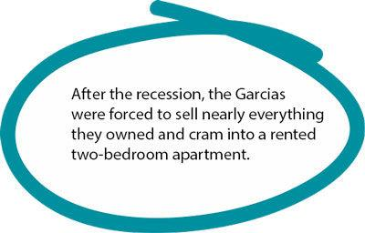

# Roxy's owner Jesse Garcia is at it again

`legacy`

#  Roxy's owner Jesse Garcia is at it again 

## His newest ice cold-club is a family matter. Go backstage with the Garcia family as they expand their empire

* Megan Schuster
* Feb 25, 2015
* [Comments](https://www.voxmagazine.com/news/people/roxy-s-owner-jesse-garcia-is-at-it-again/article_fc3b0b0e-5cec-5902-9c20-f7e440d6913b.html#disqus_thread)
*

* [Facebook](https://www.facebook.com/sharer/sharer.php?u=https%3A%2F%2Fwww.voxmagazine.com%2Fnews%2Fpeople%2Froxy-s-owner-jesse-garcia-is-at-it-again%2Farticle_fc3b0b0e-5cec-5902-9c20-f7e440d6913b.html%3Futm_medium%3Dsocial%26utm_source%3Dfacebook%26utm_campaign%3Duser-share)
* [Twitter](https://twitter.com/intent/tweet?url=https%3A%2F%2Fwww.voxmagazine.com%2Fnews%2Fpeople%2Froxy-s-owner-jesse-garcia-is-at-it-again%2Farticle_fc3b0b0e-5cec-5902-9c20-f7e440d6913b.html%3Futm_medium%3Dsocial%26utm_source%3Dtwitter%26utm_campaign%3Duser-share&text=Roxy%27s%20owner%20Jesse%20Garcia%20is%20at%20it%20again&via=VoxMag)
* [Email](https://www.voxmagazine.com/content/tncms/live/mailto:?subject=%5BVox%20Magazine%5D%20Roxy%27s%20owner%20Jesse%20Garcia%20is%20at%20it%20again&body=https%3A%2F%2Fwww.voxmagazine.com%2Fnews%2Fpeople%2Froxy-s-owner-jesse-garcia-is-at-it-again%2Farticle_fc3b0b0e-5cec-5902-9c20-f7e440d6913b.html%3Futm_medium%3Dsocial%26utm_source%3Demail%26utm_campaign%3Duser-share)
* [Print](#)
* [Save](https://www.voxmagazine.com/content/tncms/live/#)

Family is very important to Jesse and Heather Garcia, pictured with their three children, (from left) Roxxanne, 14, Diego, 9, and Paul, 13. Jesse even named Roxy's after his eldest child. Photo by Tim Nwachukwu

Tim Nwachukwu

###### On a crisp, clear Friday night in Columbia, Broadway swells with young people who laugh harder, talk louder and stumble more as the clock ticks toward bar close. Jesse Garcia stands outside his venue and waits. Amid the ruckus, a line of people ready to let loose in Roxy’s stretches from the corner of Broadway and Hitt Street down a full city block.

###### Jesse, who opened the club in 2012, chats with the people in the queue, checking IDs as he goes. Later inside, he talks music with the two disc jockeys performing that night. From bouncer to manager, he’s worked every odd job in the business, until it was finally his turn to build something of his own. Boyish excitement washes over him when he talks about Roxy’s, a club that was 20 years in the making.

###### But Roxy’s is only part of Jesse’s story. Lee Sensintaffar, co-owner of Iron Tiger Tattoo and Garcia’s half brother, calls him imaginative. “Jesse’s always been a good idea guy.” And Garcia’s wife, Heather, says, “He’s always building — he doesn’t stop.”

###### So in early March, Jesse plans to open a second Columbia venue at North Eighth and Park streets. This one, though, probably won’t have a line out the door. In fact, patrons will need a password to get in.

# 503 Service Unavailable

No server is available to handle this request.

## Hot Nights, Cold Wars

[gallery type="slideshow" ids="74343,74344,74345,74346,74348,74349"]

###### The Garcias are joining forces to create a venue that is business in the front and party in the back. At the entrance of the building, Heather will open a vintage cosmetology practice, dubbed Lips & Curls. Heather has been refurbishing authentic ’50s furniture for months to prepare for the opening.

###### “I want to make it homey,” she says. “Back in the ’50s, women used to go to the beauty salon every week for a boost — I want to bring that attitude back.”

By day, women will feel like starlets after Heather styles their modern ’dos amid a nostalgic atmosphere. By night, her studio will be the entrance to a speakeasy where patrons will uncover secret passageways through the salon to reach the atomic-age lounge and club. The duo will roll out the name of their operation in the coming weeks. Jesse expects the lounge to hold about 50 people, and the music venue to accommodate about 100. Both of these spaces will be riddled with more secret entrances, trap doors and mysteries for people to discover.  Hint: keep an eye on the bookcases;  Jesse says nothing is as it seems.

###### Although the bar has some elements of a speakeasy, it will be adorned with Cold War era decor, not prohibition glitz. The contrasting bleakness and optimism of that period fascinate Jesse. He wants the lounge, The Social Room, to have a Frank Sinatra-meets-The Jetsons aesthetic.

###### Jesse keeps an air of mystery over the details of the music hall, but he describes it as “the rebirth of rock ’n’ roll in a venue.” As Roxy’s gained popularity, it lost its classic rock flair. Jesse says this new venue will be a place where his orignal, more edgy clients can go to listen to local bands.

## Loud Music, Quiet Persistence

###### Jesse was born in Rolla, but his father was in the Air Force, so he grew up all over the country. Although he didn’t realize it at the time, playing and listening to music gave him a sense of freedom. Music allowed him to have his own world despite his family’s frequent relocation.

###### He considers Florida to be his most permanent childhood home because he was there for high school. But after Jesse’s graduation, his father was sent to Italy on a military assignment, and Jesse’s life became less structured. Jesse’s mother and his siblings joined his father in Europe, but he stayed behind.

Click on this photo to find out more about Jesse Garcia's family ties to the Columbia business scene.

###### After his family moved, Jesse decided to attend a one-year Bible college in Texas and continue his nomadic way of life. When he completed the program in 1998, he bought a van so he could travel all over the country to visit the friends he met while his dad was stationed in various cities –– mostly women, he admits. In 1999, he returned to Rolla with the intention of visiting one final woman: his grandmother.

###### While in Rolla, Jesse met Heather and decided his wayfaring days were over. “We physically ran into each other in Wal-Mart — just smacked into him,” Heather says. “He asked if he could get my number, and I told him he’d be better for my sister.”

###### But Jesse wouldn’t accept that brushoff; he knew he had to see her again. He took note of Heather’s skater style and decided to hang around skate parks to see if she would show up. Eventually he found her. Heather says she was a little “creeped out” by his persistence, but she agreed to go to Waffle House with him.

###### After their first date, Heather went home and told her mom she had found “the one.” She says she realized just how much she needed Jesse. “I saw God in him,” Heather says. She was going through a lot in her home life after experimenting with drugs and was finding them hard to shake. She, like Jesse, had moved around during her childhood because of her mother’s three marriages. Heather was a little troubled, a little scorned and in need of stability. Jesse offered that.

###### Fifteen years, three children (Roxxanne, 14,  Paul, 13, and Diego, 9), and multiple businesses later, they are still partners in everything they do. Jesse named Roxy’s after his eldest child. “I wanted it to mean something,” Jesse says. “I wanted to be reminded every day why I’m doing this.”

###### But long before Roxy’s got its second-floor home on Broadway, Jesse had been immersed in the Columbia business scene. “He’s bounced all over downtown,” Heather says, both of her husband’s movement from job to job and working as a bouncer for downtown bars and venues.

###### Jesse owned his own construction business that was profitable in the mid-2000s. The family bought a couple of new cars and renovated their home. It seemed that Jesse and Heather finally had the stability they needed to achieve their dreams. Then, of course, the recession hit.

## Shaky Foundation, Sturdy Conviction

###### When the housing bubble burst in 2007, his construction business crumbled. The Garcias were forced to sell nearly everything they owned and cram into a rented two-bedroom apartment.

###### Heather says the tough times ultimately strengthened their family. When she became overwhelmed over their situation, Jesse held onto their aspirations and started tucking away savings. Heather says he was able to separate the hardship from what needed to come next. He read books on business, leadership and finances to help kick-start his  vision and get his family back to financial stability.

With each paycheck, Jesse and Heather separated their income into three envelopes.

###### The first was for housing-related bills, which ate 60 percent of their earnings. Thirty percent of their checks went in a second envelope for food and some frivolities, such as taking the kids to a movie or out to eat. The last one was savings to reassure Heather and Jesse that having ambition was OK, even during a time when practicality ruled. As Jesse started to find more work and as Heather got closer to finishing cosmetology school, they increased their nest egg from 10 to 15 percent. Later, it grew into thousands and they had finally saved enough so the Garcias could build their  businesses.

###### When Roxy’s first opened in 2012, the crowd was mostly an eclectic subculture that used to frequent to Sideshow, a bar underneath Gumby’s Pizza. Jesse had been a manager there, and he left an impression on the regulars. They supported him in his new venture, but initially word didn’t spread far beyond that community.

###### “The college kids were harder to draw in,” Jesse says. “They were the goal.” College students make up a large part of the local nightlife, so Jesse knew that in order for Roxy’s to be successful, he needed to gain the loyalty of that group.

###### To transform Roxy’s into a collegiate club, Jesse changed his marketing strategy to highlight drink specials, exclusive DJ nights and the one thing Roxy’s has to offer that many CoMo bars don’t: a club-like atmosphere.

###### “I love going to Roxy’s to dance,” says MU senior Kate Obermeier. “It’s really one of the only places to do that here.”

###### Jesse soon introduced a $5 weekly bottomless cup night on Thursdays. This brought in hordes of students. In late spring 2014, lines began to stretch down the block at 9:30 p.m. on Thursday nights.

###### Roxy’s soon became a weekly ritual among undergrads, until people started lining up around the bar for a different reason.

###### In December, Jesse made what he calls a major “marketing blunder.” Following the events in Ferguson after the shooting of Michael Brown, Roxy’s distributed entrance wristbands that read “Hands Up, Pants Up.” It came off as mocking the “Hands Up, Don’t Shoot” rallying cry in support of Michael Brown.

###### His children received threats at their schools, so Jesse and Heather pulled them out for a week. Jesse came home from work one night to find a hostile group waiting on his driveway. The string of events caused his family to leave town for a month until the tension settled.

###### For his part, Jesse says that he wouldn’t knowingly devalue the events that happened in Ferguson. He had those bands on site months before Brown’s death and didn’t connect the message with the protests surrounding Brown’s killing.

###### It might take time to fully restore Jesse’s reputation, but he is moving forward, as he always has. He’s been a military brat, a nomad and the glue holding his family together. Today he fancies himself the owner of an empire with plans to expand to St. Louis and Kansas City.

###### Music used to be Jesse’s way of escaping. In his new project, it will be his way of interacting with the world around him.

[gallery type="slideshow" ids="74163,74164,74168,74165,74166,74169,74167"]

* [Facebook](https://www.facebook.com/sharer/sharer.php?u=https%3A%2F%2Fwww.voxmagazine.com%2Fnews%2Fpeople%2Froxy-s-owner-jesse-garcia-is-at-it-again%2Farticle_fc3b0b0e-5cec-5902-9c20-f7e440d6913b.html%3Futm_medium%3Dsocial%26utm_source%3Dfacebook%26utm_campaign%3Duser-share)
* [Twitter](https://twitter.com/intent/tweet?url=https%3A%2F%2Fwww.voxmagazine.com%2Fnews%2Fpeople%2Froxy-s-owner-jesse-garcia-is-at-it-again%2Farticle_fc3b0b0e-5cec-5902-9c20-f7e440d6913b.html%3Futm_medium%3Dsocial%26utm_source%3Dtwitter%26utm_campaign%3Duser-share&text=Roxy%27s%20owner%20Jesse%20Garcia%20is%20at%20it%20again&via=VoxMag)
* [Email](https://www.voxmagazine.com/content/tncms/live/mailto:?subject=%5BVox%20Magazine%5D%20Roxy%27s%20owner%20Jesse%20Garcia%20is%20at%20it%20again&body=https%3A%2F%2Fwww.voxmagazine.com%2Fnews%2Fpeople%2Froxy-s-owner-jesse-garcia-is-at-it-again%2Farticle_fc3b0b0e-5cec-5902-9c20-f7e440d6913b.html%3Futm_medium%3Dsocial%26utm_source%3Demail%26utm_campaign%3Duser-share)
* [Print](#)
* [Save](https://www.voxmagazine.com/content/tncms/live/#)

### [ Don't Believe Him Just Watch](https://www.voxmagazine.com/magazine/archives/don-t-believe-him-just-watch/collection_1dfdc3ee-bf0e-11e5-af93-3b9ea4ec467b.html)

###  Recommended for you 

[News & Features](https://www.voxmagazine.com/news/)

### [ How to discuss social issues at Thanksgiving dinner](https://www.voxmagazine.com/news/how-to-discuss-social-issues-at-thanksgiving-dinner/article_7d5ce976-c896-11e7-b24d-6f314a14f166.html#tncms-source=block-contextual-fallback)

[Business](https://www.voxmagazine.com/news/business/)

### [ Your guide to the HQ Trivia app](https://www.voxmagazine.com/news/business/your-guide-to-the-hq-trivia-app/article_dffd22e8-078f-11e8-b6c1-fb95526dc5eb.html#tncms-source=block-contextual-fallback)

[News & Features](https://www.voxmagazine.com/news/)

### [ The case for (and against) daylight saving time](https://www.voxmagazine.com/news/the-case-for-and-against-daylight-saving-time/article_ffcbeffe-234c-11e8-ae70-0fda73757a20.html#tncms-source=block-contextual-fallback)

[News & Features](https://www.voxmagazine.com/news/)

### [ 4 steps to overcoming your fear of making your voice heard](https://www.voxmagazine.com/news/steps-to-overcoming-your-fear-of-making-your-voice-heard/article_3edebf3e-47d2-11e7-a075-6bc8b63039cc.html#tncms-source=block-contextual-fallback)

* [0 comments]()
* [**Vox Magazine**](https://disqus.com/home/forums/voxmagcomo/)
* [Login](https://disqus.com/embed/comments/?base=default&f=voxmagcomo&t_i=fc3b0b0e-5cec-5902-9c20-f7e440d6913b&t_u=https%3A%2F%2Fwww.voxmagazine.com%2Fnews%2Fpeople%2Froxy-s-owner-jesse-garcia-is-at-it-again%2Farticle_fc3b0b0e-5cec-5902-9c20-f7e440d6913b.html&t_e=Roxy%27s%20owner%20Jesse%20Garcia%20is%20at%20it%20again&t_d=%0A%20%20%20%20%20%20%20%20%0A%20%20%20%20%20%20%20%20%20%20%20%20%0A%20%20%20%20%20%20%20%20%20%20%20%20Roxy%27s%20owner%20Jesse%20Garcia%20is%20at%20it%20again%0A%20%20%20%20%20%20%20%20%0A%20%20%20%20&t_t=Roxy%27s%20owner%20Jesse%20Garcia%20is%20at%20it%20again&s_o=default#)
* [1](https://disqus.com/home/inbox/)

* [ Recommend](https://disqus.com/embed/comments/?base=default&f=voxmagcomo&t_i=fc3b0b0e-5cec-5902-9c20-f7e440d6913b&t_u=https%3A%2F%2Fwww.voxmagazine.com%2Fnews%2Fpeople%2Froxy-s-owner-jesse-garcia-is-at-it-again%2Farticle_fc3b0b0e-5cec-5902-9c20-f7e440d6913b.html&t_e=Roxy%27s%20owner%20Jesse%20Garcia%20is%20at%20it%20again&t_d=%0A%20%20%20%20%20%20%20%20%0A%20%20%20%20%20%20%20%20%20%20%20%20%0A%20%20%20%20%20%20%20%20%20%20%20%20Roxy%27s%20owner%20Jesse%20Garcia%20is%20at%20it%20again%0A%20%20%20%20%20%20%20%20%0A%20%20%20%20&t_t=Roxy%27s%20owner%20Jesse%20Garcia%20is%20at%20it%20again&s_o=default#)

* tTweet
* [Sort by Best](https://disqus.com/embed/comments/?base=default&f=voxmagcomo&t_i=fc3b0b0e-5cec-5902-9c20-f7e440d6913b&t_u=https%3A%2F%2Fwww.voxmagazine.com%2Fnews%2Fpeople%2Froxy-s-owner-jesse-garcia-is-at-it-again%2Farticle_fc3b0b0e-5cec-5902-9c20-f7e440d6913b.html&t_e=Roxy%27s%20owner%20Jesse%20Garcia%20is%20at%20it%20again&t_d=%0A%20%20%20%20%20%20%20%20%0A%20%20%20%20%20%20%20%20%20%20%20%20%0A%20%20%20%20%20%20%20%20%20%20%20%20Roxy%27s%20owner%20Jesse%20Garcia%20is%20at%20it%20again%0A%20%20%20%20%20%20%20%20%0A%20%20%20%20&t_t=Roxy%27s%20owner%20Jesse%20Garcia%20is%20at%20it%20again&s_o=default#)

Start the discussion…

###### Log in with

* 
* 
* 
*

######  or sign up with Disqus 

?### Disqus is a discussion network

* Disqus never moderates or censors. The rules on this community are its own.
* Don't be a jerk or do anything illegal. Everything is easier that way.

[Read full terms and conditions](https://docs.disqus.com/kb/terms-and-policies/)

Be the first to comment.

* [Powered by Disqus](https://disqus.com/)
* [_✉_Subscribe_✔_](https://disqus.com/embed/comments/?base=default&f=voxmagcomo&t_i=fc3b0b0e-5cec-5902-9c20-f7e440d6913b&t_u=https%3A%2F%2Fwww.voxmagazine.com%2Fnews%2Fpeople%2Froxy-s-owner-jesse-garcia-is-at-it-again%2Farticle_fc3b0b0e-5cec-5902-9c20-f7e440d6913b.html&t_e=Roxy%27s%20owner%20Jesse%20Garcia%20is%20at%20it%20again&t_d=%0A%20%20%20%20%20%20%20%20%0A%20%20%20%20%20%20%20%20%20%20%20%20%0A%20%20%20%20%20%20%20%20%20%20%20%20Roxy%27s%20owner%20Jesse%20Garcia%20is%20at%20it%20again%0A%20%20%20%20%20%20%20%20%0A%20%20%20%20&t_t=Roxy%27s%20owner%20Jesse%20Garcia%20is%20at%20it%20again&s_o=default#)
* [_d_Add Disqus to your site](https://publishers.disqus.com/engage?utm_source=voxmagcomo&utm_medium=Disqus-Footer)
* [__Disqus' Privacy Policy](https://help.disqus.com/customer/portal/articles/466259-privacy-policy)

