# Untitled Note

`legacy`

* 

* 

*

Fear and Loathing in Las Vegas

* [News](http://www.rollingstone.com/news)
* [Video](http://www.rollingstone.com/video)
* [Music](http://www.rollingstone.com/music)
* [Politics](http://www.rollingstone.com/politics)
* [TV](http://www.rollingstone.com/tv)
* [Movies](http://www.rollingstone.com/movies)
* [Video Games](http://www.rollingstone.com/glixel)
* [RS Country](http://www.rollingstone.com/country)
* [RS Hip-Hop](http://www.rollingstone.com/hip-hop)
[More](http://www.rollingstone.com/politics/news/fear-and-loathing-in-las-vegas-19711111?print=true#)* [Lists](http://www.rollingstone.com/lists)
* [Culture](http://www.rollingstone.com/culture)
* [Galleries](http://www.rollingstone.com/pictures)
* [Sports](http://www.rollingstone.com/sports)
* [Interviews](http://www.rollingstone.com/music/features)
* [Long Reads](http://www.rollingstone.com/long-reads)
* [Artists](http://www.rollingstone.com/music/artists)
* [Ram Report](http://www.rollingstone.com/country/ram-report)
* [Album Reviews](http://www.rollingstone.com/music/albumreviews)
* [American Beauty](http://www.rollingstone.com/american-beauty)
* [Movie Reviews](http://www.rollingstone.com/movies/reviews)
* [Coverwall](http://www.rollingstone.com/coverwall)
* [Live Reviews](http://www.rollingstone.com/music/live-reviews)
* [50th Anniversary](http://www.rollingstone.com/50th-anniversary)
* [Podcasts](http://www.rollingstone.com/topic/podcast)
* [Subscribe](http://www.rollingstone.com/subscribe-more)

Trending
[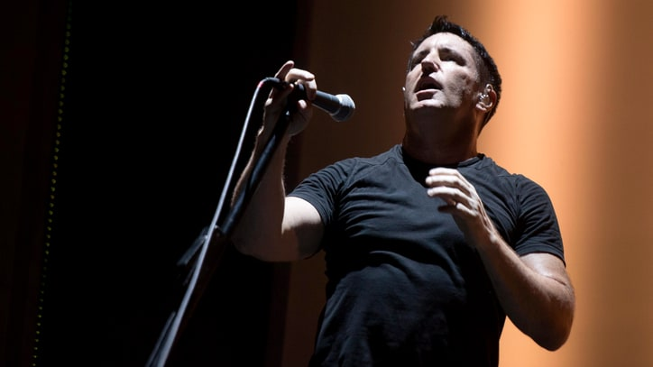

##### R. Kelly Scandals: From Underage Bride to Alleged Cult

](http://www.rollingstone.com/culture/news/r-kelly-scandals-from-aaliyah-to-alleged-cults-w492844)
[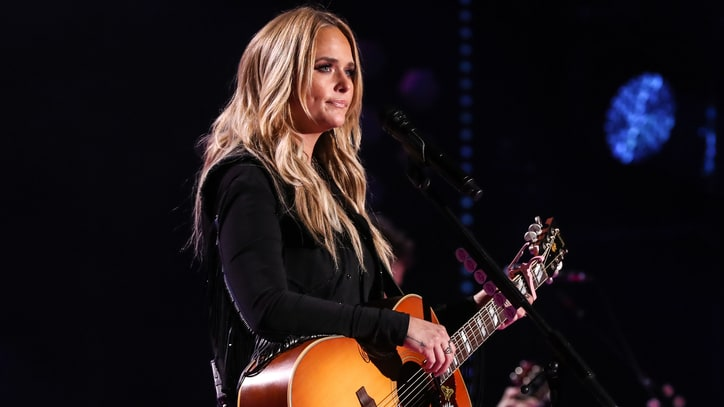

##### 'Dunkirk': Christopher Nolan's WWII Epic Is a...

](http://www.rollingstone.com/movies/reviews/peter-travers-dunkirk-may-be-greatest-war-film-ever-w492668)
[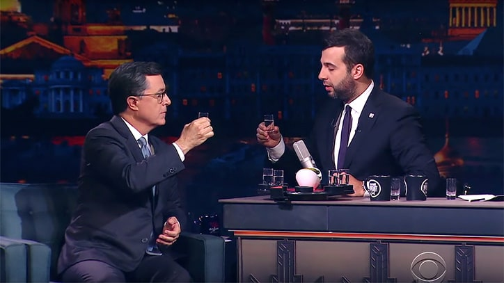

##### Kenny Rogers, Dolly Parton Announce Final Performances...

](http://www.rollingstone.com/country/news/kenny-rogers-dolly-parton-set-final-performances-together-w492714)
[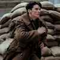

##### What Miranda Lambert's Album Sales Say About Sexism at...

](http://www.rollingstone.com/country/news/what-miranda-lamberts-sales-say-about-sexism-at-radio-w492857)

# Fear and Loathing in Las Vegas

A savage journey to the heart of the American dream

 Hunter S. Thompson  Michael Ochs Archives/GettyImages 
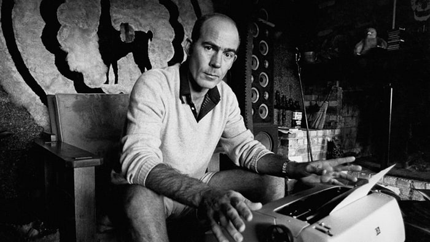

 By [ Hunter S. Thompson](http://www.rollingstone.com/contributor/hunter-s-thompson)
November 11, 1971

### More News

[Fear and Loathing at the Super Bowl](http://www.rollingstone.com/sports/features/fear-and-loathing-at-the-super-bowl-19740228)
[Fear and Loathing on the Campaign Trail '76](http://www.rollingstone.com/politics/news/fear-and-loathing-on-the-campaign-trail-76-19760603)
[Fear and Loathing in Detroit](http://www.rollingstone.com/politics/news/fear-and-loathing-in-detroit-20090330)
[Ralph Steadman's Visions of Fear and Loathing](http://www.rollingstone.com/movies/news/ralph-steadmans-visions-of-fear-and-loathing-20140423)
[Fear and Loathing on the Campaign Trail in '72](http://www.rollingstone.com/politics/news/timewarp-campaign-72-19730705)
[All Stories ](http://www.rollingstone.com/news)

We were somewhere around Barstow on the edge of the desert when the drugs began to take hold. I remember saying something like "I feel a bit lightheaded; maybe you should drive. ..." And suddenly there was a terrible roar all around us and the sky was full of what looked like huge bats, all swooping and screeching and diving around the car, which was going about 100 miles an hour with the top down to Las Vegas. And a voice was screaming: "Holy Jesus! What are these goddamn animals?"

[Fear and Loathing on the Campaign Trail](http://www.rollingstone.com/politics/news/%20Fear%20and%20Loathing%20on%20the%20Campaign%20Trail%20in%20'72)

Then it was quiet again. My attorney had taken his shirt off and was pouring beer on his chest, to facilitate the tanning process. "What the hell are you yelling about?" he muttered, staring up at the sun with his eyes closed and covered with wraparound Spanish sunglasses. "Never mind," I said. "It's your turn to drive." I hit the brakes and aimed the Great Red Shark toward the shoulder of the highway. No point mentioning those bats, I thought. The poor bastard will see them soon enough.

It was almost noon, and we still had more than 100 miles to go. They would be tough miles. Very soon, I knew, we would both be completely twisted. But there was no going back, and no time to rest. We would have to ride it out. Press registration for the fabulous Mint 400 was already underway, and we had to get there by four to claim our soundproof suite. A fashionable sporting magazine in New York had taken care of the reservations, along with this huge red Chevy convertible we'd just rented off a lot on the Sunset Strip ... and I was, after all, a professional journalist; so I had an obligation to _cover the story,_ for good or ill.

The sporting editors had also given me $300 in cash, most of which was already spent on extremely dangerous drugs. The trunk of the car looked like a mobile police narcotics lab. We had two bags of grass, 75 pellets of mescaline, five sheets of high-powered blotter acid, a salt shaker half full of cocaine, and a whole galaxy of multi-colored uppers, downers, screamers, laughers ... and also a quart of tequila, a quart of rum, a case of Budweiser, a pint of raw ether and two dozen amyls.

All this had been rounded up the night before, in a frenzy of high-speed driving all over Los Angeles County – from Topanga to Watts, we picked up everything we could get our hands on. Not that we _needed_ all that for the trip, but once you get locked into a serious drug collection, the tendency is to push it as far as you can.

The only thing that really worried me was the ether. There is nothing in the world more helpless and irresponsible and depraved than a man in the depths of an ether binge. And I knew we'd get into that rotten stuff pretty soon. Probably at the next gas station. We had sampled almost everything else, and now – yes, it was time for a long snort of ether. And then do the next 100 miles in a horrible, slobbering sort of spastic stupor. The only way to keep alert on ether is to do up a lot of amyls – not all at once, but steadily, just enough to maintain the focus at 90 miles an hour through Barstow.

"Man, this is the way to travel," said my attorney. He leaned over to turn the volume up on the radio, humming along with the rhythm section and kind of moaning the words: "One toke over the line ... Sweet Jesus ... One toke over the line ..."

One toke? You poor fool! Wait till you see those goddamn bats. I could barely hear the radio ... slumped over on the far side of the seat, grappling with a tape recorder turned all the way up on "Sympathy for the Devil." That was the only tape we had, so we played it constantly, over and over, as a kind of demented counterpoint to the radio. And also to maintain our rhythm on the road. A constant speed is good for gas mileage – and for some reason that seemed important at the time. Indeed. On a trip like this one _must_ be careful about gas consumption. Avoid those quick bursts of acceleration that drag blood to the back of the brain.

My attorney saw the hitchhiker long before I did. "Let's give this boy a lift," he said, and before I could mount any argument he was stopped and this poor Okie kid was running up to the car with a big grin on his face, saying, "Hot damn! I never rode in a convertible before!"

"Is that right?" I said. "Well, I guess you're about ready, eh?"

The kid nodded eagerly as we roared off.

"We're your friends," said my attorney. "We're not like the others."

O Christ, I thought, he's gone around the bend. "No more of that talk," I said sharply. "Or I'll put the leeches on you." He grinned, seeming to understand. Luckily, the noise in the car was so awful – between the wind and the radio and the tape machine – that the kid in the back seat couldn't hear a word we were saying. Or could he?

How long can we _maintain?_ I wondered. How long before one of us starts raving and jabbering at this boy? What will he think then? This same lonely desert was the last known home of the Manson family. Will he make that grim connection when my attorney starts screaming about bats and huge manta rays coming down on the car? If so – well, we'll just have to cut his head off and bury him somewhere. Because it goes without saying that we can't turn him loose. He'll report us at once to some kind of outback nazi law enforcement agency, and they'll run us down like dogs.

Jesus! Did I _say_ that? Or just think it? Was I talking? Did they hear me? I glanced over at my attorney, but he seemed oblivious – watching the road, driving our Great Red Shark along at a hundred and ten or so. There was no sound from the back seat.

Maybe I'd better have a chat with this boy, I thought. Perhaps if I _explain_ things, he'll rest easy.

Of course. I leaned around in the seat and gave him a fine big smile ... admiring the shape of his skull.

"By the way," I said. "There's one thing you should probably understand."

He stared at me, not blinking. Was he gritting his teeth?

"Can you _hear_ me?" I yelled.

He nodded.

"That's good," I said. "Because I want you to know that we're on our way to Las Vegas to find the American Dream." I smiled. "That's why we rented this car. It was the only way to do it. Can you grasp that?"

He nodded again, but his eyes were nervous.

"I want you to have all the background," I said. "Because this is a very ominous assignment – with overtones of extreme personal danger. ... Hell, I forgot all about this beer; you want one?"

He shook his head.

"How about some ether?" I said.

"What?"

"Never mind. Let's get right to the heart of this thing. You see, about 24 hours ago we were sitting in the Polo Lounge of the Beverly Hills Hotel – in the patio section, of course – and we were just sitting there under this palm tree when this uniformed dwarf came up to me with a pink telephone and said, 'This must be the call you've been waiting for all this time, sir.'"

I laughed and ripped open a beer can that foamed all over the back seat while I kept talking. "And you know? He was right! I'd been _expecting_ that call, but I didn't know who it would come from. Do you follow me?"

The boy's face was a mask of pure fear and bewilderment.

I blundered on: "I want you to understand that this man at the wheel is my _attorney!_ He's not just some dingbat I found on the Strip. Shit, _look_ at him! He doesn't look like you or me, right? That's because he's a foreigner. I think he's probably Samoan. But it doesn't matter, does it? Are you prejudiced?"

"Oh, hell _no!"_ he blurted.

"I didn't think so," I said. "Because in spite of his race, this man is extremely valuable to me." I glanced over at my attorney, but his mind was somewhere else.

I whacked the back of the driver's seat with my fist. "This is _important,_ goddamnit! This is a _true story!"_ The car swerved sickeningly, then straightened out. "Keep your hands off my fucking neck!" my attorney screamed. The kid in the back looked like he was ready to jump right out of the car and take his chances.

Our vibrations were getting nasty – but why? I was puzzled, frustrated. Was there no communication in this car? Had we deteriorated to the level of _dumb beasts?_

* * *

Because my story _was_ true. I was certain of that. And it was extremely important, I felt, for the _meaning_ of our journey to be made absolutely clear. We had actually been sitting there in the Polo Lounge – for many hours – drinking Singapore Slings with mescal on the side and beer chasers. And when the call came, I was ready.

The dwark approached our table cautiously, as I recall, and when he handed me the pink telephone I said nothing, merely listened. And then I hung up, turning to face my attorney. "That was headquarters," I said. "They want me to go to Las Vegas at once, and make contact with a Portuguese photographer named Lacerda. He'll have the details. All I have to do is check into my suite and he'll seek me out."

My attorney said nothing for a moment, then he suddenly came alive in his chair. "God _hell!"_ he exclaimed. "I think I see the _pattern._ This one sounds like real trouble!" He tucked his khaki undershirt into his white rayon bellbottoms and called for more drink. "You're going to need plenty of legal advice before this thing is over," he said. "And my first advice is that you should rent a very fast car with no top and get the hell out of L.A. for at least 48 hours." He shook his head sadly. "This blows my weekend, because naturally I'll have to go with you – and we'll have to arm ourselves."

"Why not?" I said. "If a thing like this is worth doing at all, it's worth doing right. We'll need some decent equipment and plenty of cash on the line – if only for drugs and a super-sensitive tape recorder, for the sake of a permanent record."

"What kind of a story is this?" he asked.

"The Mint 400," I said. "It's the richest off-the-road race for motorcycles and dune-buggies in the history of organized sport – a fantastic spectacle in honor of some fatback _grossero_ named Del Webb, who owns the luxurious Mint Hotel in the heart of downtown Las Vegas ... at least that's what the press release says; my man in New York just read it to me."

"Well," he said, "as your attorney I advise you to buy a motorcycle. How else can you cover a thing like this righteously?"

"No way," I said. "Where can we get hold of a Vincent Black Shadow?"

"What's that?"

"A fantastic bike," I said. "The new model is something like two thousand cubic inches, developing 200 brake horsepower at 4000 revolutions per minute on a magnesium frame with two styrofoam seats and a total curb weight of exactly 200 pounds."

"That sounds about right for this gig," he said.

"It is," I assured him. "The fucker's not much for turning, but it's pure hell on the straightaway. It'll outrun the F-111 until takeoff."

"Takeoff?" he said. "Can we handle that much torque?"

"Absolutely," I said. "I'll call New York for some cash."

**II**

The seizure of $300 from a pig woman in Beverly Hills

The New York office was not familiar with the Vincent Black Shadow: they referred me to the Los Angeles bureau – which is actually in Beverly Hills just a few long blocks from the Polo Lounge – but when I got there, the money-woman refused to give me more than $300 in cash. She had no idea who I was, she said, and by that time I was pouring sweat. My blood is too thick for California: I have never been able to properly explain myself in this climate. Not with the soaking sweats ... wild red eyeballs and trembling hands.

So I took the $300 and left. My attorney was waiting in a bar around the corner. "This won't make the nut," he said, "unless we have unlimited credit."

I assured him we would. "You Sa-moans are all the same," I told him. "You have no faith in the essential decency of the white man's culture. Jesus, just one hour ago we were sitting over there in that stinking bagnio, stone broke and paralyzed for the weekend, when a call comes through from some total stranger in New York, telling me to go to Las Vegas and expenses be damned – and then he sends me over to some office in Beverly Hills where another total stranger gives me $300 raw cash for no reason at all ... I tell you, my man, this is the American Dream in action! We'd be fools not to ride this strange torpedo all the way out to the end."

"Indeed," he said. "We _must_ do it."

"Right," I said. "But first we need the car". And after that, the cocaine. And then the tape recorder, for special music, and some Acapulco shirts." The only way to prepare for a trip like this, I felt, was to dress up like human peacocks and get crazy, then screech off across the desert and _cover the story._ Never lose sight of the primary responsibility.

But what _was_ the story? Nobody had bothered to say. So we would have to drum it up on our own. Free Enterprise. The American Dream. Horatio Alger gone mad on drugs in Las Vegas. Do it _now:_ pure Gonzo journalism.

There was also the socio-psychic factor. Every now and then when your life gets complicated and the weasels start closing in, the only real cure is to load up on heinous chemicals and then drive like a bastard from Hollywood to Las Vegas. To _relax,_ as it were, in the womb of the desert sun. Just roll the roof back and screw it on, grease the face with white tanning butter and move out with the music at top volume, and at least a pint of ether.

* * *

Getting hold of the drugs had been no problem, but the car and the tape recorder were not easy things to round up at 6:30 on a Friday afternoon in Hollywood. I already had one car, but it was far too small and slow for desert work. We went to a Polynesian bar, where my attorney made 17 calls before locating a convertible with adequate horsepower and proper coloring.

"Hang onto it," I heard him say into the phone. "We'll be over to make the trade in 30 minutes." Then after a pause, he began shouting: "What? _Of course_ the gentleman has a major credit card! Do you realize who the fuck you're talking to?"

"Don't take any guff from these swine," I said as he slammed the phone down. "Now we need a sound store with the finest equipment. Nothing dinky. We want one of those new Belgian Heliowatts with a voice-activated shotgun mike, for picking up conversations in oncoming cars."

We made several more calls and finally located our equipment in a store about five miles away. It was closed, but the salesman said he would wait, if we hurried. But we were delayed enroute when a Stingray in front of us killed a pedestrian on Sunset Boulevard. The store was closed by the time we got there. There were people inside, but they refused to come to the double-glass door until we gave it a few belts and made ourselves clear.

Finally two salesmen brandishing tire irons came to the door and we managed to negotiate the sale through a tiny slit. Then they opened the door just wide enough to shove the equipment out, before slamming and locking it again. "Now take that stuff and get the hell away from here," one of them shouted through the slit.

My attorney shook his fist at them. "We'll be back," he yelled. "One of these days I'll toss a fucking bomb into that place! I have your name on this sales slip! I'll find out where you live and burn your house down!"

"That'll give him something to think about," he muttered as we drove off. "That guy is a paranoid psychotic, anyway. They're easy to spot."

We had trouble, again, at the car rental agency. After signing all the papers, I got in the car and almost lost control of it while backing across the lot to the gas pump. The rental-man was obviously shaken.

"Say there ... uh ... you fellas are going to be _careful_ with this car, aren't you?"

"Of course."

"Well, good god!" he said. "You just backed over that two-foot concrete abutment and you didn't even slow down! Forty-five in reverse! And you barely missed the pump!"

"No harm done," I said. "I always test a transmission that way. The _rear end._ For stress factors."

Meanwhile, my attorney was busy transferring rum and ice from the Pinto to the back seat of the convertible. The rental-man watched him nervously.

"Say," he said. "Are you fellas _drinking?"_

"Not me," I said.

"Just fill the goddamn tank," my attorney snapped. "We're in a hell of a hurry. We're on our way to Las Vegas for a desert race."

"What?"

"Never mind," I said. "We're responsible people." I watched him put the gas cap on, then I quickly poked the thing into low gear and we lurched into traffic.

"There's another worrier," said my attorney. "He's probably all cranked up on speed."

"Yeah, you should have given him some reds."

"Reds wouldn't help a pig like that," he said. "To hell with him. We have a lot of business to take care of, before we can get on the road."

"I'd like to get hold of some priests' robes," I said. "They might come in handy in Las Vegas."

But there were no costume stores open, and we weren't up to burglarizing a church. "Why bother?" said my attorney. "And you have to remember that a lot of cops are good vicious Catholics. Can you imagine what those bastards would do to us if we got busted all drugged-up and drunk in stolen vestments? Jesus, they'd castrate us!"

"You're right," I said. "And for Christ's sake don't smoke that pipe at stoplights. Keep in mind that we're exposed."

He nodded. "We need a big hookah. Keep it down here on the seat, out of sight. If anybody sees us, they'll think we're using oxygen."

We spent the rest of that night rounding up materials and packing the car. Then we ate the mescaline and went swimming in the ocean. Somewhere around dawn we had breakfast in a Malibu coffee shop, then drove very carefully across town and plunged onto the smog-shrouded Pasadena Freeway, heading East.

**III**

Strange medicine on the desert ... a crisis of confidence

I am still vaguely haunted by our hitchhiker's remarks about how he'd "never rode in a convertible before." Here's this poor geek living in a world of convertibles zipping past him on the highways all the time, an he's never even _ridden_ in one. It made me feel like King Farouk. I was tempted to have my attorney pull into the next airport and arrange some kind of simple, common-law contract whereby we could just _give_ the car to this unfortunate bastard. Just say: "Here, sign this and the car's yours." Give him the keys and then use the credit card to zap off on a jet to some place like Miami and rent another huge fireapple-red convertible for a drug-addled, top-speed run across the water all the way out to the last stop in Key West ... and then trade the car off for a boat. Keep moving.

But this manic notion passed quickly. There was no point in getting this harmless kid locked up – and, besides, I had _plans_ for this car. I was looking forward to flashing around Las Vegas in the bugger. Maybe do a bit of serious drag-racing on the Strip: Pull up to that big stoplight in front of the Flamingo and start screaming at the traffic:

"Alright, you chickenshit wimps! You pansies! When this goddamn light flips green, I'm gonna stomp down on this thing and blow every one of you gutless punks off the road!"

Right. Challenge the bastards on their own turf. Come screeching up to the crosswalk, bucking and skidding with a bottle of rum in one hand and jamming the horn to drown out the music ... glazed eyes insanely dilated behind tiny black, gold - rimmed greaser shades, screaming gibberish ... a genuinely _dangerous_ drunk, reeking of ether and terminal psychosis. Revving the engine up to a terrible high-pitched chattering whine, waiting for the light to change ...

How often does a chance like that come around? To jangle the bastards right down to the core of their spleens. Old elephants limp off to the hills to die; old Americans go out to the highway and drive themselves to death with huge cars.

But our trip was different. It was a classic affirmation of everything right and true and decent in the national character It was a gross, physical salute to the fantastic _possibilities_ of life in this country – but only for those with true grit. And we were chock full of that.

My attorney understood this concept, despite his racial handicap, but our hitchhiker was not an easy person to reach. He _said_ he understood, but I could see in his eyes that he didn't. He was lying to me.

The car suddenly veered off the road and we came to a sliding halt in the gravel. I was hurled against the dashboard. My attorney was slumped over the wheel. "What's wrong?" I yelled. "We can't stop _here._ This is bat country!"

"My heart," he groaned. "Where's the medicine?"

"Oh," I said. "The medicine, yes, it's right here." I reached into the kit-bag for the amyls. The kid seemed petrified. "Don't worry," I said. "This man has a bad heart – Angina Pectoris. But we have the cure for it. Yes, here they are." I picked four amyls out of the tin box and handed two of them to my attorney. He immediately cracked one under his nose, and I did likewise.

He took a long snort and fell back on the seat, staring straight up at the sun. "Turn up the fucking music!" he screamed. "My heart feels like an alligator!

"Volume! Clarity! Bass! We must have bass!" He flailed his naked arms at the sky. "What's _wrong_ with us? Are we goddamn _old ladies?"_

I turned both the radio and the tape machine up full bore. "You scurvy shyster bastard," I said. "Watch your language! You're talking to a doctor of journalism!"

He was laughing out of control. "What the fuck are we _doing_ out here on this desert?" he shouted. "Somebody call the police! We need help!"

"Pay no attention to this swine," I said to the hitchhiker. "He can't handle the medicine. Actually, we're _both_ doctors of journalism, and we're on our way to Las Vegas to cover the main story of our generation." And then I began laughing. ...

My attorney hunched around to face the hitchhiker. "The truth is," he said, "We're going to Vegas to croak a scag baron named Savage Henry. I've known him for years, but he ripped us off – and you know what that means, right?"

I wanted to shut him off, but we were both helpless with laughter. What the fuck _were_ we doing out here on this desert, when we both had bad hearts?

"Savage Henry has cashed his check!" My attorney snarled at the kid in the back seat. "We're going to rip his lungs out!"

"And eat them!" I blurted. "That bastard won't get away with this! What's going on in this country when a scum-sucker like that can get away with sandbagging a doctor of journalism?"

Nobody answered. My attorney was cracking another amyl and the kid was climbing out of the back seat, scrambling down the trunk lid. "Thanks for the ride," he yelled. "Thanks a _lot._ I _like_ you guys. Don't worry about _me."_ His feet hit the asphalt and he started running back towards Baker. Out in the middle of the desert, not a tree in sight.

"Wait a minute," I yelled. "Come back and get a beer." But apparently he couldn't hear me. The music was very loud, and he was moving away from us at good speed.

* * *

"Good Riddance," said my attorney. "We had a real freak on our hands. That boy made me nervous. Did you see his _eyes?"_ He was still laughing. "Jesus," he said. "This is good medicine!"

I opened the door and reeled around to the driver's side. "Move over," I said. "I'll drive. We have to get out of California before that kid finds a cop."

"Shit, that'll be hours." said my attorney. "He's a hundred miles from anywhere."

"So are we," I said.

"Let's turn around and drive back to the Polo Lounge," he said. "They'll never look for us there."

I ignored him. "Open the tequila," I yelled as the windscream took over again; I stomped on the accelerator as we hurtled back onto the highway. Moments later he leaned over with a map. "There's a place up ahead called Mescal Springs," he said. "As your attorney, I advise you to stop and take a swim."

I shook my head. "It's absolutely imperative that we get to the Mint Hotel before the deadline for press registration," I said. "Otherwise, we might have to pay for our suite."

He nodded. "But let's forget that bullshit about the American Dream," he said. "The _important_ thing is the Great Samoan Dream." He was rummaging around in the kit-bag. "I think it's about time to chew up a blotter," he said. "That cheap mescaline wore off a long time ago, and I don't know if I can stand the smell of that goddamn ether any longer."

"I _like_ it," I said. "We should soak a towel with the stuff and then put it down on the floorboard by the accelerator, so the fumes will rise up in my face all the way to Las Vegas."

He was turning the tape cassette over. The radio was screaming: "Power to the People – Right On!" John Lennon's political song, ten years too late. "That poor fool should have stayed where he was," said my attorney. "Punks like that just get in the way when they try to be serious."

"Speaking of serious," I said. "I think it's about time to get into the ether and the cocaine."

"Forget ether," he said. "Let's save it for soaking down the rug in the suite. But here's this. Your half of the sunshine blotter. Just chew it up like baseball gum."

I took the blotter and ate it. My attorney was now fumbling with the salt shaker containing the cocaine. Opening it. Spilling it. Then screaming and grabbing at the air, as our fine white dust blew up and out across the desert highway. A very expensive little twister rising up from the Great Red Shark. "Oh, _jesus!"_ he moaned. "Did you see what God just did to us?"

"God didn't do that!" I shouted. "_You_ did it. You're a fucking narcotics agent! I was on to your stinking act from the start, you pig!"

"You better be careful," he said. And suddenly he was waving a fat black .357 magnum at me. One of those snubnosed Colt Pythons with the beveled cylinder. "Plenty of vultures out here," he said. "They'll pick your bones clean before morning."

"You whore," I said. "When we get to Las Vegas I'll have you chopped into hamburger. What do you think the Drug Bund will do when I show up with a Samoan narcotics agent?"

"They'll kill us both," he said. "Savage Henry knows who I am. Shit, I'm your _attorney."_ He burst into wild laughter. "You're full of acid, you fool. It'll be a goddamn miracle if we can get to the hotel and check in before you turn into a wild animal. Are you ready for that? Checking into a Vegas hotel under a phony name with intent to commit capital fraud and a head full of acid?" He was laughing again, then he jammed his nose down toward the salt shaker, aiming the thin green roll of a $20 bill straight into what was left of the powder.

"How long do we have?" I said.

"Maybe 30 more minutes," he replied. "As your attorney I advise you to drive at top speed."

Las Vegas was just up ahead. I could see the strip/hotel skyline looming through the blue desert ground-haze: The Sahara, the landmark, the Americana and the ominous Thunderbird – a cluster of grey rectangles in the distance, rising out of the cactus.

Thirty minutes. It was going to be very close. The objective was the big tower of the Mint Hotel, downtown – and if we didn't get there before we lost all control, there was also the Nevada State prison upstate in Carson City. I had been there once, but only for a talk with the prisoners – and I didn't want to go back, for any reason at all. So there was really no choice: We would have to run the gauntlet, and acid be damned. Go through all the official gibberish, get the car into the hotel garage, work out on the desk clerk, deal with the bellboy, sign in for the press passes – all of it bogus, totally illegal, a fraud on its face, but of course it would have to be done.

"Kill the Body and the Head will Die"

This line appears in my notebook, for some reason. Perhaps some connection with Joe Frazier. Is he still alive? Still able to talk? I watched that fight in Seattle – horribly twisted about four seats down the aisle from the Governor. A very painful experience in every way, a proper end to the Sixties: Tim Leary a prisoner of Eldridge Cleaver in Algeria, Bob Dylan clipping coupons in Greenwich Village, both Kennedys murdered by mutants, Owsley folding napkins on Terminal Island, and finally Cassius/Ali belted incredibly off his pedestal by a human hamburger, a man on the verge of death. Joe Frazier, like Nixon, had finally prevailed for reasons that people like me refused to understand – at least not out loud.

... But that was some other era, burned out and long gone from the brutish realities of this foul year of Our Lord, Nineteen Hundred and Seventy One. A lot of things had changed in those years. And now I was in Las Vegas as the motor sports editor of this fine slick magazine that had sent me out here in the Great Red Shark for some reason that nobody claimed to understand. "Just check it out," they said, "and we'll take it from there. ..."

Indeed. Check it out. But when we finally arrived at the Mint Hotel my attorney was unable to cope artfully with the registration procedure. We were forced to stand in line with all the others – which proved to be extremely difficult under the circumstances. I kept telling myself: "Be quiet, be calm, say nothing ... speak only when spoken to: name, rank and press affiliation, nothing else, ignore this terrible drug, pretend it's not happening. ..."

There is no way to explain the terror I felt when I finally lunged up to the clerk and began babbling. All my well-rehearsed lines fell apart under that woman's stoney glare. "Hi there," I said. "My name is ... ah, Raoul Duke ... yes, _on the list,_ that's for sure. Free lunch, final wisdom, total coverage. ... why not? I have my attorney with me and I realize of course that _his_ name is not on my list, but we _must_ have that suite, yes, this man is actually my _driver._ We brought this red shark all the way from the Strip and now it's time for the desert, right? Yes. Just check the list and you'll see. Don't worry. What's the score, here? What's next?"

The woman never blinked. "Your room's not ready yet," she said. "But there's somebody looking for you."

"No!" I shouted. "Why? We haven't _done_ anything yet!" My legs felt rubbery. I gripped the desk and sagged toward her as she held out the envelope, but I refused to accept it. The woman's face was _changing:_ swelling, pulsing ... horrible green jowls and fangs jutting out, the face of a Moray Eel! Deadly poison! I lunged backwards into my attorney, who gripped my arm as he reached out to take the note. "I'll handle this," he said to the Moray woman. "This man has a bad heart, but I have plenty of medicine. My name is Doctor Gonzo. Prepare our suite at once. We'll be in the bar."

The woman shrugged as he led me away. In a town full of bedrock crazies, nobody even _notices_ an acid freak. We struggled through the crowded lobby and found two stools at the bar. My attorney ordered two cuba libres with beer and mescal on the side, then he opened the envelope. "Who's Lacerda?" he asked. "He's waiting for us in a room on the 12th floor."

I couldn't remember. Lacerda? The name rang a bell, but I couldn't concentrate. Terrible things were happening all around us. Right next to me a huge reptile was gnawing on a woman's neck, the carpet was a blood-soaked sponge – impossible to walk on it, no footing at all. "Order some golf shoes," I whispered. "Otherwise, we'll never get out of this place alive. You notice these lizards don't have any trouble moving around in this muck – that's because they have _claws_ on their feet."

"Lizards?" he said. "If you think we're in trouble now, wait till you see what's happening in the elevators." He took off his Brazilian sunglasses and I could see he'd been crying. "I just went upstairs to see this man Lacerda," he said. "I told him we knew what he was up to. He _says_ he's a photographer, but when I mentioned Savage Henry – well, that did it; he freaked. I could see it in his eyes. He knows we're onto him."

"Does he understand we have magnums?" I said.

"No. But I told him we had a Vincent Black Shadow. That scared the piss out of him."

"Good," I said. "But what about our room? And the golf shoes? We're right in the middle of a fucking reptile zoo! And somebody's giving _booze_ to these goddamn things! It won't be long before they tear us to shreds. Jesus, look at the floor! Have you ever _seen_ so much blood? How many have they killed _already?"_ I pointed across the room to a group that seemed to be staring at us. "Holy shit, look at that bunch over there! They've spotted us!"

"That's the press table," he said. "That's where you have to sign in for our credentials. Shit, let's get it over with. You handle that, and I'll get the room."

**IV**

**Hideous music and the sound of many shotguns ... rude vibes on a Saturday evening in Vegas**

We finally got into the suite around dusk, and my attorney was immediately on the phone to room service – ordering four club sandwiches, four shrimp cocktails, a quart of rum and nine fresh grapefruits. "Vitamin C," he explained. "We'll need all we can get."

I agreed. By this time the drink was beginning to cut the acid and my hallucinations were down to a tolerable level. The room service waiter had a vaguely reptilian cast to his features, but I was no longer seeing huge pterodactyls lumbering around the corridors in pools of fresh blood. The only problem now was a gigantic neon sign outside the window, blocking our view of the mountains – millions of colored balls running around a very complicated track, strange symbols & filigree, giving off a loud hum. ...

"Look outside," I said.

"Why?"

"There's a big ... machine in the sky, ... some kind of electric snake ... coming straight at us."

"Shoot it," said my attorney.

"Not yet," I said. "I want to study its habits."

He went over to the corner and began pulling on a chain to close the drapes. "Look," he said, "You've got to stop this talk about snakes and leeches and lizards and that stuff. It's making me sick."

"Don't worry," I said.

"_Worry?_ Jesus, I almost went crazy down there in the bar. They'll never let us back in that place – not after your scene at the press table."

"What scene?"

"You bastard," he said. "I left you alone for _three minutes!_ You scared the shit out of those people! Waving that goddamn marlin spike around and yelling about reptiles. You're lucky I came back in time. They were ready to call the cops. I said you were only drunk and that I was taking you up to your room for a cold shower. Hell, the only reason they gave us the press passes was to get you out of there."

He was pacing around nervously. "Jesus, that scene straightened me right out! I _must_ have some drugs. What have you done with the mescaline?"

"The kit-bag," I said.

He opened the bag and ate two pellets while I got the tape machine going. "Maybe _you_ should only eat _one_ of these," he said. "That acid's still working on you."

I agreed. "We have to go out to the track before dark," I said. "But we have time to watch the TV news. Let's carve up this grapefruit and make a fine rum punch, maybe toss in a blotter ... where's the car?"

"We gave it to somebody in the parking lot," he said. "I have the ticket in my briefcase."

"What's the number? I'll call down and have them wash the bastard, get rid of that dust and grime."

"Good idea," he said. But he couldn't find the ticket.

"Well, we're fucked," I said. "We'll never convince them to give us that car without proof."

He thought for a moment, then picked up the phone and asked for the garage. "This is Doctor Gonzo in eight-fifty," he said. "I seem to have lost my parking stub for that red convertible I left with you, but I want the car washed and ready to go in 30 minutes. Can you send up a duplicate stub? ... What ... Oh? ... Well, that's fine." He hung up and reached for the hash pipe. "No problem," he said. "That man remembers my face."

"That's good," I said. "They'll probably have a big net ready for us when we show up."

He shook his head. "As your attorney, I advise you not to worry about _me."_

The TV news was about the Laos Invasion – a series of horrifying disasters: explosions and twisted wreckage, men fleeing in terror, Pentagon generals babbling insane lies. "Turn that shit off!" screamed my attorney "Let's get _out_ of here!"

A wise move. Moments after we picked up the car my attorney went into a drug coma and ran a red light on Main street before I could bring us under control. I propped him up in the passenger seat and took the wheel myself ... feeling fine, extremely sharp. All around me in traffic I could see people talking and I wanted to hear what they were saying. All of them. But the shotgun mike was in the trunk and I decided to leave it there. Las Vegas is not the kind of town where you want to drive down Main Street aiming a black bazooka-looking instrument at people.

Turn up the radio. Turn up the tape machine. Look into the sunset up ahead. Roll the windows down for a better taste of the cool desert wind. Ah yes. This is what it's all about. Total control now. Tooling along the main drag on a Saturday night in Las Vegas, two good old boys in a fireapple-red convertible ... stoned, ripped, twisted ... Good People.

* * *

"Great God! What! What is this terrible music? "The Battle Hymn of Lieutenant Calley":

_"... as we go marching on ...

When I reach my final

campground, in that land beyond the sun,

and the Great Commander

asks me ..."_

(What did he ask you, Rusty?)

_"... Did you fight or did you run?"_

(and what did you tell him, Rusty?)

_"... We responded to their rifle fire with everything we had ..."_

No! I can't be hearing this! It must be the drug. I glanced over at my attorney, but he was staring up at the sky, and I could see that his brain had gone off to that campground beyond the sun. Thank Christ he can't hear this music, I thought. It would drive him into a racist frenzy.

Mercifully, the song ended. But my mood was already shattered ... and now the fiendish cactus juice took over, plunging me into a sub-human funk as we suddenly came up on the turnoff to the Mint Gun Club. "One mile," the sign said. But even a mile away I could hear the crackling scream of two-stroke bike engines winding out ... and then, coming closer, I heard another sound.

Shotguns! No mistaking that flat hollow boom.

I stopped the car. What the hell is going on down there? I rolled up all the windows and eased down the gravel road, hunched low on the wheel ... until I saw about a dozen figures pointing shotguns into the air, firing at regular intervals.

Standing on a slab of concrete out here in the mesquite-desert, this scraggly little oasis in a wasteland north of Vegas ... They were clustered, with their shotguns, about 50 yards away from a one-story concrete/block-house, half-shaded by ten or 12 trees and surrounded by cop-cars, bike-trailers and motorcycles.

Of course. The Mint _Gun Club!_ These lunatics weren't letting _anything_ interfere with their target practice. Here were about a hundred bikers, mechanics and assorted motorsport types milling around in the pit area, signing in for tomorrow's race, idly sipping beers and appraising each other's machinery – and right in the middle of all this, oblivious to everything but the clay pigeons flipping out of the traps every five seconds or so, the shotgun people never missed a beat.

Well, why not? I thought. The shooting provided a certain rhythm – sort of a steady bass-line – to the high-pitched chaos of the bike scene. I parked the car and wandered into the crowd, leaving my attorney in his coma.

I bought a beer and watched the bikes checking in. Many 405 Husquavarnas, high-tuned Swedish fireballs ... also many Yamahas, Kawasakis, a few 500 Triumphs, Maicos, here & there a CZ, a Pursang ... all very fast, super-light dirt bikes. No Hogs in this league, not even a Sportster ... that would be like entering our Great Red Shark in the dune buggy competition.

Maybe I should _do_ that, I thought. Sign my attorney up as the driver, then send him out to the starting line with a head full of ether and acid. How would they handle it?

Nobody would dare go out on the track with a person that crazy. He would roll on the first turn, and take out four or five dune buggies – a Kamikaze trip.

"What's the entry fee?" I asked the desk-man.

"Two fifty," he said.

"What if I told you I had a Vincent Black Shadow?"

He stared up at me, saying nothing, not friendly. I noticed he was wearing a .38 revolver on his belt. "Forget it," I said. "My driver's sick, anyway."

His eyes narrowed. "Your driver ain't the only one sick around here, buddy."

"He has a bone in his throat," I said.

"What?"

The man was getting ugly, but suddenly his eyes switched away. He was staring at something else ... my attorney; no longer wearing his Danish sunglasses, no longer wearing his Acapulco shirt ... a very crazy looking person, half-naked and breathing heavily.

"What's the trouble here?" he croaked. "This man is my client. Are you prepared to go to court?"

I grabbed his shoulder and gently spun him around. "Never mind," I said. "It's the Black Shadow – they won't accept it."

"_Wait_ a minute!" he shouted. "What do you _mean,_ they won't _accept_ it? Have you made a _deal_ with these pigs?"

"Certainly not," I said, pushing him along toward the gate. "But you notice they're all armed. We're the only people here without guns. Can't you hear that _shooting_ over there."

He paused, listened for an instant, then suddenly began running toward the car. "You cocksuckers!" he screamed over his shoulder. "We'll be back!"

By the time we got the shark back on the highway he was able to talk. "Jesus christ! How did we get mixed up with that gang of psychotic bigots? Let's get the fuck out of this town. Those scumbags were trying to _kill_ us!"

**V**

**Covering the story ... a glimpse of the Press in action ... ugliness & failure**

The racers were ready at dawn. Fine sunrise over the desert. Very tense. But the race didn't start until nine, so we had to kill about three long hours in the casino next to the pits, and that's where the trouble started.

The bar opened at 7:00. There was also a "koffee & donut canteen" in the bunker, but those of us who had been up all night in places like the Circus-Circus were in no mood for coffee & donuts. We wanted strong drink. Our tempers were ugly and there were at least two hundred of us, so they opened the bar early. By 8:30 there were big crowds around the crap-tables. The place was full of noise and drunken shouting.

A boney, middle-aged hoodlum wear-a Harley-Davidson T-shirt boomed up to the bar and yelled: "God damn! What day is this – Saturday?"

"More like Sunday," somebody replied.

"Hah! That's a _bitch,_ ain't it?" the H-D boomer shouted to nobody in particular. "Last night I was out home in Long Beach and somebody said they were runnin' the Mint 400 today, so I says to my old lady, 'Man, I'm goin'." He laughed. "So she gives me a lot of crap about it, you know ... so I started slappin' her around and the next thing I knew two guys I never even seen before got me out on the sidewalk workin' me over. Jesus! They beat me stupid."

He laughed again, talking into the crowd and not seeming to care who listened. "Hell yes!" he continued. "Then one of 'em says, 'Where you going?' And I says, 'Las Vegas, to the Mint 400.' So they gave me ten bucks and drove me down to the bus station. ..." He paused. "At least I _think_ it was them. ...

"Well; anyway, here I am. And I tell you that was one _hell_ of a long night, man! Seven hours on that goddamn bus! But when I woke up it was dawn and here I was in downtown Vegas and for a minute I didn't know what the hell I was _doin'_ here. All I could think was, 'O Jesus, here we go again: Who's divorced me this time?'"

He accepted a cigarette from somebody in the crowd, still grinning as he lit up. "But then I remembered, by God! I was here for the Mint 400 ... and, man, that's all I needed to know. I tell you it's wonderful to be here, man. I don't give a damn who wins or loses. It's just wonderful to be here with you people. ..."

Nobody argued with him. We all understood. In some circles, the "Mint 400" is a far, far better thing than the Super Bowl, the Kentucky Derby and the Lower Oakland Roller Derby Finals all rolled into one. This race attracts a very special breed, and our man in the Harley T-shirt was clearly one of them.

* * *

The correspondent from Life nodded sympathetically and screamed at the bartender: "Senzaman wazzyneeds!"

"Fast up with it," I croaked. "Why not five?" I smacked the bar with my open, bleeding palm. "Hell yes! Bring us ten!"

"I'll back it!" The Life man screamed. He was losing his grip on the bar, sinking slowly to his knees, but still speaking with definite authority: "This is a magic moment in sport! It may never come again!" Then his voice seemed to break. "I once did the Triple Crown," he muttered. "But it was nothing like this."

The frog-eyed woman clawed feverishly at his belt. "Stand up!" she pleaded. "_Please_ stand up! You'd be a very handsome man if you'd just _stand_ up!"

He laughed distractedly. "Listen, madam," he snapped. "I'm damn near intolerably handsome down here where I am. You'd go _crazy_ if I stood up!"

The woman kept pulling at him. She'd been mooning at his elbows for two hours, and now she was making her move. The man from Life wanted no part of it; he slumped deeper into his crouch.

I turned away. It was too horrible. We were, after all, the absolute cream of the national sporting press. And we were gathered here in Las Vegas for a very special assignment: to cover the Fourth Annual "Mint 400" ... and when it comes to things like this, you don't fool around.

* * *

But now – even before the spectacle got under way – there were signs that we might be losing control of the situation. Here we were on this fine Nevada morning, this cool bright dawn on the desert, hunkered down at some greasy bar in a concrete blockhouse & gambling casino called the "Mint Gun Club" about ten miles out of Vegas ... and with the race about to start, we were dangerously disorganized.

Outside, the lunatics were playing with their motorcycles, taping the headlights, topping off oil in the forks, last minute bolt-tightening (carburetor screws, manifold nuts, etc.) ... and the first ten bikes blasted off on the stroke of nine. It was extremely exciting and we all went outside to watch. The flag went down and these ten poor buggers popped their clutches and zoomed into the first turn, all together, then somebody grabbed the lead (a 405 Husquavarna, as I recall), and a cheer went up as the rider screwed it on and disappeared in a cloud of dust.

"Well, that's that," somebody said. "They'll be back around in an hour or so. Let's go back to the bar."

* * *

But not yet. No. There were something like a hundred and ninety more bikes waiting to start. They went off ten at a time, every two minutes. At first it was possible to watch them out to a distance of some 200 yards from the starting line. But this visibility didn't last long. The third brace of ten disappeared into the dust about 100 yards from where we stood ... and by the time they'd sent off the first 100 (with still _another_ hundred to go), our visibility was down to something like 50 feet. We could see as far as the hay-bales at the end of the pits. ...

Beyond that point the incredible dust-cloud that would hang over this part of the desert for the next two days was already formed up solid. None of us realized, at the time, that this was the last we would see of the "Fabulous Mint 400" –

By noon it was hard to see the pit area from the bar/casino, 100 feet away in the blazing sun. The idea of trying to "cover this race" in any conventional press-sense was absurd: It was like trying to keep track of a swimming meet in an Olympic - sized pool filled with talcum powder instead of water. The Ford Motor Company had come through, as promised, with a "press Bronco" and a driver, but after a few savage runs across the desert – looking for motorcycles and occasionally finding one – I abandoned this vehicle to the photographers and went back to the bar.

It was time, I felt, for an Agonizing Reappraisal of the whole scene. The race was definitely underway. I had witnessed the start; I was sure of that much. But what now? Rent a helicopter? Get back in that stinking Bronco? Wander out on that goddamn desert and _watch_ these fools race past the checkpoints? One every 13 minutes. ...?

By ten they were spread out all over the course. It was no longer a "race"; now it was an Endurance Contest. The only visible action was at the start/finish line, where every few minutes some geek would come speeding out of the dust-cloud and stagger off his bike, while his pit crew would gas it up and then launch it back onto the track with a fresh driver ... for another 50-mile lap, another brutal hour of kidney-killing madness out there in that terrible dust-blind limbo.

Somewhere around 11, I made another tour in the press-vehicle, but all we found were two dune-buggies full of what looked like retired petty-officers from San Diego. They cut us off in a dry-wash and demanded, "Where _is_ the damn thing?"

"Beats me," I said. "We're just good patriotic Americans like yourselves." Both of their buggies were covered with ominous symbols: Screaming Eagles carrying American Flags in their claws, a slant-eyed snake being chopped to bits by a buzz-saw made of stars & stripes, and one of the vehicles had what looked like a machine-gun mount on the passenger side.

They were having a bang-up time – just crashing around the desert at top speed and hassling anybody they met. "What _outfit_ you fellas with?" one of them shouted. The engines were all roaring; we could barely hear each other.

"The sporting press," I yelled. "We're friendlies – hired geeks."

Dim smiles.

"If you want a good chase," I shouted "you should get after that skunk from CBS News up ahead in the big black jeep. He's the man responsible for _The Selling of the Pentagon."_

"Hot damn!" two of them screamed at once. "A black jeep? You say?"

They roared off, and so did we. Bouncing across the rocks & scrub oak/cactus like iron tumbleweeds. The beer in my hand flew up and hit the top, then fell in my lap and soaked my crotch with warm foam.

"You're fired," I said to the driver. "Take me back to the pits."

It was time, I felt, to get grounded – to ponder this rotten assignment and figure out how to cope with it. Lacerda insisted on Total Coverage. He wanted to go back out in the dust storm and keep trying for some rare combination of film and lens that might penetrate the awful stuff.

"Joe," our driver, was willing. His name was not really "Joe," but that's what we'd been instructed to call him. I had talked to the FoMoCo boss the night before, and when he mentioned the driver he was assigning to us he said, "His real name is Steve, but you should call him Joe."

"Why not?" I said. "We'll call him anything he wants. How about 'Zoom'?"

"No dice," said the Ford man. "It has to be 'Joe.'"

Lacerda agreed, and sometime around noon he went out on the desert, again, in the company of our driver, Joe. I went back to the blockhouse bar/casino that was actually the Mint Gun Club – where I began to drink heavily, think heavily, and make many heavy notes. ...

**VI**

**A night on the town ... confrontation at the Desert Inn ... drug frenzy at the Circus-Circus**

Saturday midnight ... Memories of this night are extremely hazy. All I have, for guide-pegs, is a pocketfull of keno cards and cocktail napkins, all covered with scribbled notes. Here is one: "Get the Ford man, demand a Bronco for race-observation purposes ... photos? ... Lacerda/call ... why not a helicopter? ... Get on the phone, _lean_ on the fuckers ... heavy yelling."

Another says: "Sign on Paradise Boulevard – 'Stopless and Topless' ... bush-league sex compared to L.A., _pasties_ here – total naked public humping in L.A. ... Las Vegas is a society of armed masturbators/gambling is the kicker here/sex is extra/weird trip for high rollers ... house-whores for winners, hand jobs for the bad luck crowd."

* * *

A long time ago when I lived in Big Sur down the road from Lionel Olay I had a friend who liked to go to Reno for the crap-shooting. He owned a sporting-goods store in Carmel. And one month he drove his Mercedes highway-cruiser to Reno on three consecutive weekends – winning heavily each time. After three trips he was something like $15,000 ahead, so he decided to skip the fourth weekend and take some friends to dinner at Nepenthe. "Always quit winners," he explained. "And besides, it's a long drive."

On Monday morning he got a phone call from Reno – from the general manager of the casino he'd been working out on. "We missed you this weekend," said the GM. "The pit-men were bored."

"Shucks," said my friend.

So the _next_ weekend he flew up to Reno in a private plane, with a friend and two girls – all "special guests" of the GM. Nothing too good for high rollers. ...

And on Monday morning the same plane – the casino's plane – flew him back to the Monterey airport. The pilot lent him a dime to call a friend for a ride to Carmel. He was $30,000 in debt, and two months later he was looking down the barrel of one of the world's heaviest collection agencies.

So he sold his store, but that didn't make the nut. They could wait for the rest, he said – but then he got stomped, which convinced him that maybe he'd be better off borrowing enough money to pay the whole wad.

Mainline gambling is a very heavy business – and Las Vegas makes Reno seem like your friendly neighborhood grocery store. For a loser, Las Vegas is the meanest town on earth. Until about a year ago, there was a giant billboard on the outskirts of Las Vegas, saying:

Don't Gamble with Marijuana!

In Nevada: Possession – 20 years

Sale – Life!

I was not entirely at ease drifting around the casinos on this Saturday night with a car full of marijuana and head full of acid. We had several narrow escapes: at one point I tried to drive the Great Red Shark into the laundry room of the Landmark Hotel – but the door was too narrow, and the people inside seemed dangerously excited.

* * *

We drove over to the Desert Inn, to catch the Debbie Reynolds/Harry James show. "I don't know about you," I told my attorney, "but in my line of business it's important to be Hep."

"Mine too," he said. "But as your attorney I advise you to drive over to the Tropicana and pick up on Guy Lombardo. He's in the Blue Room with his Royal Canadians."

"Why?" I asked.

"Why _what?"_

"Why should I pay out my hard-earned dollars to watch a fucking corpse?"

"Look," he said. "Why are we out here? To entertain ourselves, or to _do the job?"_

"The job, of course," I replied. We were driving around in circles, weaving through the parking lot of a place I thought was the Dunes, but it turned out to be the Thunderbird ... or maybe it was the Hacienda.

My attorney was scanning The Vegas Visitor, looking for hints of action. "How about "'Nickle Nik's Slot Arcade?'" he said. "'Hot Slots,' that sounds heavy ... 29c hotdogs ..."

Suddenly people were screaming at us. We were in trouble. Two thugs wearing red/gold military overcoats were looming over the hood: "What the hell are you _doing?"_ one screamed. "You can't park _here!"_

"Why not?" I said. It seemed like a reasonable place to park, plenty of space. I'd been looking for a parking spot for what seemed like a very long time. Too long. I was about ready to abandon the car and call a taxi ... but then, yes, we found this _space._

Which turned out to be the sidewalk in front of the main entrance to the Desert Inn. I had run over so many curbs by this time, that I hadn't even noticed this last one. But now we found ourselves in a position that was hard to explain ... blocking the entrance, thugs yelling at us, bad confusion. ...

My attorney was out of the car in a flash, waving a five dollar bill. "We want this car parked! I'm old friend of Debbie's. I used to _romp_ with her."

For a moment I thought he had blown it ... then one of the doormen reached out for the bill, saying: "Ok, Ok. I'll take care of it, sir." And he tore off a parking stub.

"Holy shit!" I said, as we hurried through the lobby. "They almost _had_ us there. That was quick thinking."

"What do you expect?" he said. "I'm your _attorney_ ... and you owe me five bucks. I want it _now."_

I shrugged and gave him a bill. This garish, deep-orlon carpeted lobby of the Desert Inn seemed an inappropriate place to be haggling about nickel/dime bribes for the parking lot attendant. This was Bob Hope's turf. Frank Sinatra's. Spiro Agnew's. The lobby fairly reeked of high-grade formica and plastic palm trees – it was clearly a high-class refuge for Big Spenders.

We approached the grand ballroom full of confidence, but they refused to let us in. We were too late, said a man in a wine-colored tuxedo; the house was already full – no seats left, at _any_ price.

"Fuck seats," said my attorney. "We're old friends of Debbie's. We drove all the way from L.A. for this show, and we're goddamn well going in."

The tux-man began jabbering about "fire regulations," but my attorney refused to listen. Finally, after a lot of bad noise, he let us in for nothing – provided we would stand quietly in back and not smoke.

We promised, but the moment we got inside we lost control. The tension had been too great. Debbie Reynolds was yukking across the stage in a shiny black Afro wig ... to the tune of "Sergeant Pepper," from the golden trumpet of Harry James.

"Jesus creeping shit!" said my attorney. "We've wandered into a time capsule!"

Heavy hands grabbed our shoulders. I jammed the hash pipe back into my pocket just in time. We were dragged across the lobby and held against the front door by goons until our car was fetched up. "Ok, get lost," said the wine-tux-man. "We're giving you a break. If Debbie has friends like you guys, she's in worse trouble than I thought."

"We'll see about this!" my attorney shouted as we drove away. "You paranoid scum!"

I drove around to the Circus-Circus Casino and parked near the back door. "This is the place," I said. "They'll never fuck with us here."

"Where's the ether?" said my attorney. "This mescaline isn't working."

I gave him the key to the trunk while I lit up the hash pipe. He came back with the ether-bottle, un-capped it, then poured some into a kleenex and mashed it under his nose, breathing heavily. I soaked another kleenex and fouled my own nose. The smell was overwhelming, even with the top down. Soon we were staggering up the stairs towards the entrance, laughing stupidly and dragging each other along, like drunks.

This is the main advantage of ether: it makes you behave like the village drunkard in some early Irish novel ... total loss of all basic motor skills: blurred vision, no balance, numb tongue – severence of all connection between the body and the brain. Which is interesting, because the brain continues to function more or less normally ... you can actually _watch_ yourself behaving in this terrible way, but you can't control it.

You approach the turnstiles leading into the Circus-Circus and you know that when you get there, you have to give the man two dollars or he won't let you inside ... but when you get there, everything goes wrong: you misjudge the distance to the turnstile and slam against it, bounce off and grab hold of an old woman to keep from falling, some angry Rotarian shoves you and you think: What's happening here? What's going on? Then you hear yourself mumbling: "Dogs fucked the Pope, no fault of mine. Watch out! ... Why money? My name is Brinks; I was born ... born? Get sheep over side ... women and children to armored car ... orders from Captain Zeep."

Ah, devil ether – a total body drug. The mind recoils in horror, unable to communicate with the spinal column. The hands flap crazily, unable to get money out of the pocket ... garbled laughter and hissing from the mouth ... always smiling.

Ether is the perfect drug for Las Vegas. In this town they love a drunk. Fresh meat. So they put us through the turnstiles and turned us loose inside.

* * *

The Circus-Circus is what the whole hep world would be doing on Saturday night if the Nazis had won the war. This is the Sixth Reich. The ground floor is full of gambling tables, like all the other casinos ... but the place is about four stories high, in the style of a circus tent, and all manner of strange County-Fair/Polish Carnival madness is going on up in this space. Right above the gambling tables the Forty Flying Carazito Brothers are doing a high-wire trapeze act, along with four muzzled Wolverines and the Six Nymphet Sisters from San Diego ... so you're down on the main floor playing blackjack, and the stakes are getting high when suddenly you chance to look up, and there, right smack above your head is a half-naked 14-year-old girl being chased through the air by a snarling wolverine, which is suddenly locked in a death battle with two silver-painted Polacks who come swinging down from opposite balconies and meet in mid-air on the wolverine's neck ... both Polacks seize the animal as they fall straight down towards the crap tables – but they bounce off the net; they separate and spring back up towards the roof in three different directions, and just as they're about to fall again they are grabbed out of the air by three Korean Kittens and trapezed off to one of the balconies.

This madness goes on and on, but nobody seems to notice. The gambling action runs 24 hours a day on the main floor, and the circus never ends. Meanwhile, on all the upstairs balconies, the customers are being hustled by every conceivable kind of bizarre shuck. All kinds of funhouse-type booths. Shoot the pasties off the nipples of a ten-foot bull-dyke and win a cotton-candy goat. Stand in front of this fantastic machine, my friend, and for just 99¢ your likeness will appear, 200 feet tall, on a screen above downtown Las Vegas. Niney-nine cents more for a voice message. "Say whatever you want, fella. They'll hear you, don't worry about that. Remember you'll be 200 feet tall."

Jesus Christ. I could see myself lying in bed in the Mint Hotel, half-asleep and staring idly out the window, when suddenly a vicious nazi drunkard appears 200 feet tall in the midnight sky, screaming gibberish at the world: _"Woodstock Uber Alles."_

We will close the drapes tonight. A thing like that could send a drug person careening around the room like a ping-pong ball. Hallucinations are bad enough. But after a while you learn to cope with things like seeing your dead grandmother crawling up your leg with a knife in her teeth. Most acid fanciers can handle this sort of thing.

But _nobody_ can handle that other trip – the possibility that any freak with $1.98 can walk into the Circus-Circus and suddenly appear in the sky over downtown Las Vegas 12 times the size of God, howling anything that comes into his head. No, this is not a good town for psychedelic drugs. Reality itself is too twisted.

* * *

Good mescaline comes on slow. The first hour is all waiting, then about halfway through the second hour you start cursing the creep who burned you, because nothing is happening ... and then ZANG! Fiendish intensity, strange glow and vibrations ... a very heavy gig in a place like the Circus-Circus.

"I hate to say this," said my attorney as we sat down at the Merry-Go-Round Bar on the second balcony, "but this place is getting _to_ me. I think I'm getting the Fear."

"Nonsense," I said. "We came out here to find the American Dream, and how that we're right in the vortex you want to quit." I grabbed his bicep and squeezed. "You must _realize,"_ I said, "that we've found the main nerve."

"I know," he said. "That's what gives me the Fear."

The ether was wearing off, the acid was long gone, but the mescaline was running strong. We were sitting at a small round gold formica table, moving in orbit around the bartender.

"Look over there," I said. "Two women fucking a polar bear."

"Please," he said. "Don't _tell_ me those things. Not now." He signaled the waitress for two more Wild Turkeys. "This is my last drink," he said. "How much money can you lend me?"

"Not much," I said. "Why?"

"I have to go," he said.

"Go?"

"Yes. Leave the country. Tonight."

"Calm down," I said. "You'll be straight in a few hours."

"No," he said. "This is serious."

"George Metesky was serious," I said. "And you see what they did to _him."_

"Don't fuck around!" he shouted. "One more hour in this town and I'll kill somebody!"

I could see he was on the edge. That fearful intensity that comes at the peak of a mescaline seizure. "Ok," I said. "I'll lend you some money. Let's go outside and see how much we have left."

"Can we make it?" he said.

"Well ... that depends on how many people we fuck with between here and the door. You want to leave quietly?

"I want to leave _fast,"_ he said.

"Ok. Let's pay this bill and get up very slowly. We're both out of our heads. This is going to be a long walk." I shouted at the waitress for a bill. She came over, looking bored, and my attorney stood up.

"Do they _pay_ you to screw that bear?" he asked her.

"What?"

"He's just kidding," I said, stepping between them. "Come on, Doc – let's go down and gamble." I got him as far as the edge of the bar, the rim of the merry-go-round, but he refused to get off until it stopped turning.

"It won't stop," I said. "It's not _ever_ going to stop." I stepped off and turned around to wait for him, but he wouldn't move ... and before I could reach out and pull him off, he was carried away. "Don't move," I shouted. "You'll come around!" His eyes were staring blindly ahead, squinting with fear and confusion. But he didn't move a muscle until he'd made the whole circle.

I waited until he was almost in front of me, then I reached out to grab him – but he jumped back and went around the circle again. This made me very nervous. I felt on the verge of a freak-out. The bartender seemed to be watching us.

Carson City, I thought. Twenty years.

* * *

I stepped on the merry-go-round and hurried around the bar, approaching my attorney on his blind side – and when we came to the right spot I pushed him off. He staggered into the aisle and uttered a hellish scream as he lost his balance and went down, thrashing into the crowd ... rolling like a log, then up again in a flash, fists clenched, looking for somebody to hit.

I approached him with my hands in the air, trying to smile. "You fell," I said. "Let's go."

By this time people _were_ watching us. But the fool wouldn't move, and I knew what would happen if I grabbed him. "Ok," I said. "_You_ stay here and go to jail. _I'm_ leaving." I started walking fast towards the stairs, ignoring him.

This moved him.

"Did you see that?" he said as he caught up with me. "Some sonofabitch kicked me in the back!"

"Probably the bartender," I said. "He wanted to stomp you for what you said to the waitress."

"Good _god!_ Let's get out of here. Where's the elevator?"

"Don't go _near_ that elevator," I said. "That's just what they _want_ us to do ... trap us in a steel box and take us down to the basement." I looked over my shoulder, but nobody was following.

"Don't run," I said. "They'd like an excuse to shoot us." He nodded, seeming to understand. We walked fast along the big indoor midway – shooting galleries, tattoo parlors, money-changers and cotton-candy booths – then out through a bank of glass doors and across the grass downhill to a parking lot where the Red Shark waited.

"You drive," he said. "I think there's something wrong with me."

**VII**

**Paranoid terror ... and the awful specter of sodomy ... a flashing of knives and green water**

When we got to the Mint I parked on the street in front of the casino, around a corner from the parking lot. No point risking a scene in the lobby, I thought. Neither one of us could pass for drunk. We were both hyper-tense. Extremely menacing vibrations all around us. We hurried through the casino and up the rear escalator.

We made it to the room without meeting anybody – but the key wouldn't open the door. My attorney was struggling desperately with it. "Those bastards have changed the lock on us," he groaned. "They probably searched the room. Jesus, we're finished."

Suddenly the door swung open. We hesitated, then hurried inside. No sign of trouble. "Bolt everything," said my attorney. "Use all chains." He was staring at two Mint Hotel Room keys in his hand. "Where did _this_ one come from?" he said, holding up a key with number 1221 on it.

"That's Lacerda's room," I said.

He smiled. "Yeah, that's right. I thought we might need it."

"What for?"

"Let's go up there and blast him out of bed with the fire hose," he said.

"No," I said. "We should leave the poor bastard alone, I get the feeling he's avoiding us for some reason."

"Don't kid yourself," he said. "That Portuguese son of bitch is _dangerous._ He's watching us like a hawk." He squinted at me. "Have you made a deal with him?"

"I talked with him on the phone," I said, "while you were out getting the car washed. He said he was turning in early, so he can get out there to the starting line at dawn."

My attorney was not listening. He uttered an anguished cry and smacked the wall with both hands. "That dirty bastard!" he shouted. "I _knew_ it! He got hold of my woman!"

I laughed. "That little blonde groupie with the film crew? You think he sodomized her?"

"That's right – _laugh_ about it!" he yelled. "You goddamn honkies are all the same." By this time he'd opened a new bottle of tequila and was quaffing it down. Then he grabbed a grapefruit and sliced it in half with a Gerber Mini-Magnum – a stainless-steel hunting knife with a blade like a fresh-honed straight razor.

"Where'd you get that knife?" I asked.

"Room service sent it up," he said. "I wanted something to cut the limes."

"What limes?"

"They didn't have any," he said. "They don't grow out here in the desert." He sliced the grapefruit into quarters ... then into eighths ... then 16ths ... then he began slashing aimlessly at the residue. "That dirty toad bastard," he groaned. "I _knew_ I should have taken him out when I had the chance. Now he _has_ her."

I remembered the girl. We'd had a problem with her on the elevator a few hours earlier: my attorney had made a fool of himself.

"You must be a rider," she'd said. "What class are you in?"

"Class?" he snapped. "What the fuck do you mean?"

"What do you _ride?"_ she asked with a quick smile. "We're filming the race for a TV series – maybe we can use you."

"_Use_ me?"

Mother of God, I thought. Here it comes. The elevator was crowded with race people: it was taking a long time to get from floor to floor. By the time we'd stopped at Three, he was trembling badly. Five more to go. ...

"I ride the _big ones!"_ he shouted suddenly. "The really _big_ fuckers!"

I laughed, trying to de-fuse the scene. "The Vincent Black Shadow," I said. "We're with the factory team."

This brought a murmur of rude dissent from the crowd. "Bullshit," somebody behind me muttered.

"Wait a minute!" my attorney shouted ... and then to the girl: "Pardon me, lady, but I think there's some kind of ignorant chicken-sucker in this car who needs his face cut open." He plunged his hand into the pocket of his black plastic jacket and turned to face the people crowded into the rear of the elevator. "You cheap honky faggots," he snarled. "Which one of you wants to get cut?"

I was watching the overhead floor-indicator. The door opened at Seven, but nobody moved. Dead silence. The door closed. Up to eight ... then open again. Still no sound or movement in the crowded car. Just as the door began to close I stepped off and grabbed his arm, jerking him out just in time. The doors slid shut and the elevator light dinged Nine.

"Quick! Into the room," I said. "Those bastards will have the pigs on us!" We ran around the corner to the room. My attorney was laughing wildly. "Spooked!" he shouted. "Did you see _that?_ They were _spooked._ Like rats in a death-cage!" Then, as we bolted the door behind us, he stopped laughing. "God damn," he said. "It's _serious_ now. That girl understood. She fell in love with me."

* * *

Now many hours later, he was convinced that Lacerda – the so-called photographer had somehow got his hands on the girl. "Let's go up there and _castrate_ that fucker," he said, waving his new knife around in quick circles in front of his teeth. "Did _you_ put him onto her?"

"Look," I said, "you'd better put that goddamn blade away and get your head straight. I have to put the car in the lot." I was backing slowly towards the door. One of the things you learn, after years of dealing with drug people, is that _everything_ is serious. You can turn your back on a person, but never turn your back on a drug – especially when it's waving a razor-sharp hunting knife in your eyes.

"Take a shower," I said. "I'll be back in 20 minutes." I left quickly, locking the door behind me and taking the key to Lacerda's room – the one my attorney had stolen earlier. That poor geek, I thought, as I hurried down the escalator. They sent him out here on this perfectly reasonable assignment – just a few photos of motorcycles and dune buggies racing around the desert – and now he was plunged, without realizing it, into the maw of some world beyond his ken. There was no way he could possibly understand what was happening.

* * *

What were we doing out here? What was the meaning of this trip? Did I actually have a big red convertible out there on the street? Was I just roaming around these Mint Hotel escalators in a drug frenzy of some kind or had I really come out here to Las Vegas to work on a _story?_

I reached in my pocket for the room key; "1850," it said. At least that much was real. So my immediate task was to deal with the car and get back to that room ... and then hopefully get straight enough to cope with whatever might happen at dawn.

Now off the escalator and into the casino, big crowds still tight around the crap tables. Who _are_ these people? These faces! Where do they come from? They look like caricatures of used-car dealers from Dallas. But they're _real._ And, sweet Jesus, there are a hell of a _lot_ of them – still screaming around these desert-city crap tables at 4:30 on a Sunday morning. Still humping the American Dream, that vision of the Big Winner somehow emerging from the last-minute pre-dawn chaos of a stale Vegas casino.

Big strike in Silver City. Beat the dealer and go home rich. Why not? I stopped at the Money Wheel and dropped a dollar on Thomas Jefferson – a $2 bill, the straight Freak ticket, thinking as always that some idle instinct bet might carry the whole thing off.

But no. Just another two bucks down the tube. You bastards!

No. Calm down. Learn to _enjoy_ losing. The important thing is to cover this story on its own terms; leave the other stuff to Life and Look – at least for now. On the way down the escalator I saw the Life man twisted feverishly into the telegraph booth, chanting his wisdom into the ear of some horny robot in a cubicle on that other coast. Indeed: "Las Vegas at Dawn – The racers are still asleep, the dust is still on the desert, $50,000 in prize money slumbers darkly in the office safe at Del Webb's fabulous Mint Hotel in the bright heart of _Casino Center._ Extreme tension. And our Life team is here (as always, with a sturdy police escort. ...)." Pause. "Yes, operator, that word was _police._ What else? This is, after all, a Life Special. ..."

The Red Shark was out on Fremont where I'd left it. I drove around to the garage and checked it in – Dr. Gonzo's car, no problem, and if any of your men fall idle we can use a total wax job before morning. Yes, of course – just bill the room.

* * *

My attorney was in the bathtub when I returned. Submerged in green water – the oily product of some Japanese bath salts he'd picked up in the hotel gift shop, along with a new AM/FM radio plugged into the electric razor socket. Top volume. Some gibberish by a thing called "Three Dog Night," about a frog named Jeremiah who wanted "Joy to the World."

First Lennon, now this, I thought. Next we'll have Glenn Campbell screaming "Where Have All the Flowers Gone?"

Where indeed? No flowers in this town. Only carnivorous plants. I turned the volume down and noticed a hunk of chewed-up white paper beside the radio. My attorney seemed not to notice the sound-change. He was lost in a fog of green steam; only half his head was visible above the water line.

"You ate this?" I asked, holding up the white pad.

He ignored me. But I knew. He would be very difficult to reach for the next six hours. The whole blotter was chewed up.

"You evil son of a bitch," I said. "You better hope there's some thorazine in that bag, because if there's not you're in bad trouble tomorrow."

"Music!" he snarled. "Turn it up. Put that tape on."

"What tape?"

"The new one. It's right there."

I picked up the radio and noticed that it was also a tape recorder – one of those things with a cassette-unit built in. And the tape, _Surrealistic Pillow,_ needed only to be flipped over. He had already gone through side one – at a volume that must have been audible in every room within a radius of 100 yards, walls and all.

"'White Rabbit,'" he said. "I want a _rising_ sound."

"You're doomed," I said. "I'm leaving here in two hours – and then they're going to come up here and beat the mortal shit out of you with big saps. Right there in the tub."

"I dig my own graves," he said. "Green water and the White Rabbit ... put it on; don't make me use this." His arm lashed out of the water, the hunting knife gripped in his fist.

"Jesus," I muttered. And at that point I figured he was beyond help – lying there in the tub with a head full of acid and the sharpest knife I'd ever seen, totally incapable of reason, demanding the White Rabbit. This is it, I thought. I've gone as far as I can with this waterhead. This time it's a suicide trip. This time he wants it. He's ready. ...

"Ok," I said, turning the tape over and pushing the "play" button. "But do me one last favor, will you? Can you give me two hours? That's all I ask – just two hours to sleep before tomorrow. I suspect it's going to be a very difficult day."

"Of course," he said. "I'm your _attorney._ I'll give you all the time you need, at my normal rates: $45 an hour – but you'll be wanting a cushion, so why don't you just lay one of those $100 bills down there beside the radio, and fuck off?"

"How about a check?" I said. "On the Sawtooth National Bank. You won't need any ID to cash it there. They know me."

"Whatever's right," he said, beginning to jerk with the music. The bathroom was like the inside of a huge defective woofer. Heinous vibrations, overwhelming sound. The floor was full of water. I moved the radio as far from the tub as it would go, then I left and closed the door behind me.

The room was very quiet. I walked over to the TV set and turned it on to a dead channel – white noise at maximum decibels, a fine sound for sleeping, a powerful continuous hiss to drown out everything strange.

**VIII**

**"Genius 'round the world stands hand in hand, and one stock of recognition runs the whole circle round" – Art Linkletter**

I live in a quiet place, where any sound at night means something is about to happen: You come awake fast – thinking, what does _that_ mean?

Usually nothing. But sometimes ... it's hard to adjust to a city gig where the night is full of sounds, all of them comfortably routine. Cars, horns, footsteps ... no way to relax; so drown it all out with the fine white drone of a cross-eyed TV set. Jam the bugger between channels and doze off nicely. ...

Ignore that nightmare in the bathroom. Just another ugly refugee from the Love Generation, some doom-struck gimp who couldn't handle the pressure. My attorney is not a candidate for the Master Game.

And neither am I, for that matter. I once lived down the hill from Dr. Robert DeRopp on Sonoma Mountain Road, and one fine afternoon in the first rising curl of what would soon become the Great San Francisco Acid Wave I stopped by the Good Doctor's house with the idea of asking him (since he was even then a known drug authority) what sort of advice he might have for a neighbor with a healthy curiosity about LSD.

I parked on the road and lumbered up his gravel driveway, pausing enroute to wave pleasantly at his wife, who was working in the garden under the brim of a huge seeding hat ... a good scene, I thought: The old man is inside brewing up one of his fantastic drug-stews, and here we see his woman out in the garden, pruning carrots, or whatever ... humming while she works, some tune I failed to recognize.

Humming. Yes ... but it would be nearly ten years before I would recognize that sound for what it was: Like Ginsberg far gone in the Om, DeRopp was trying to _humm me off._ He was playing the Master Game. That was no old lady out there in that garden; it was the good doctor _himself_ – and his humming was a frantic attempt to block me out of his higher consciousness. But he hadn't written _The Master Game_ yet, so I had no way of knowing. ...

I made several attempts to make myself clear – just a neighbor come to call and ask the doctor's advice about gobbling some LSD in my shack just down the hill from his house. I did, after all, have weapons. And I liked to shoot them – especially at night, when the great blue flame would leap out, along with all that noise ... and, yes, the bullets, too. We couldn't ignore that. Big balls of lead/alloy flying around the valley at speeds up to 3700 ft. per second. ...

But I always fired into the nearest hill or, failing that, into blackness. I meant no harm; I just liked the explosions. And I was careful never to kill more than I could eat.

"Kill?" I realized I could never properly explain that word to this creature in DeRopp's garden. Had it ever eaten meat? Could it conjugate the verb "hunt?" Did it understand hunger? Or grasp the awful fact that my income averaged around $32 a week that year?

No ... no hope of communication in this place. I recognized that – but not soon enough to keep the drug doctor from humming me all the way down his driveway and into my car and down the mountain road. Forget LSD, I thought. Look what it's done to _that_ poor bastard.

So I stuck with hash and rum for another six months or so, until I moved into San Francisco and found myself one night in a place called "The Fillmore Auditorium." And that was that. One grey lump of sugar and Boom. In my mind I was right back there in DeRopp's garden. Not on the surface, but _underneath_ – poking up through that finely cultivated earth like some kind of mutant mushroom. A victim of the Drug Explosion. A natural street freak, just eating whatever came by. I recall one night in the Matrix, when a road-person came in with a big pack on his back, shouting: "Anybody want some L ... S ... D ...? I got all the makin's right here. All I need is a place to cook."

Ray Anderson was on him at once, mumbling, "Cool it, cool it, come on back to the office." I never saw him after that night, but before he was taken away, the road-person distributed his samples. Huge white spansules. I went into the men's room to eat mine. But only _half_ at first, I thought. Good thinking, but a hard thing to accomplish under the circumstances. I ate the first half, but spilled the rest on the sleeve of my red Pendleton shirt ... And then, wondering what to do with it, I saw the bartender come in. "What's the trouble," he said.

"Well," I said. "All this white stuff on my sleeve is LSD."

He said nothing: Merely grabbed my arm and began sucking on it. A very gross tableau. I wondered what would happen if some Kingston Trio/young stockbroker type might wander in and catch us in the act. Fuck him, I thought. With a bit of luck, it'll ruin his life – forever thinking that just behind some narrow door in all his favorite bars, men in red Pendleton shirts are getting incredible kicks from things he'll never know. Would he dare to suck a sleeve? Probably not. Play it safe. Pretend you never saw it. ...

* * *

Strange memories on this nervous night in Las Vegas. Five years later? Six? It seems like a lifetime, or at least a Main Era – the kind of peak that never comes again. San Francisco in the middle Sixties was a very special time and place to be a part of. Maybe it _meant something._ Maybe not, in the long run ... but no explanation, no mix of words or music or memories can touch that sense of knowing that you were there and alive in that corner of time and the world. Whatever it meant. ...

History is hard to know, because of all the hired bullshit, but even without being sure of "history" it seems entirely reasonable to think that every now and then the energy of a whole generation comes to a head in a long fine flash, for reasons that nobody really understands at the time – and which never explain, in retrospect, what actually happened.

My central memory of that time seems to hang on one or five or maybe forty nights – or very early mornings – when I left the Fillmore half-crazy and, instead of going home, aimed the big 650 Lightning across the Bay Bridge at 100 miles an hour wearing L. L. Bean shorts and a Butte sheepherder's jacket ... booming through the Treasure Island tunnel at the lights of Oakland and Berkeley and Richmond, not quite sure which turn-off to take when I got to the other end (always stalling at the toll-gate, too twisted to find neutral while I fumbled for change) ... but being absolutely certain that no matter which way I went I would come to a place where people were just as high and wild as I was: No doubt at all about that. ...

There was madness in any direction, at any hour. If not across the Bay, then up the Golden Gate or down 101 to Los Altos or La Honda. ... You could strike sparks anywhere. There was a fantastic universal sense that whatever we were doing was _right,_ that we were winning. ...

And that, I think, was the handle – that sense of inevitable victory over the forces of Old and Evil. Not in any mean or military sense; we didn't need that. Our energy would simply _prevail._ There was no point in fighting – on our side or theirs. We had all the momentum; we were riding the crest of a high and beautiful wave. ...

So now, less than five years later, you can go up on a steep hill in Las Vegas and look West, and with the right kind of eyes you can almost _see_ the high water mark – that place where the wave finally broke and rolled back.

**IX**

**No sympathy for the Devil ... newsmen tortured? ... flight into madness**

The decision to flee came suddenly. Or maybe not. Maybe I'd planned it all along – subconsciously waiting for the right moment. The bill was a factor, I think. Because I had no money to pay it. And no more of these devilish credit-card/reimbursement deals. Not after dealing with Sidney Zion. They seized my American Express card after that one, and now the bastards are suing me – along with the Diner's Club and the IRS. ...

And besides, the magazine is legally responsible. My attorney saw to that. We signed nothing. Except those room service tabs. We never knew the total, but – just before we left – my attorney figured we were running somewhere between $29 and $36 per hour, for 48 consecutive hours.

"Incredible," I said. "How could it happen?"

But by the time I asked this question, there was nobody around to answer. My attorney was gone.

He must have sensed trouble. On Monday evening he ordered up a set of fine cowhide luggage from room service, then told me he had reservations on the next plane for L.A. We would have to hurry, he said, and on the way to the airport he borrowed $25 for the plane ticket.

I saw him off, then I went back to the airport souvenir counter and spent all the rest of my cash on garbage – complete shit, souvenirs of Las Vegas, plastic fake-Zippo-lighters with a built-in roulette wheel for $6.95, JFK half-dollar money clips for $5 each, tin apes that shook dice for $7.50 ... I loaded up on this crap, then carried it out to the Great Red Shark and dumped it all in the back seat ... and then I stepped into the driver's seat in a very dignified way (the white top was rolled back, as always) and I sat there and turned the radio on and began thinking.

How would Horatio Alger handle this situation?

_One toke over the line, sweet Jesus ... one toke over the line._

Panic. It crept up my spine like the first rising vibes of an acid frenzy. All these horrible realities began to dawn on me: Here I was all alone in Las Vegas with this goddamn incredibly expensive car, completely twisted on drugs, no attorney, no cash, no story for the magazine – and on top of everything else I had a gigantic goddamn hotel bill to deal with. We had ordered everything into that room that human hands could carry – including about 600 bars of translucent Neutrogena soap.

The whole car was full of it – all over the floors, the seats, the glove compartment. My attorney had worked out some kind of arrangement with the mestizo maids on our floor to have this soap delivered to us – 600 bars of this weird, transparent shit – and now it was all mine.

Along with this plastic briefcase that I suddenly noticed right beside me on the front seat. I lifted the fucker and knew immediately what was inside. No Samoan attorney in his right mind is going to stomp through the metal-detector gates of a commercial airline with a fat black .357 Magnum on his person. ...

So he had left it with me, for delivery – if I made it back to L.A. Otherwise ... well, I could almost hear myself talking to the California Highway Patrol:

_What? This weapon? This loaded, unregistered, concealed and maybe hot .357 Magnum? What am I doing with it? Well, you see, officer, I pulled off the road near Mescal Springs – on the advice of my attorney, who subsequently disappeared – and all of a sudden while I was just sort of walking around that deserted waterhole by myself for no reason at all when this little fella with a beard came up to me, out of nowhere, and he had this horrible linoleum knife in one hand and this huge black pistol in the other hand ... and he offered to carve a big X on my forehead, in memory of Lt. Calley ... but when I told him I was a doctor of journalism his whole attitude changed. Yes, you probably won't believe this, officer, but he suddenly hurled that knife into the brackish mescal waters near our feet, and then he gave me this revolver. Right, he just shoved it into my hands, butt-first, and then he ran off into the darkness._

_So that's why I have this weapon, officer. Can you believe that?_

_No._

But I wasn't about to throw the bastard away, either. A good .357 is a hard thing to get, these days.

So I figured, well, just get this bugger back to Malibu, and it's _mine._ My risk – my gun: it made perfect sense. And if that Samoan pig wanted to argue, if he wanted to come yelling around the house, give him a taste of the bugger about midway up the femur. Indeed. 158 grains of half-jacketed lead/alloy, traveling 1500 feet per second, equals about 40 pounds of Samoan hamburger, mixed up with bone splinters. Why not?

* * *

Madness, madness ... and meanwhile all alone with the Great Red Shark in the parking lot of the Las Vegas airport. To hell with this panic. Get a grip. _Maintain._ For the next 24 hours this matter of personal control will be critical. Here I am sitting out here alone on this fucking desert, in this nest of armed loonies, with a very dangerous carload of hazards, horrors and liabilities that I _must_ get back to L.A. Because if they nail me out here, I'm doomed. Completely fucked. No question about that. No future for a doctor of journalism editing the state pen weekly. Better to get the hell out of this atavistic state at high speed. Right. But, first – back to the Mint Hotel and cash a $50 check, then up to the room and call down for two club sandwiches, two quarts of milk, a pot of coffee and a fifth of Bacardi Anejo.

Rum will be absolutely necessary to get through this night – to polish these notes, this shameful diary ... keep the tape machine screaming all night long at top volume: "Allow me to introduce myself ... I'm a man of wealth and taste."

Sympathy?

Not for me. No mercy for a criminal freak in Las Vegas. This place is like the Army: the shark ethic prevails – eat the wounded. In a closed society where everybody's guilty, the only crime is getting caught. In a world of thieves, the only final sin is stupidity.

It is a weird feeling to sit in a Las Vegas hotel at four in the morning – hunkered down with a notebook and a tape recorder in a $35 a day suite and a fantastic room service bill, run up in 48 hours of total madness – knowing that just as soon as dawn comes up you are going to flee without paying a fucking penny ... go stomping out through the lobby and call your red convertible down from the garage and stand there waiting for it with a suitcase full of marijuana and illegal weapons ... trying to look casual, scanning the first morning edition of the Las Vegas Sun.

This was the final step. I had taken all the grapefruit and other luggage out to the car a few hours earlier.

Now it was only a matter of slipping the noose: Yes, extremely casual behavior, wild eyes hidden behind these Saigon-mirror sun glasses ... waiting for the Shark to roll up. Where is it? I gave that evil pimp of a carboy $5, a prime investment right now.

Stay calm, keep reading the paper. The lead story was a screaming blue headline across the top of the page:

Trio Re-Arrested in Beauty's Death

"An overdose of heroin was listed as the official cause of death for pretty Diane Hamby, 19, whose body was found stuffed in a refrigerator last week, according to the Clark County Coroner's office. Investigators of the sheriff's homicide team who went to arrest the suspects said that one, a 24-year-old woman, attempted to fling herself through the glass doors of her trailer before being stopped by deputies. Officers said she was apparently hysterical and shouted, 'You'll never take me alive.' But officers handcuffed the woman and she apparently was not injured. ..."

Gi Drug Deaths Claimed

"Washington (AP) – A House Subcommittee report says illegal drugs killed 160 American GI's last year – 40 of them in Vietnam ... Drugs were suspected, it said, in another 56 military deaths in Asia and the Pacific Command ... It said the heroin problem in Vietnam is increasing in seriousness, primarily because of processing laboratories in Laos, Thailand and Hong Kong. 'Drug suppression in Vietnam is almost completely ineffective,' the report said, 'partially because of an ineffective local police force and partially because some presently unknown corrupt officials in public office are involved in the drug traffic'"

To the left of that grim notice was a four-column center-page photo of Washington, D.C., cops fighting with "young anti-war demonstrators who staged a sit-in and blocked the entrance to Selective Service Headquarters."

And next to the photo was a large black headline: Torture tales told in war hearings.

"Washington – Volunteer witnesses told an informal congressional panel yesterday that while serving as military interrogators they routinely used electrical telephone hookups and helicopter drops to torture and kill Vietnamese prisoners. One Army intelligence specialist said the pistol slaying of his Chinese interpreter was defended by a superior who said, 'She was just a slope, anyway,' meaning she was an Asiatic. ..."

Right underneath that story was a headline saying: Five wounded near NYC Tenement ... by an unidentified gunman who fired from the roof of a building, for no apparent reason. This item appeared just above a headline that said: Pharmacy owner arrested in probe ... "a result," the article explained, "of a preliminary investigation (of a Las Vegas pharmacy) showing a shortage of over 100,000 pills considered dangerous drugs. ..."

Reading the front page made me feel a lot better. Against that heinous background, my crimes were pale and meaningless. I was a relatively respectable citizen – a multiple felon, perhaps, but certainly not dangerous. And when the Great Scorer came to write against my name, that would surely make a difference.

Or would it? I turned to the sports page and saw a small item about Muhammad Ali; his case was before the Supreme Court, the final appeal. He'd been sentenced to five years in prison for _refusing_ to kill "slopes."

"I ain't got nothin' against them Viet Congs," he said.

Five years.

**X**

**Western Union intervenes: A warning from ... Mr. Heem ... a new assignment from the Sports Desk and a savage invitation from the police**

Suddenly I felt guilty again. The Shark! Where was it? I tossed the paper aside and began to pace. Losing control. I felt my whole act slipping ... and then I saw the car, swooping down a ramp in the next-door garage.

Deliverance! I grasped my leather satchel and moved forward to meet my wheels.

"Mister Duke!"

The voice came from over my shoulder.

"Mister Duke! We've been looking for you!"

I almost collapsed on the curb. Every cell in my brain and body sagged. No! I thought. I must be hallucinating. There's nobody back there, nobody calling ... it's a paranoid delusion, amphetamine psychosis ... just keep walking towards the car, always smiling. ...

"Mister Duke! Wait!"

Well ... why not? Many fine books have been written in prison. And it's not like I'll be a total stranger up there in Carson City. The warden will recognize me; and the Con Boss – I once interviewed them for the New York Times. Along with a lot of other cons, guards, cops and assorted hustlers who got ugly, by mail, when the article never appeared.

Why not? They asked. They wanted their stories told. And it was hard to explain; in those circles, that everything they told me went into the wastebasket or at least the dead-end file because the lead paragraphs I wrote for that article didn't satisfy some editor 3000 miles away – some nervous drone behind a grey formica desk in the bowels of a journalistic bureauracracy that no cob in Nevada will ever understand – and that the article finally died on the vine, as it were, because I refused to rewrite the lead. For reasons of my own ...

None of which would make much sense in The Yard. But what the hell? Why worry about details? I turned to face my accuser, a small young clerk with a big smile on his face and a yellow envelope in his hand. "I've been calling your room," he said. "Then I saw you standing outside."

I nodded, too tired to resist. By now the Shark was beside me, but I saw no point in even tossing my bag into it. The game was up. They had me.

The clerk was still smiling. "This telegram just came for you," he said. "But actually it _isn't_ for you. It's for somebody named Thompson, but it says '_care of_ Raoul Duke'; does that make sense?"

I felt dizzy. It was too much to absorb all at once. From freedom, to prison, and then, back to freedom again – all in 30 seconds. I staggered backwards and leaned on the car, feeling the white folds of the canvas top beneath my trembling hand. The clerk, still smiling, was poking the telegram at me.

I nodded, barely able to speak. "Yes, "I said finally, "it makes sense." I accepted the envelope and tore it open:

"Holy shit _!"_ I muttered. "This _can't_ be true!"

"You mean it's not for _you?"_ the clerk asked, suddenly nervous. "I checked the register for this man Thompson. We don't show him, but I thought he was part of your team."

"He is," I said quickly. "Don't worry, I'll get it to him." I tossed my bag into the front seat of the Shark, wanting to leave before my stay of execution ran out. But the clerk was still curious.

"What about Doctor Gonzo?" he said.

I stared at him, giving him a full taste of the mirrors. "He's fine," I said. "But he has a vicious temper. The Doctor handles our finances, makes all our _arrangements."_ I slid into the driver's seat and prepared to leave.

The clerk leaned into the car. "What confused us," he said, "was Doctor Gonzo's signature on this telegram from Los Angeles – when we knew he was here in the hotel." He shrugged. "And then to have the telegram addressed to some guest we couldn't account for ... well, this delay was unavoidable. You understand, I hope. ..."

I nodded, impatient to flee. "You did the right thing," I said. "Never try to understand a press message. About half the time we use codes – especially with Doctor Gonzo."

He smiled again, but this time it seemed a trifle odd. "Tell me," he said, "when will the doctor be awake?"

I tensed at the wheel. "Awake?" What do you mean?"

He seemed uncomfortable. "Well ... the manager, Mister Heem, would like to _meet_ him." Now his grin was definitely malevolent. "Nothing unusual. Mr. Heem likes to meet all our _large_ accounts ... put them on a personal basis ... just a chat and a handshake, you understand."

"Of course," I said. 'But if I were you I'd leave the doctor alone until after he's eaten breakfast. He's a very crude man."

The clerk nodded warily. "But he _will_ be available. ... Perhaps later this morning?"

I saw what he was getting at. "Look," I said. "That telegram was all scrambled. It was actually _from_ Thompson, not _to_ him. Western Union must have got the names reversed." I held up the telegram, knowing he'd already read it. "What this _is,"_ I said, "is a speed message to Doctor Gonzo, upstairs, saying Thompson is on his way out from L.A. with a new assignment – a new work order." I waved him off the car. "See you later," I snapped. "I have to get out to the track."

He backed away as I eased the car into low gear. "There's no hurry," he called after me. The race is _over."_

"Not for me," I said, tossing him a quick friendly wave.

"Let's have lunch!" he shouted as I turned into the street.

"Righto!" I yelled. And then I was off into traffic. After a few blocks in the wrong direction on Main Street, I doubled back and aimed south, towards L.A. But with all deliberate speed. Keep cool and slow, I thought. Just _drift_ to the city limits. ...

What I needed was a place to get safely off the road, out of sight, and ponder this incredible telegram from my attorney. It was true; I was certain of that. There was a definite valid urgency in the message. The tone was unmistakable. ...

But I was in no mood or condition to spend another week in Las Vegas. Not _now._ I had pushed my luck about as far as it was going to carry me in this town ... all the way out to the edge. And now the weasels were closing in; I could _smell_ the ugly brutes.

Yes, it was definitely time to leave. My margin had shrunk to nothing.

Now idling along Las Vegas Boulevard at 30 miles an hour, I wanted a place to rest and formalize the decision. It was settled, of course, but I needed a beer or three to seal the bargain and stupefy that one rebellious nerve end that kept vibrating negative. ...

It would have to be dealt with. Because there _was_ an argument, of sorts, for staying on. It was treacherous, stupid and demented in every way – but there was no avoiding the stench of twisted humor that hovered around the idea of a gonzo journalist in the grip of a potentially terminal drug episode being invited to cover the National District Attorneys' Conference on Narcotics and Dangerous Drugs.

There was also a certain bent appeal in the notion of running a savage burn on one Las Vegas Hotel and then – instead of becoming a doomed fugitive on the highway to L.A. – just wheeling across town, trading in the red Chevy convertible for a white Cadillac and checking into _another_ Vegas hotel, with press credentials to mingle with a thousand ranking cops from all over America, while they harangued each other about the Drug Problem.

It was dangerous lunacy, but it was also the kind of thing a real connoisseur of edge-work could make an argument for. Where, for instance, was the _last_ place the Las Vegas police would look for a drug-addled fraud-fugitive who just ripped off a downtown hotel?

Right. In the middle of a National District Attorneys' Drug Conference at an elegant hotel on the strip. ... Arriving at Caesar's Palace for the Tom Jones dinner show in a flashing white Coupe de Ville ... At a cocktail party for narcotics agents and their wives at the Dunes?

Indeed, what better place to hide? For _some_ people. But not for me. And certainly not for my attorney – a very conspicuous person. Separately, we might pull it off. But together, no – we would blow it. Too much aggressive chemistry in that mix; the temptation to run a deliberate freak-out would be too heavy.

And that of course would finish us. They would show us no mercy. To infiltrate the infiltrators would be to accept the fate of all spies: "As always, if you or any member of your organization is apprehended by the enemy, the Secretary will deny any Knowledge, etc. ..."

No, it was too much. The line between madness and masochism was already hazy; the time had come to pull back ... to retire, hunker down, back off and "cop out," as it were. Why not? In every gig like this, there comes a time to either cut your losses or consolidate your winnings – whichever fits.

I drove slowly, looking for a proper place to sit down with an early morning beer and get my head together ... to plot this unnatural retreat.

**XI**

**Aaawww, Mama, can this really he the end? ... down and out in Vegas, with amphetamine psychosis again?**

Tuesday, 9:00 AM ... Now, sitting in "Wild Bill's Cafe" on the outskirts of Las Vegas, I saw it all very clearly. There is only one road to L.A. – US Interstate 15, a straight run with no exits, no alternate routes, just a flat-out high-speed burn through Baker and Barstow and Berdoo and then on the Hollywood Freeway straight into frantic oblivion: safety, obscurity, just another freak in the Freak Kingdom.

But in the meantime, for the next five or six hours, I'd be the most conspicuous thing on this goddamn evil road – the only fireapple-red shark convertible between Butte and Tijuana ... blazing along this desert highway with a half-naked hillbilly mental case at the wheel. Is it better to wear my purple and green Acapulco shirt, or nothing at all?

No way to hide in this monster.

This will not be a happy run. Not even the Sun God wants to watch. He has gone behind a cloud for the first time in three days. No sun at all. The sky is grey and ugly.

Just as I pulled into Wild Bill's back-street, half-hidden parking lot I heard a roar overhead and looked up to see a big silver smoke-trailing DC-8 taking off – about 2000 feet above the highway. Was Lacerda aboard? The man from Life? Did they have all the photos they needed? All the facts? Had they fulfilled their responsibilities?

I didn't even know who'd won the race. Maybe nobody. For all I knew, the whole spectacle had been aborted by a terrible riot – an orgy of senseless violence, kicked off by drunken hoodlums who refused to abide by the rules.

I wanted to plug this gap in my knowledge at the earliest opportunity: Pick up the L.A. Times and scour the sports section for a Mint 400 story. Get the details. Cover myself. Even on the Run, in the grip of a serious Fear ...

I knew it was Lacerda in that plane, heading back to New York. He told me last night that he meant to catch the first flight.

So there he goes ... and here I am, with no attorney, slumped on a red plastic stool in Wild Bill's Tavern, nervously sipping a Budweiser in a bar just coming awake to an early morning rush of pimps and pinball hustlers ... with a huge red shark just outside the door so full of felonies that I'm afraid to even look at it.

But I can't abandon the fucker. The only hope is to somehow get it across 300 miles of open road between here and Sanctuary. But, sweet Jesus, I am _tired!_ I'm scared. I'm crazy. This culture has beaten me down. What the fuck am I _doing_ out here? This is not even the story I was supposed to be working on. My agent warned me against it. All signs were negative – especially that evil dwark with the pink telephone in the Polo Lounge. I should have stayed there ... anything but _this._

_Aaaww ... Mama

can this really be the end?_

No!

Who played that song? Did I actually _hear_ that fucking thing on the jukebox just now? At 9:19 on this filthy grey morning in Wild Bill's Tavern?

No. That was only in my brain, some long-lost echo of a painful dawn in Toronto ... a long time ago, half-mad in another world. ... but no different.

How many more nights and weird mornings can this terrible shit go on? How long can the body and the brain _tolerate_ this doom-struck craziness? This grinding of teeth, this pouring of sweat, this pounding of blood in the temples ... small blue veins gone amok in front of the ears, 60 and 70 hours with no sleep. ...

* * *

And now that is the jukebox! Yes, no doubt about it ... and why not? A very popular song: "Like a bridge over troubled waters ... I will lay me down ..."

Boom. Flashing paranoia. What kind of rat-bastard psychotic would play _that_ song – right now, at this moment? Has somebody followed me here? Does the bartendress know who I am? Can she _see_ me behind these mirrors?

All bartenders are treacherous, but this one is a surly middle-aged fat woman wearing a muu-muu and Iron Boy overalls ... probably Wild Bill's woman.

Jesus, bad waves of paranoia, madness, fear and loathing – intolerable vibrations in this place. Get out. Flee ... and suddenly it occurs to me, some final flash of lunatic shrewdness before the darkness closes in, that my legal/hotel checkout time is not until _noon_ ... which gives me at least two hours of legitimate high-speed driving to get out of this goddamn state before I become a fugitive in the eyes of the law.

Wonderful luck. By the time the alarm goes off, I can be running full bore somewhere between Needles and Death Valley – jamming the accelerator through the floorboard and shaking my fist up at Efrem Zimbalist Jr. swooping down on me in his FBI/Screaming Eagle helicopter.

_You can run, But you can't hide*_

Fuck you, Efrem, that wisdom cuts both ways.

As far as you and the Mint people know, I am still up there in 1850 – legally and spiritually if not in the actual flesh – with a "Do Not Disturb" sign hung out to ward off disturbance. The maids won't come near that room as long as that sign is on a doorknob. My attorney saw to that – along with 600 bars of Neutrogena soap that I still have to deliver to Malibu. What will the FBI make of that? This Great Red Shark full of Neutrogena soap bars? All completely legal. The maids _gave_ us that soap. They'll swear to it ... Or will they?

Of course not. Those goddamn treacherous maids will swear they were menaced by two heavily-armed crazies who threatened them with a Vincent Black Shadow unless they gave up all their soap.

Jesus Creeping God! Is there a priest in this tavern? I want to confess! I'm a fucking _sinner!_ Venal, mortal, carnal, major, minor – however you want to call it, Lord ... I'm guilty.

But do me this one last favor: just give me five more high-speed hours before you bring the hammer down; just let me get rid of this goddamn car and off of this horrible desert.

Which is not really a hell of a lot to ask, Lord, because the final incredible truth is that I am not guilty. All I did was take your gibberish _seriously_ ... and you see where it got me? My primitive Christian instincts have made me a criminal.

Creeping through the casino at 6:00 in the morning with a suitcase full of grapefruit and "Mint 400" T-shirts, I remember telling myself, over and over again, "you are not guilty." This is merely a necessary expedient, to avoid a nasty scene. After all, I made no binding agreements; this is an _institutional debt_ – nothing personal. This whole goddamn nightmare is the fault of that stinking, irresponsible _magazine._ Some fool in New York did this to me. It was _his_ idea, Lord, not mine.

**XII**

**Hellish, speed ... grappling with the California Highway Patrol ... mano a mano on Highway 61**

Tuesday, 12:30 PM ... Baker, California ... Into the Ballantine Ale now, zombie drunk and nervous. I recognize this feeling: three or four days of booze, drugs, sun, no sleep and burned out adrenalin reserves – a giddy, quavering sort of high that means the crash is coming. But when? How much longer? This tension is part of the high. The possibility of physical and mental collapse is very real now. ...

... but collapse is out of the question; as a solution or even a cheap alternative, it is _unacceptable._ Indeed. This is the moment of truth, that fine and fateful line between control and disaster – which is also the difference between staying loose and weird on the streets, or spending the next five years of summer mornings playing basketball in the yard at Carson City.

No sympathy for the devil; keep that in mind. Buy the ticket, take the ride ... and if it occasionally gets a little heavier than what you had in mind, well ... maybe chalk it off to forced _consciousness expansion:_ Tune in, freak out, get beaten. It's all in Kesey's Bible. ... The Far Side of Reality.

And so much for bad gibberish; not even Kesey can help me now. I have just had two very bad emotional experiences – one with the California Highway Patrol and another with a phantom hitchhiker who may or may not have been who I thought it was – and now, feeling right on the verge of a bad psychotic episode, I am hunkered down with my tape machine in a "beer bar" that is actually the back room of a huge Hardware Barn – all kinds of plows and harnesses and piled-up fertilizer bags, and wondering how it all happened.

About five miles back I had a brush with the CHP. Not stopped or pulled over: nothing routine. I always drive properly. A bit fast, perhaps, but always with consummate skill and a natural feel for the road that even cops recognize. No cop was ever born who isn't a sucker for a finely-executed hi-speed Controlled Drift _all the way around_ one of those cloverleaf freeway interchanges.

Few people understand the psychology of dealing with a highway traffic cop. Your normal speeder will panic and immediately pull over to the side when he sees the big red light behind him ... and then he will start apologizing, begging for mercy.

This is wrong. It arouses contempt in the cop-heart. The thing to do – when you're running along about 100 or so and you suddenly find a red-flashing CHP-tracker on your tail – what you want to do then is _accelerate._ Never pull over with the first siren-howl. Mash it down and make the bastard chase you at speeds up to 120 all the way to the next exit. He will follow. But he won't know what to make of your blinker-signal that says you're about to turn right.

This is to let him know you're looking for a proper place to pull off and talk ... keep signaling and hope for an off-ramp, one of those uphill side-loops with a sign saying "Max Speed 25" ... and the trick, at this point, is to suddenly leave the freeway and take him into the chute at no less than 100 miles an hour.

He will lock his brakes about the same time you lock yours, but it will take him a moment to realize that he's about to make a 180-degree turn at this speed ... but you will be _ready_ for it, braced for the Gs and the fast heel-toe work, and with any luck at all you will have come to a complete stop off the road at the top of the turn and be standing beside your automobile by the time he catches up.

He will not be reasonable at first ... but no matter. Let him calm down. He will want the first word. Let him have it. His brain will be in a turmoil: he may begin jabbering, or even pull his gun. Let him unwind; keep smiling. The idea is to show him that you were always in total control of yourself and your vehicle – while _he_ lost control of everything.

It helps to have a police/press badge in your wallet when he calms down enough to ask for your license. I had one of these – but I also had a can of Budweiser in my hand. Until that moment, I was unaware that I was holding it. I had felt totally on top of the situation ... but when I looked down and saw that little red/silver evidence-bomb in my hand, I knew I was fucked. ....

Speeding is one thing, but Drunk Driving is quite another. The cop seemed to grasp this – that I'd blown my whole performance by forgetting the beer can. His face relaxed, he actually smiled. And so did I. Because we both understood, in that moment, that my Thunder Road, moonshine-bomber act had been totally wasted: We had both scared the piss out of ourselves for nothing at all – because the fact of this beer can in my hand made any argument about "speeding" beside the point.

He accepted my open wallet with his left hand, then extended his right toward the beer can. "Could I have that?" he asked.

"Why not?" I said.

He took it, then held it up between us and poured the beer out on the road.

I smiled, no longer caring. "It was getting warm, anyway," I said. Just behind me, on the back seat of the Shark, I could see about ten cans of hot Budweiser and a dozen or so grapefruits. I'd forgotten all about them, but now they were too obvious for either one of us to ignore. My guilt was so gross and overwhelming that explanations were useless.

The cop understood this. "You realize," he said, "that it's a crime to ..."

"Yeah," I said. "I know. I'm guilty. I understand that. I knew it was a crime, but I did it anyway." I shrugged. "Shit, why argue? I'm a fucking criminal."

"That's a strange attitude," he said.

I stared at him, seeing for the first time that I was dealing with a bright-eyed young sport, around 30, who was apparently enjoying his work. "You know," he said. "I get the feeling you could use a nap." He nodded. "There's a rest area up ahead. Why don't you pull over and sleep a few hours?"

I instantly understood what he was telling me, but for some insane reason I shook my head. "A nap won't help," I said. "I've been awake for too long – three or four nights; I can't even remember. If I go to sleep now, I'm dead for 20 hours."

Good God, I thought. What have I said? This bastard is trying to be human; he could take me straight to jail, but he's telling me to take a fucking nap. For Christ sake, _agree_ with him: Yes, officer, _of course_ I'll take advantage of that rest area. And I can't tell you how _grateful_ I am for this break you want to give me. ...

But no ... here I was insisting that if he turned me loose I would boom straight ahead for L.A. which was true, but why _say_ it? Why _push_ him? This is not the right time for a showdown. This is Death Valley ... get a grip on yourself.

Of course. Get a grip. "Look," I said. "I've been out in Las Vegas covering the Mint 400." I pointed to the "VIP Parking" sticker on the windshield. "Incredible," I said. "All those bikes and dune buggies crashing around the desert for two days. Have you seen it?"

He smiled, shaking his head with a sort of melancholy understanding. I could see him thinking. Was I dangerous? Was he ready for the vicious, time-consuming scene that was bound to come if he took me under arrest? How many off-duty hours would he have to spend hanging around the courthouse, waiting to testify against me? And what kind of monster lawyer would I bring in to work out on him?

I knew, but how could he?

"Ok," he said. "Here's how it is. What goes into my book, as of noon, is that I apprehended you ... for driving too fast for conditions, and advised you ... with this written warning" ... he handed it to me ... "to proceed no further than the next rest area ... your stated destination, right? Where you plan to take a long nap ..." He hung his ticket-pad back on his belt. "Do I make myself clear?" he asked as he turned away.

I shrugged. "How far is Baker? I was hoping to stop there for lunch."

"That's not in my jurisdiction," he said. "The city limits are two-point-two miles beyond the rest area. Can you make it that far?" He grinned heavily.

"I'll try," I said. "I've been wanting to go to Baker for a long time. I've heard a lot about it."

"Excellent seafood," he said. "With a mind like yours, you'll probably want the land-crab. Try the Majestic Diner."

* * *

I shook my head and got back in the car, feeling raped. The pig had done me on all fronts, and now he was going off to chuckle about it – on the west edge of town, waiting for me to make a run for L.A.

I got back on the freeway and drove past the rest area to the intersection where I had to turn right into Baker. As I approached the turn I saw ... Great Jesus, it's him, the hitchhiker, the same kid we'd picked up and terrified on the way out to Vegas. Our eyes met as I slowed down to make the corner. I was tempted to wave, but when I saw him drop his thumb I thought, no, this is not the time ... God only knows what that kid said about us when he finally got back to town.

Acceleration. Get out of sight at once. How could I be sure he'd recognized me? But the car was hard to miss. And why else would he back away from the road?

Suddenly I had two _personal_ enemies in this godforsaken town. The CHP cop would bust me for sure if I tried to go on through to L.A., and this goddamn rotten kid/hitchhiker would have me hunted down like a beast if I stayed. (Holy Jesus, Sam! There he is! That guy the kid _told_ us about! He's back!)

Either way, it was horrible – and if these righteous outback predators ever got their stories together ... and they would; it was inevitable in a town this small ... that would cash my check all around. I'd be lucky to leave town alive. A ball of tar and feathers dragged onto the prison bus by angry natives. ...

This was it: The crisis. I raced through town and found a telephone booth on the northern outskirts, between a Sinclair station and ... yes ... the Majestic Diner. I placed an emergency collect call to my attorney in Malibu. He answered at once.

"They've nailed me!" I shouted. "I'm trapped in some stinking desert crossroads called Baker. I don't have much time. The fuckers are closing in."

"Who?" he said. "You sound a little paranoid."

"You bastard!" I screamed. "First I got run down by the CHP, then that _kid_ spotted me! I need a lawyer _immediately!"_

"What are you doing in Baker?" he said. "Didn't you get my telegram?"

"What? Fuck telegrams. I'm in _trouble."_

"You're supposed to be in Vegas," he said. "We have a suite at the Flamingo. I was just about to leave for the airport. ..."

I slumped in the booth. It was too horrible. Here I was calling my attorney in a moment of terrible crisis and the fool was deranged on drugs – a goddamn vegetable! "You worthless bastard," I groaned. "I'll cripple your ass for this! All that shit in the car is _yours!_ You understand that? When I finish testifying out here, you'll be _disbarred!"_

"You brainless scumbag!" he shouted. "I sent you a telegram! You're supposed to be covering the National District Attorneys' Conference! I made all the reservations ... rented a white Cadillac convertible ... the whole thing is _arranged!_ What the hell are you doing out there in the middle of the fucking desert?"

Suddenly I remembered. Yes. The telegram. It was all very clear. My mind became calm. I saw the whole thing in a flash. "Never mind," I said. "It's all a big joke. I'm actually sitting beside the pool at the Flamingo. I'm talking from a portable phone. Some dwarf brought it out from the casino. I have total credit! Can you grasp that?" I was breathing heavily, feeling crazy, sweating into the phone.

"Don't come anywhere near this place!" I shouted. "Foreigners aren't welcome here."

I hung up and strolled out to the car. Well, I thought. This is how the world works. All energy flows according to the whims of the Great Magnet. What a fool I was to defy him. He knew. He knew all along. It was He who sacked me in Baker. I had run far enough, so He nailed me ... closing off all my escape routes, hassling me first with the CHP and then with this filthy phantom hitchhiker ... plunging me into fear and confusion.

Never cross the Great Magnet. I understood this now ... and with understanding came a sense of almost terminal relief. Yes, I would go back to Vegas. Slip the Kid and confound the CHP by moving _East_ again, instead of West. This would be the shrewdest move of my life. Back to Vegas and sign up for the Drugs and Narcotics conference; me and a thousand pigs. Why not? Move confidently into their midst. Register at the Flamingo and have the White Caddy sent over at once. Do it right; remember Horatio Alger. ...

* * *

I looked across the road and saw a huge red sign that said Beer. Wonderful. I left the Shark by the phone booth and reeled across the highway into the Hardware Barn. A Jew loomed up from behind a pile of sprockets and asked me what I wanted.

"Ballantine Ale," I said ... a very mystic long shot, unknown between Newark and San Francisco.

He served it up, ice-cold.

I relaxed. Suddenly everything was going right; I was finally getting the breaks.

The bartender approached me with a smile. "Where ya headin', young man?"

"Las Vegas," I said.

He smiled. "A great town, that Vegas. You'll have good luck there; you're the type."

"I know," I said. "I'm a triple Scorpio."

He seemed pleased. "That's a fine combination," he said. "You can't lose."

I laughed. "Don't worry," I said. "I'm actually the district attorney from Ignoto county. Just another good American like yourself."

His smile disappeared. Did he understand? I couldn't be sure. But that hardly mattered now. I was going back to Vegas. I had no choice.

### More News

[Fear and Loathing at the Super Bowl](http://www.rollingstone.com/sports/features/fear-and-loathing-at-the-super-bowl-19740228)
[Fear and Loathing on the Campaign Trail '76](http://www.rollingstone.com/politics/news/fear-and-loathing-on-the-campaign-trail-76-19760603)
[Fear and Loathing in Detroit](http://www.rollingstone.com/politics/news/fear-and-loathing-in-detroit-20090330)
[Ralph Steadman's Visions of Fear and Loathing](http://www.rollingstone.com/movies/news/ralph-steadmans-visions-of-fear-and-loathing-20140423)
[Fear and Loathing on the Campaign Trail in '72](http://www.rollingstone.com/politics/news/timewarp-campaign-72-19730705)
[All Stories ](http://www.rollingstone.com/news)

Topics: [Long Reads](http://www.rollingstone.com/long-reads)[Coverwall](http://www.rollingstone.com/coverwall)

## Don’t Miss a Story

Sign up for our newsletter to receive breaking news directly in your inbox.

How we use your email address

[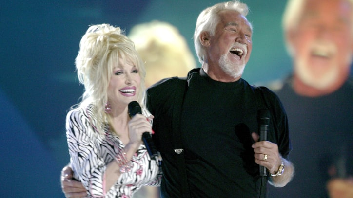

R. Kelly Scandals: From Underage Bride to Alleged Cult

A timeline of accusations, lawsuits and charges, including child pornography and sex with minors, against the embattled R&B singer

](http://www.rollingstone.com/culture/news/r-kelly-scandals-from-aaliyah-to-alleged-cults-w492844)
[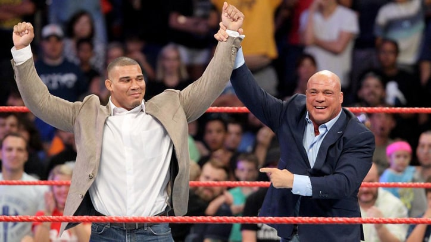

'Dunkirk': Christopher Nolan's WWII Epic Is a Masterpiece

Filmmaker's recreation of key British battle is stunning, stirring – and a stone-cold masterpiece

](http://www.rollingstone.com/movies/reviews/peter-travers-dunkirk-may-be-greatest-war-film-ever-w492668)

[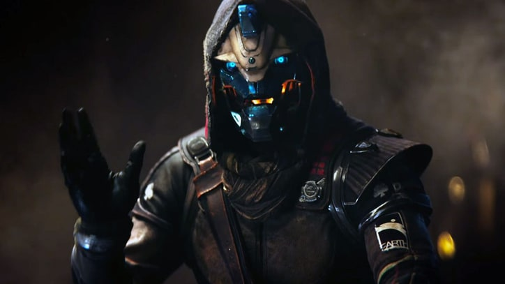

Kenny Rogers, Dolly Parton Announce Final Performances Together

Collaborations will be the centerpiece of a tribute concert to Rogers in Nashville in October, featuring Little Big Town, Flaming Lips and more

](http://www.rollingstone.com/country/news/kenny-rogers-dolly-parton-set-final-performances-together-w492714)
[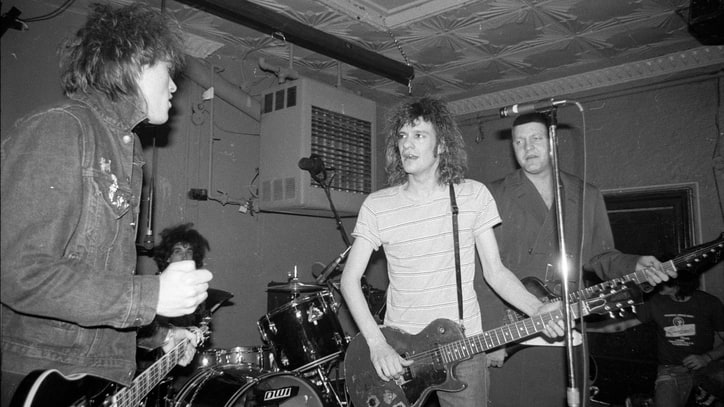

What Miranda Lambert's Album Sales Say About Sexism at Country Radio

With minimal radio support of singles like "We Should Be Friends" and "Tin Man," 'The Weight of These Wings' reaches Platinum status of one million copies sold

](http://www.rollingstone.com/country/news/what-miranda-lamberts-sales-say-about-sexism-at-radio-w492857)
[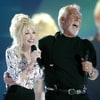

How to Get Into the 'Destiny 2' Beta Without a Code or Pre-Order

No pre-order? No problem!

](http://www.rollingstone.com/glixel/news/how-to-get-into-the-destiny-2-beta-without-a-code-or-pre-order-w492926)
[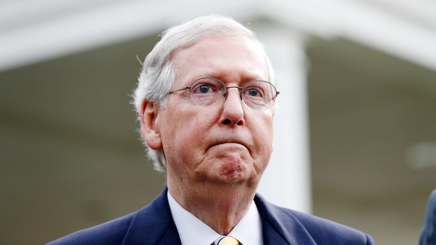

'Destiny 2 Beta' Offers a Tantalizing Glimpse at a Impressive Shooter

We played the beta – here's what we think so far

](http://www.rollingstone.com/glixel/news/destiny-2-beta-hands-on-impressions-w493022)
[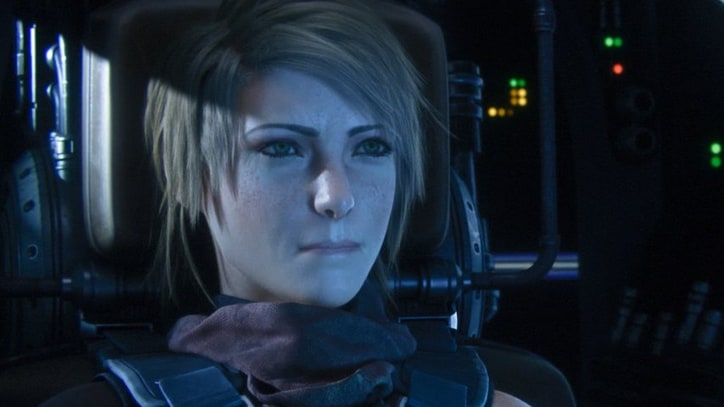

Why Mitch McConnell's Latest Obamacare Repeal Effort Imploded

Several Republican senators quickly quashed the idea of repealing the existing health care law without a replacement

](http://www.rollingstone.com/politics/features/why-mitch-mcconnells-latest-obamacare-repeal-effort-imploded-w492869)
[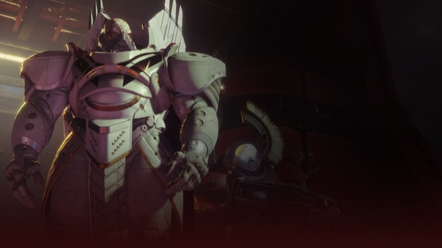

How This Twitter Comedian Fights 'Numbness' of the 'Endless Scroll'

Comic Jaboukie Young-White talks about the symbiotic link between social media and standup routines, politics, why he loves memes

](http://www.rollingstone.com/culture/features/twitter-comic-jaboukie-young-white-fights-2017-numbess-w491153)
[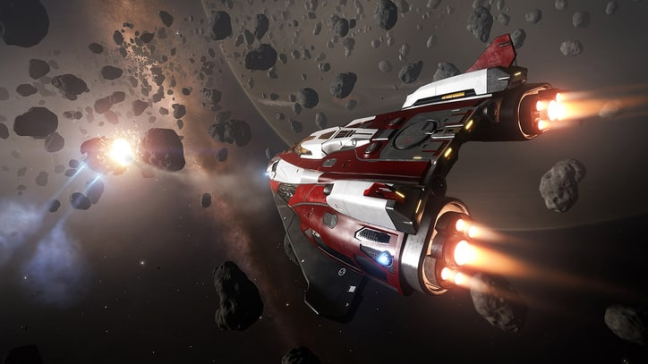

Hear Nine Inch Nails' Unsettling New Song 'This Isn't the Place'

Track is second offering from band's upcoming EP, 'Add Violence'

](http://www.rollingstone.com/music/news/hear-nine-inch-nails-eerie-new-song-this-isnt-the-place-w492951)
[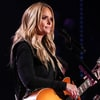

'Destiny 2' Beta: How, When and Why to Play

Everything you need to know to get into Destiny 2's early access

](http://www.rollingstone.com/glixel/news/destiny-2-beta-how-when-and-why-to-play-w492835)
[

Watch James Franco Recreate Tommy Wiseau's Cult Classic 'The Room'

Actor stars as bumbling auteur in hilarious first clip from 'The Disaster Artist' 

](http://www.rollingstone.com/movies/news/james-franco-remakes-tommy-wiseaus-cult-classic-the-room-w492819)
[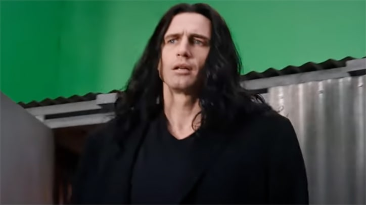

WWE Raw: Jason Jordan Is Kurt Angle's Son?

It may not have shocked the world, but their family reunion is alpha-ready 

](http://www.rollingstone.com/sports/news/wwe-raw-kurt-angle-reveal-helps-jason-jordan-w492949)
[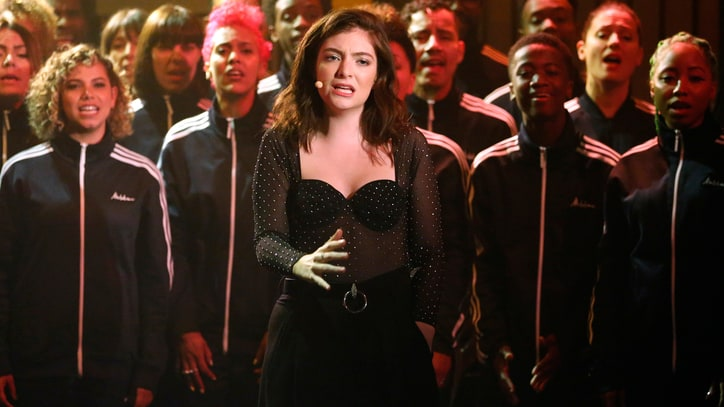

Replacements Unearth 1986 Concert for 'Live at Maxwell's'

Hear "Can't Hardly Wait" from intimate New Jersey gig, 30 years after band recorded show

](http://www.rollingstone.com/music/news/replacements-unearth-1986-concert-for-live-at-maxwells-w492369)
[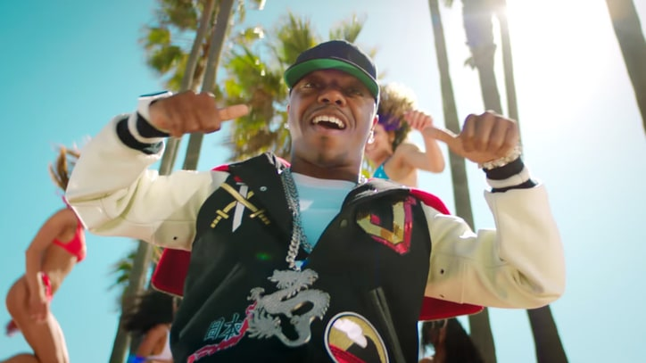

See Chris Stapleton's Mesmerizing 'Today Show' Performances 

Singer and his stripped-down core band delivered "Broken Halos," "Tennessee Whiskey" and "Second One to Know"

](http://www.rollingstone.com/country/news/chris-stapletons-broken-halos-see-today-performance-w492871)
[

Watch Sisqo, Jcy's EDM Remake of 1999 Hit 'Thong Song'

"I thought it was dope and figured maybe it was time to put some new rims on the Bugatti," R&B singer explains

](http://www.rollingstone.com/music/news/watch-sisqo-jcys-edm-remake-of-1999-hit-thong-song-w492925)
[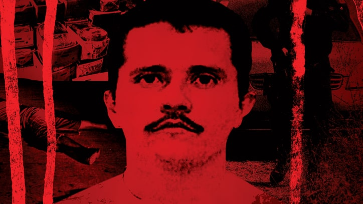

See Lorde Belt 'Perfect Places' With Choir on 'Seth Meyers'

Singer also reveals she was stuck on an NYC subway for four hours while working on 'Melodrama'

](http://www.rollingstone.com/music/news/see-lorde-belt-perfect-places-with-choir-on-seth-meyers-w492859)
[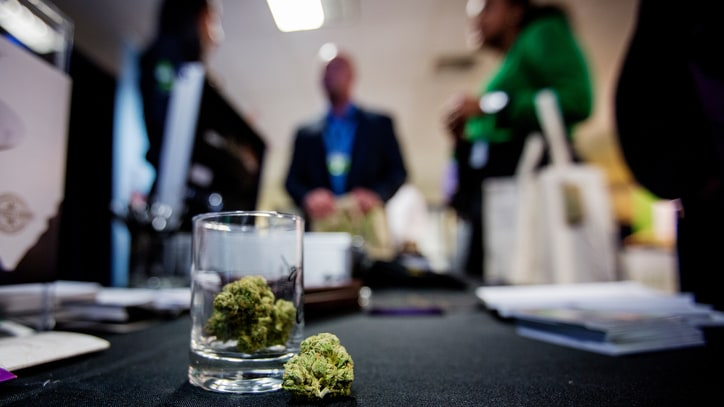

Can Oakland Help Solve the Weed Industry's Diversity Problem?

People of color have been largely left out of the Green Rush – but this Bay Area city has a plan to turn that around

](http://www.rollingstone.com/culture/features/can-oakland-help-solve-the-weed-industrys-diversity-problem-w491059)
[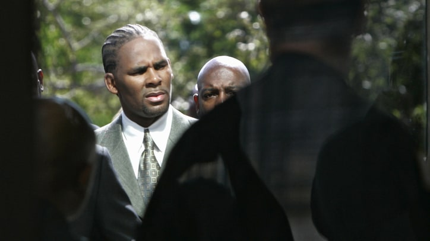

The Brutal Rise of El Mencho

With El Chapo behind bars, an even more dangerous drug lord has emerged. On the hunt for Mexico's next-generation narco 

](http://www.rollingstone.com/culture/features/the-brutal-rise-of-el-mencho-w491405)
[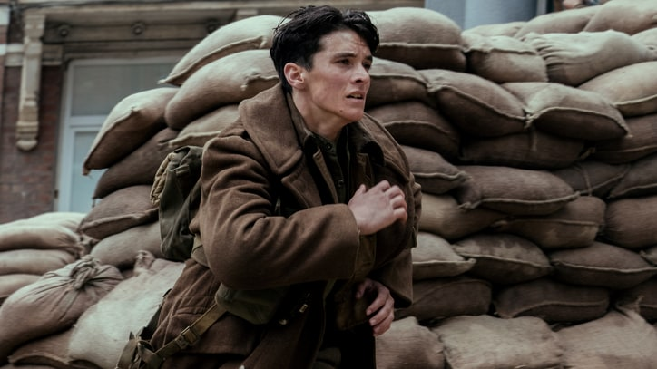

The Space Game Packed with 160,000 star systems and a Cut-Throat, Capitalist Society

Elite: Dangerous creator David Braben discusses politics, science fiction and what's next for his game

](http://www.rollingstone.com/glixel/features/elite-dangerous-creator-talks-sci-fi-politics-and-whats-next-w492781)
[

See Stephen Colbert Drink Vodka, Joke About Trump on Russian TV Show

'Late Show' kicks off "Russia Week" with behind-the-scenes clip of recent appearance on state-sanctioned talk show 

](http://www.rollingstone.com/tv/news/watch-colbert-swap-trump-jokes-with-russian-late-night-host-w492843)

* © Rolling Stone 2017
* [Digital Edition](http://www.rollingstone.com/latestissue)
* [Subscribe](http://www.rollingstone.com/footer-subscribe)
* [Give a Gift](http://www.rollingstone.com/footer-gift)
* [Coverwall](http://www.rollingstone.com/coverwall)
* [Contact](http://www.rollingstone.com/services/contactus)
* [Privacy Policy](http://www.rollingstone.com/services/privacypolicy)
* [Your Privacy Rights](http://www.rollingstone.com/services/privacypolicy#california)
* [Your Ad Choices](http://www.rollingstone.com/services/adchoices)
* [Terms of Use](http://www.rollingstone.com/services/terms)
* [Customer Service](http://www.rollingstone.com/customerservice)
* [Advertise](http://www.rollingstone.com/services/pages/advertising-terms-and-conditions)
* [Sitemap](http://www.rollingstone.com/services/sitemap)

|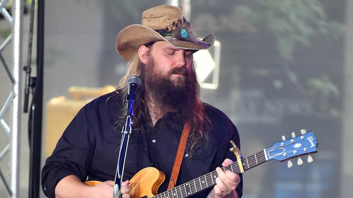

|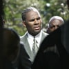

|%!(EXTRA markdown.ResourceType=, string=, string=)

|
|%!(EXTRA markdown.ResourceType=, string=, string=)

                                                                                     |%!(EXTRA markdown.ResourceType=, string=, string=)

                                                                                                                                 |%!(EXTRA markdown.ResourceType=, string=, string=)

|
|%!(EXTRA markdown.ResourceType=, string=, string=)

                                                                                     |
                                                                                                                                                                                   |%!(EXTRA markdown.ResourceType=, string=, string=)

|
|%!(EXTRA markdown.ResourceType=, string=, string=)

                                                                                     ||%!(EXTRA markdown.ResourceType=, string=, string=)

|%!(EXTRA markdown.ResourceType=, string=, string=)

|

                                                                            |%!(EXTRA markdown.ResourceType=, string=, string=)

|
