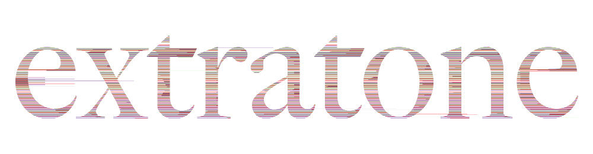

## A comparatively-short summation of our exponentially-increasing traffic and a celebration of the arrival of some great folks.

Welcome to our fake news website.

Yes, I think it best to just get it out of the way. Regardless of politik, the public is acutely more aware of the state of the American intellect since the last time I wrote you. Some of our staff believes that Donald Trump is more representative of our [_new_](http://extratone.com/about) than any candidate has ever been, while most are in varying intensities of resolute opposition.

If we industry folk are all honest with ourselves, though, it is the time to be in the media culture's orbit, if only for the spectacle.

As I write, "post-truth" is on the masses' hands and lips, and Facebook is under accusation of all but treason. (And such language is finally under widespread mainstream scrutiny.) There has never been a better time to talk about communication. There has never been a better time to talk about relevance.

Superb timing, eh?

I've been praying to the Sun lately, and I think it must be working.

I have now spent half a year doing my best to incentivize a community of talented futurists into being.  
I have been Webmaster, Mentor, Data Warden, Entrepeneurial Hermit, and Foe.  
I have descended into tremendous debt and premature senility.

I have forsaken as many of my bitter old quips for newfound knowledge as has been feasible and it looks like I'll only be getting softer.

I have begun many friendships, and strengthened plenty of existing ones.

In just a few weeks, my perception of this project and my role in it has gone from acting as a howling, irrelevant, old creature to something and someone with a tangible agenda. Loose ends have been rectified, the site is looking better than ever, our Discord is active daily, and our pool of contribution continues to grow exponentially.

Some of the growth is measurable - we're rapidly closing in on 200 total posts. Most is less tangible.

I'd like to mention and thank a few especially substantial individuals who've graced us with their effort this month.

[Cil](https://twitter.com/robotposter), Chief Technical Officer  
[Emily Waters](https://twitter.com/EmilyEWaters), Production Editor  
[Chris](https://twitter.com/AwkwardOrpheus) and [Ian](https://twitter.com/Nogisa_), our new [_Futureland_](http://www.extratone.com/drakesville/futureland) cohosts.  
[Wabi](https://twitter.com/WabiMusic), Music Editor  
The cinema hunks and babes behind [_The Movie Closet_](http://www.extratone.com/drakesville/moviecloset)_._  
[anonymoist](http://www.extratone.com/drakesville/author/anonymoist/), Poetry Contributor

## Editorially

_Extratone_ is far from a news service, so we are spared most of the burdens of political publishing. The outcome of the United States' Presidential Election, though, is of unusual importance in our industry. This week, it has been suggested that "fake news" distributed by Facebook could've had a significant enough impact on voter sentiments to be worth "investigation."

Here's a kicker: were we aggregated by Facebook in addition to our page, we would've undoubtedly been subject to any and all scrutiny levied by individuals and/or institutions who maintain "truth" as an absolute - or even just tangible - concept.

There is something that needs to be said on behalf of those of us who plan to stick around for awhile: **we no longer have the time to redundantly make our intent explicitly known**. In many cases, we even find it patronizing. I have all but resigned from writing "dishonestly," but a good portion of our prospective content argues ingenuinely, though we don't use Twitter as a singular source, at least.

https://twitter.com/extratone/status/800350781996204032

Clearly, a distinction must be made - one more time - between **news** and **entertainment**. We are here to fulfill a function, (I hope,) but it's rarely a purely informative one. Technically, we are here primarily to discuss and scrutinize relevance as a concept, which - conveniently - is awfully relevant.

Six months ago, I started this thing with respect for audience volition as a primary editorial guideline. Our readers are intelligent enough to discern our role for themselves. We believe this assumption is a distinctly reverent and progressive fundamental of futurism.

Obviously, this week's "[post-truth](https://theconversation.com/why-journalistic-balance-is-failing-the-public-68783)" buzz is not something I am qualified to discuss in a meaningful way. (Though it is a fascinating conversation.) Nor would it be appropriate for me to journey much further in the voice of _Extratone_'s editorial whole.

## Visually

[_The Verge_ 3.0](http://www.theverge.com/2016/11/1/13484656/verge-5th-anniversary-relaunch-2016)'s launch inspired me to celebrate our six months by playing around with the logo. (Though I do that occasionally anyway - unconsciously torturing the original with destructive Gimp scripts.)

Though _Distressed E_ (right) was originally intended to be evicted after midnight, I think it actually looks great up there, and the feedback from staff and friends alike was overwhelmingly in favor of a longer-term lease.

I've also removed "Rediscovering Relevance" for the time being. It will be back - just not in the same form, perhaps. When viewed in a narrow enough window, the logo below will take _E_'s place.

## Audibly

If you recall how much I've been hassling everyone in reach for music-related opinion, you'll be relieved to hear that Music Editor [Wabi](http://twitter.com/wabibeats) has published two absolutely brilliant episodes of [_Web Crates_](http://www.extratone.com/drakesville/crates) - his new exploratory podcast and outlet.

Meanwhile, [_The Movie Closet_](http://www.extratone.com/drakesville/moviecloset) is in the midst of a month-long, four-part series of "favorite film" episodes which are - as always - charmingly entertaining and fantastically well-produced.

I think we've managed to turn [_Futureland_](http://www.extratone.com/drakesville/futureland) - our flagship technology show - into a more-than-worthwhile listen thanks to Cil's enlistment, Chris, Ian, and Emily's participation, and a general refocus on higher-quality, spectacle-enhanced discussion.  
  
[DangerBoy](http://twitter.com/dangerboy) was kind enough to join me for a chat about the implications of Vine's mortality on the first installment since the name change, and plans to contribute original content of his own in the near future.

In fact, we have [anonymoist](http://www.extratone.com/drakesville/members/anonymoist/) to thank for the only written content yet published this month. As I suspected, it's nice seeing prose on our front page again.

## The Plan of Action

A push for words in the coming weeks. The staff has some exciting storytelling in the works and I - at least - am looking forward to reading it all in Garamond. I hope you are, too.

I can't tell if my neglect for these past two letters has been out of a lack of discipline or a newfound contentment thanks to the regulars that now actively inhabit the [Discord](http://bit.ly/extratone). It's conceivable that they'll progressively become more and more version notes-like, which is probably for the better.

**Something really clicked this month.**

After a third of a year of solitude in this pursuit, there are now a core group of people (see above) that demonstrate their interest **daily**, and their arrival has given me incommunicable reassurance. For the first time, I no longer feel like a heckler when we record podcasts. That, alone, is huge. Without a budget, I am at a loss for methods of sufficiently thanking them. I can only hope that constant appreciation will suffice for the immediate.

Donald Trump may be President of the United States, but Extratone is growing and gaining, and he is not the future.

Before I go until my last [_Freq Check_](http://extratone.com/freq) of the year, I leave you with a [prayer](https://youtu.be/0axs_A20MN8):

Futureland  
and I believe  
the night is over  
let the light fall on me  
  
Futureland  
all history  
is just a dream  
a fire burning so high
