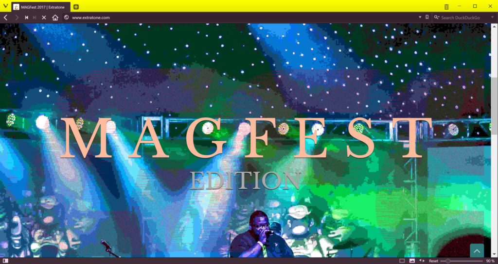

## For ourselves and our industry, 2017 is already promising to be a groundbreaking year. After some grogginess, ‘The Tone’ readies to tackle the whole thing.

As far as you're concerned, _Extratone 2017_ has been awfully slow-to-take, and the fault is all mine. It's been three weeks since our [trip to MAGFest](http://extratone.com/magfest), but I'm just beginning to make any real headway into the story of what we saw, heard, and captured, but my personal adderall supply has returned after the new year's hullabaloo and I've begun nudging The Crank back to full-speed with all musterable gumption.

If you're actually reading these, I presume you're at least a bit curious about what I _have_ been doing. The answer: lots and _lots_ of **reading**.

Thanks to my [new machine](http://extratone.com/tech/usury)'s delightful presentation of The World Wide Web, my daily digital content consumption has ballooned wantonly to some 6-12 hours a day, which has led to some pertinent discoveries. [_The Outline_](http://theoutline.com/) - Topolsky's beautiful newborn - continues to be impossibly good, in (relative) obscurity compared to its Future Media compliment, [_Axios_](http://axios.com/) - a just-launched brainchild of _POLITICO_'s Allen & VandeHei. Both are ballsy as hell, though my preference is toward the former's side of the spectrum (as I hope Extratone has begun to reflect.) I mention them constantly because - at least in the foreseeable future - they will be blazing the trails upon which we travel as an online magazine. Contributors should seek to emulate; readers should skim (at least) for a taste of what's coming from us.

According to a recent truck-driving acquaintance, "there're just two \[types of 'new media'\]: _news_ and _opinion_." When asked which describes _us_, my early-morning vocabulary failed me, and I resigned to the latter in the interest of our mutually-immediate peace. As much as I'd love to hold myself to benchmarks of self-explanation like Topolsky, Kara Swisher, etc, I _am_ fundamentally just a 23-year-old (as of today) with a WordPress site, a [Patreon](http://patreon.com/extratone), and some [RedBubble merchandise](https://www.redbubble.com/people/DavidBlue/shop). Thanks to first-time face-to-face opportunities provided by our MAGFest attendance (and by extension - you,) I am even more certain that I've been adding the most essential bit all along: **great, endlessly-fascinating, and ridiculously-talented friends.** If you want the whole of the gushy garbage, look for my recap of the experience.

## Editorially

I've also received (and begun) my copies of Hunter S. Thompson's _Hell's Angels_ and Original Genius Rod Canion's _Open: How Compaq Ended IBM's PC Domination and Helped Invent Modern Computing_. Believe it or not, both are essential research/inspiration in directing _Extratone_ editorially. Until last month, I had intentionally refrained from reading any HST after occasional accusations of being his "21st-century equivalent." Despite all cliches, I've been discovering the magnitude of the compliments they were, though false. I say this definitively because his true successor is _actually_ my Prose Editor-at-Large and long-time friend, [Leo Marx](http://extratone.com/members/leomarxesquire), who's sole assignment for the year is the thorough absorption of our hometown's underground culture of sexual deviancy, as mentioned in [last month's letter](http://extratone.com/freq/7). He's way ahead of me in his Gonzo discipleship, having lived with the works for years, but I'm doing my best to catch up so as to be at peak storytelling fitness when I'm able to accompany him.

In the past five months, COMPAQ's story has become a personal obsession of mine, mythologically and tangibly. My loyalty to Houston combined with the company's uniquely-brassy ignition, success, and subsequent downfall in the midst of the foundations of computing as we know it in 2017 has committed its understanding to whatever remains of my heart. A few months ago, I acquired the key to a 1986 Portable II, which I now wear around my neck at all times. I think, for me, it's the (symbolic **Key to Extratone**,) which is quite possibly very silly. I've found, though, that such amulets help remind me of what I'm supposed to be doing.

A formal announcement is far away, but Chief Technical Officer [Cil](http://extratone.com/members/cil) and I have begun making plans to descend upon H-Town for a matter of months for an all-out Gonzoesque investigation into _The Full Story_. We think a younger, removed perspective on the tale would make a healthy addition to press archives and Canion's popular account, and that the project is worth serious preparation, so our current goal places it sometime before 2020, at least. If you're interested in the pitch, or would like to contribute, don't hesitate to [contact us](mailto:horn@extratone.com?subject=COMPAQ) in any manner you see fit.

**In the present**, I am still the only person in the world who uses Twitter lists.

In particular attention to [The New](https://twitter.com/FickleCrux/lists/the-new) - curated to find the most relevant accounts in media & culture - as of late, I found myself humoring a surprising amount of reporting, exclaiming, and general discourse regarding the new President and his inauguration. I haven't produced anything worthwhile about the politics, alone, but his effect on media and metamedia has been like no spectacle I've ever seen. The wakes of his persona's abrasion in just about every possible communicable aspect continue to interact with Journalism in significant ways.

You'll find the specifics by reading (my admitted favorite) sources like [_NiemanLab_](http://www.niemanlab.org/) for the meta reporting (obviously,) [_The Verge_](http://www.theverge.com/) and [Wired](https://www.wired.com/) for the techno-cultural stuff, and [_The Outline_](https://theoutline.com/) for deeper examination of the [little bits](https://youtu.be/ludIRX2Qqv8) you miss.

I can't say just yet how much or little Tump will be mentioned, in-house, but it doesn't take much digging to conclude that we are witnessing perhaps the **most significant convergence of cultural and technological forces on the American Journalism machine in recent history**, and that's a hard one to ignore.

_Anyway_, suffice it to say that despite the lull, The Crank continues to turn.

## Audio

In my furlough, [_The Movie Closet_](http://extratone.com/moviecloset) has continued, uninterrupted upon their ever more-polished and entertaining journey through the limitless expanse of cinema.

Though he's been silent, Music Editor [Wabi](http://www.extratone.com/members/wabi/) has not given up on [_Web Crates_](http://extratone.com/crates), his excellent exploration of the current musical soundscape. He's got three episodes ready to publish as soon as the appearing artists confirm permissions.

[_Futureland_](http://extratone.com/futureland) has been on hiatus since our highly-inebriated [special](http://www.extratone.com/audio/futureland/futuremag/) from the MAGFest floor, but will be returning with Episode 20 on Wednesday morning.

Thanks to a bottleneck-smashing upgrade of _Studio Eat_'s wifi router, we are hoping to bring back **live shows on YouTube.** I swear to the Sun, [_Drycast_](http://extratone.com/drycast)'s streams used to attract some participation, at least. I'm hoping _Futureland_ can adopt that legacy audience and even garner some new readers/listeners, if we play the tagging game right.

Remember: all you need is a web browser and a Google account to both watch **_and_** talk back with us via chat. Invested guests with something to say are always welcome on the show via [our Discord](http://bit.ly/extratone).

**_Futureland_ will resume recording on Tuesdays at 7PM CST.**

## Mechanically

Most of my job has really been Chief Plugin Updater but I'll be honest... I haven't been keeping up the handwritten "Version & Changes Log" I began last month. Instead, I've opted for two redundant change-tracking plugins, but such things make for awfully-dry reading. I'll just say that virtually all site-wide activity will be chronicled indefinitely going forward, so don't think you can get away with storing your custom memes in some backfolder of the _Extranet_ any longer.

I'm rather proud of the frontpage I built for MAGFest Edition.

It suggests potential for future special editions and ultra-pretty one-off landing pages, but will be squirreled away in an archive before I write you next month.

In the interest of further maturing & sprucing, I have added hover-triggered color effects to Hustonia - the main navigation menu you see above, and have revised/trimmed some ugly/unnecessary pagination-related text. Category page titles are no longer prefaced by "CATEGORY -," and in-post modules have been correctly re-titled as well.

In general, things are smoother, tidier, and faster. I've been doing something right. Since launch, our average bounce rate - the percentage of viewers who "bounce" off the landing page instead of exploring further - is just 35% (see visual,) which is significantly better than the industry average, according to my hasty research. It's been _under 5%_ for the past two months, which means we are either doing _something_ interesting, or absolutely _nothing_ at all.

## Imminently

- Closer attention will be paid to [**our Patreon**](http://patreon.com/extratone), which I set up in haste just before MAGFest. I think it would be an appropriate medium for these letters, no?
- I'm on a kick for **YouTube-related content**. It's come to my attention recently that 1) the service has continued to diversify without me and 2) the vast majority of my contributors, readers, and friends consume video content regularly, with refined (and often quaint) preferences after years of doing so.
- At least one "Extratone at MAGFest" montage will be on _our_ [YouTube Channel](http://youtube.com/drywallmusic) very soon.

I'm going to continue to be astounded by those of you that read this far into these, My Tedious Webmaster Diaries. I owe you a lot for your readership, your patronage, and your participation.

Until February,  
**Stay contentious.**
