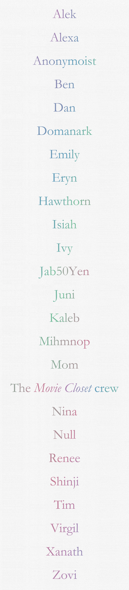

For the most part, we've been taking it easy since our one-year celebration, [last month](http://extratone.com/freq/12), aside from [Isiah](https://twitter.com/ammnontet), who’s account of his [5-day-long soylent fast](http://bit.ly/isiahsoylent) will make you laugh, reflect, and shiver, all at once.

The rest of our expended energy was in audio, after Anchor [featured our station](http://bit.ly/anchorfeatured) on their music channel. [_The Movie Closet_](http://extratone.com/moviecloset)’s [39th episode](http://bit.ly/moviecloset39) regarding PIXAR films is some of the most powerfully nostalgic content we’ve ever published.

Visually, we've continually diversified, polished, trimmed, and decluttered. Our landing pages have matured colorfully, and the template has been virtually perfected. Elements can now be reordered, spawned, or removed in seconds, without necessitating adjustment of others.

I told you [last month](http://bit.ly/freq12) that my gift to _Extratone_ for its first birthday would be a [bespoke masthead](http://extratone.com/masthead).

## Editorially

It’s unfortunate that _I_ of all people have been and will continue to be responsible for _branding_ in the near future. I’ve never been a very good salesman, and the language I’ve contributed to _Extratone_’s brand image has often been criticized as ostentatious: [the latin mantra](http://bit.ly/scribam), staff-given titles, and my use of legacy journo words like “masthead.” Until last week, the short description on our [Twitter](http://twitter.com/extratone), [Facebook page](http://facebook.com/extratonemagazine), [YouTube channel](http://youtube.com/extratone), [Anchor station](http://extratone.com/anchor), etc. was copied from the beginning of our [About page](http://extratone.com/about), and dated back to the first few days of the project.

_An online magazine covering technology, music, culture, and media from an exclusively-youthful perspective._

Ugh.

It doesn’t sound like a very fun place, does it? I’ve been pitifully devoid of alternative descriptors to “youth” or “fresh.” The most apt summary I’ve come across is that of [_The Last Magazine_](https://thelast-magazine.com/info/) and well… I can’t use that now, can I?

I _did_ come up with something, thanks to Anchor. (The old one wouldn’t fit.) I want you to try it on for size.

Ready?

**_An online magazine for the new curious._**

As in, those individuals possessing a _new curiosity_. Or, perhaps - those new individuals who are curious.

My hope is that it is not passed over because of its vagueness, at first glance - that the reader, in asking these questions internally, if only for a moment, will arrive at a significantly more precise conception than the old one lent to, but I am notoriously confusing, so I will always welcome [your suggestions](http://extratone.com/bilge).

I’ll be honest with you - I wasn’t entirely happy with the idea of a digital-only future for _Extratone_, but I’d conceded to the reality I was sure of, given my experience: the only print magazines worth circulation will be those that began that way.

However, Hawthorn - with significantly more experience occupying the Northwestern U.S. - insists that our prospects for pure circulation in the Portland and Seattle area are actually _better_ in print. Apparently, that’s how things are done there.

It’s still a pipe dream to be able to one day smell my creation, albeit less of one.

[_The Tone_](http://bit.ly/thetone) has gotten itself into a bit of a rhythm of subjects - **DIVISION**, **ART**, and **MEDIA**. Did ya notice?

## Audio

I had a feeling that Anchor’s company culture would be a good match for ours, but I did _not_ expect to receive an email from them, asking to feature our station. They were tremendously kind and patient, even when I screwed up a bit of legal language and didn’t respond for 15 hours. I was given a choice between the Tech, Music, and Culture channels. I thought music made the most sense. Feel free to [kick my ass](mailto:davidblue@extratone.com) if you disagree. We were also encouraged to continue using “other elements,” and told that “variety is always a good thing,” which is obviously very freeing and on-brand as hell.

It’s been a fun three weeks. Subscribers can listen to the archives of our [first full-scheduled day](https://www.patreon.com/posts/archived-our-day-11592398), Hawthorn’s [_Summer of Digital Heartbreak 2017_](https://www.patreon.com/posts/archived-summer-11609737) playlist, and Tim’s [ultra-cool indie dive](https://www.patreon.com/posts/archived-tims-11643732). 

The Anchor community has already been unbelievably welcoming and supportive, including [Maya](https://twitter.com/mayafish) (who originally contacted me and put up with my negligence,) [Grant](https://twitter.com/gmanteer) (who hosts [_Podcast of the Day_](https://anchor.fm/potd) on Anchor and was the first intelligible caller on the station,) and many other already-memorable names who’ve consistently listened to and ‘applaud’ed our radio content despite its… breadth.

## Mechanically

Astonishingly, I think I found an almost-compelling reason for us to have a Facebook page… A MailChimp-integrated Email tab!

Wow. 

I don’t think I’ve _actually_ seen a useful application for Pages before. This is a huge milestone. Please be sure to select/tap/click that "[Newsletter](http://bit.ly/thetonefb)" tab with haste.

Also, I have revised the site-bound [signup page](http://extratone.com/email) and [frontpage element](http://www.extratone.com/june12/), as well.

## The Future

[Eryn](http://extratone.com/scout), [Madeline](http://extratone.com/dixie), and [I](http://extratone.com/bilge) are just short of releasing an introductory episode for [_Running Down a Dream_](http://extratone.com/dream)\- a podcast pitch conceived of to encapsulate the ludicrous, spectacular, and sometimes frightening experiences we’ve fostered for a year, now, returning to our rural, small-town origins.

At least one feature from [_True/False_](http://www.extratone.com/tf/) 2017 is coming your way from me, very soon, as are local stories from ever-varying perspectives.

Now, though, we are busy watching the _24 Hours of Le Mans_. If you feel like joining us on social, you’re more than welcome.

Till next month,

