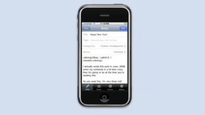
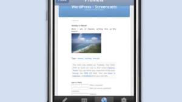
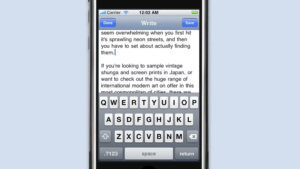

# WordPress for iOS

## The WordPress mobile app remained little more than an afterthought until this year’s astonishing updates.

---
title: "WordPress for iOS"
date: "2020-08-08"
---

_I wrote the entirety of this post - from inception to publication - using Version 15.4.0.2 of the [WordPress for iOS Beta](https://testflight.apple.com/join/AkJQt8Pw)._

There has never been much reason to give a shit about the WordPress app on iOS. It’s always been a mediocre way of making quick edits/basic editorial changes on the go. If I had to guess, the vast majority of users who’ve downloaded it have done so in haste - to correct spelling, erase slurs, trim duplicates, quickly disappear drunk posts, swap images, etc. It’s been far too long since I first found myself compelled to do so to remember _why_, but I _can_ tell you it occurred on January 14th, 2015 - the day before I [first discovered](https://twitter.com/neoyokel/status/555681940418748418?s=21) the EAT theme.

https://twitter.com/neoyokel/status/555681940418748418

Astonishingly - with too much of my lifetime spent digging through the multiple developer blogs relating to the iOS app - I discovered the [original announcement post](https://apps.wordpress.com/2008/07/22/wordpress-for-iphone-available-now/) for the iPhone app’s release as well as a [slightly-earlier one](https://apps.wordpress.com/2008/07/10/wordpress-for-iphone/) from July 2008 including a precious, [extremely rare video](https://videopress.com/v/GyIzZkju) of the app’s original version being demonstrated.

<iframe width="auto" height="auto" src="https://www.youtube.com/embed/yqr62jZogxU?controls=0" frameborder="0" allow="accelerometer; autoplay; clipboard-write; encrypted-media; gyroscope; picture-in-picture" allowfullscreen></iframe>

While the app is surprisingly pleasant to compose with, now (somehow,) I’m afraid I do not have it in me to chronicle the rest of its 12 year history for you. Take a moment to [scroll through](https://media0.giphy.com/media/lqdl6Q2enVCcQOaVOr/giphy.gif?cid=4d1e4f291ba822919a1d8ee4279fa6e7f37b0edb9b07c5bc&rid=giphy.gif) the reviews on its [app store page](https://apps.apple.com/us/app/wordpress-world-stickers/id1139958755) and you’ll notice a fairly stark point in the past year at which the jist of the most positive transitions from _adequate_, _functional_, (essentially where they’ve been for the entire history of the app,) to _really good_. You’ll notice even in the media surrounding the adaptation of Gutenberg blocks to iOS [in February](https://make.wordpress.org/mobile/2019/02/26/the-block-editor-is-coming-to-the-mobile-apps/) that _a lot_ has changed about its UI since then.

- 
  
- 
  
- 
  
- 
  
- 
  
- 

The shear amount of improvement since Winter compared to the state of general stagnancy it’d endured for years arouses curiosity regarding the _incentive_ behind the new effort. Well, just last month, WordPress hosted a live “[webinar](https://youtu.be/qBZIU_I49H8)” specifically dedicated to demonstrating the capabilities of their new mobile experience.

<iframe width="auto" height="auto" src="https://www.youtube.com/embed/qBZIU_I49H8?controls=0" frameborder="0" allow="accelerometer; autoplay; clipboard-write; encrypted-media; gyroscope; picture-in-picture" allowfullscreen></iframe>

I simply have zero desire to watch through that recording, but I would like to respond to one particular capability the [event notes](https://wordpress.com/blog/2020/06/19/wordpress-mobile-apps-webinar/) emphasized: **site creation**. As far as administrative tasks one should ever expect to perform on a mobile handset, actually _creating a new website_ is extreme from just about any perspective. There is absolutely zero legitimate reason for anyone to be launching new WordPress installations at any volume on the go, and therefore none to invest any time or effort whatsoever into making the process easier. However, in the course of my own rough, completely unrehearsed [demonstration](https://youtu.be/BYOdugyqV34), it took me less than _four and a half minutes_ from opening the app until pisscore.wordpress.com was launched and online with _real content_.

<iframe width="auto" height="auto" src="https://www.youtube.com/embed/BYOdugyqV34?controls=0" frameborder="0" allow="accelerometer; autoplay; clipboard-write; encrypted-media; gyroscope; picture-in-picture" allowfullscreen></iframe>

From here, I think we should look back again for just a moment at that [February announcement](https://make.wordpress.org/mobile/2019/02/26/the-block-editor-is-coming-to-the-mobile-apps/) of Gutenberg block integration into the mobile WordPress app:

> For this first version, our main focus was to build a pleasant writing experience with support for the most basic types of content. Our data showed that 90%+ of the posts created on the mobile apps consisted of basic text and images, so we decided to focus on supporting the Paragraph, Image, and Heading blocks on this version.
> 
> “[The block editor is coming to the mobile apps](https://make.wordpress.org/mobile/2019/02/26/the-block-editor-is-coming-to-the-mobile-apps/)” | _Make WordPress Mobile_

I would surmise that the introduction of the first new from-scratch editor in WordPress history spearheaded the seismic shift in the quality of the app’s design. “We did a lot of work on making sure the little things that you would expect to work on an editor were there,” continues Jorge. The effort has resulted in the apparent solution to the dominant obstruction to actually _composing_ in the WordPress app as I saw it: **one can now trust the app to save progress enough to feel comfortable writing here**. In the course of this writing, I only received the once-dreaded “post failed to upload” error a single time, after which one retry immediately resolved it. The last time I logged into a property on the WordPress app, just briefly _viewing_ content caused unwanted changes/fucked up formatting that had to be corrected from the web admin panel. So far, this seems to have been [completely resolved](https://9to5mac.com/2019/07/30/wordpress-ios-app/).

Before I go on, let me just acknowledge that it has always been possible - if a bit clunky - to log in to the full web WordPress admin dashboard on mobile browsers. When _[Extratone](https://extratone.com)_ was still running on pre-Gutenberg WordPress, I kept Google Chrome for iOS on my phone exclusively to interact with the backend this way, which allowed me to make editorial revisions and tweak administrative settings away from my PC. The superior reliability of this method to the WordPress app of the time was _immediately_ evident. From a practical perspective, I’m still not entirely sure why Automatic chose to stick to the idea of a standalone mobile app in the first place. Tasks like theme customization, menu/tag/category editing, and media metadata management shouldn’t be often necessary to do on a cellular phone, and certainly not in any significant quantity.

If an administrator is doing things at all correctly, the full admin dashboard’s compatibility with mobile browsers (which has also [improved](https://media3.giphy.com/media/MFmkQ8vz7f63uZar4K/giphy.gif?cid=4d1e4f29be5b2d528cbffd78861893074d146c6228d0994c&rid=giphy.gif), I’m pretty sure,) should provide more than adequate mobile administrative capability, yet Automatic clearly made a deliberate commitment to backing their own app instead. The only use case worth any justification in this regard almost certainly has to be use on iPad. I am personally far too alienated from tablet use to provide any insight, here, but I’d imagine my argument still stands.

- 
  
- 
  
- 
  
- 
  
- 
  
- 
  
- 
  
- 
  
- 
  
- 
  
- 
  
- 
  

Plugin management on mobile makes sense to a certain extent - the ability to deactivate an errant extension or activate an _Under Construction_ plugin on the fly, for instance - but it definitely ends before the plugin discovery interface, which is the sole half-assed area in the app, almost as if a developer realized its futility midway through the design process. Before you start downloading shit willy nilly to your website on your phone, _just go home_ dude.

This narrative of the handset-dwelling publisher is an interesting one, at least. My criticism is mostly rooted in the fact that I do not know anyone who’d choose an iPhone application as their primary development/publishing environment, but then again, I don’t actually know _anyone at all_, so I’d be genuinely curious to hear about experiences with/opinions on WordPress in any fashion from you or someone you know. Give me a [fuckin ring](https://www.davidblue.wtf/contact), eh?

#software