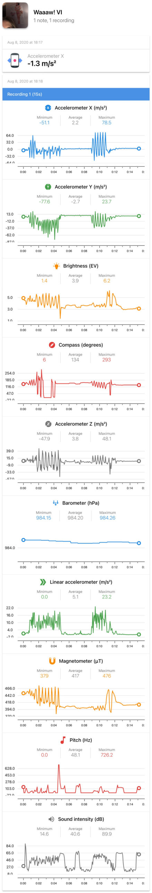

You ever stop and wonder what the fuck you’re doing with your life? I was looking through [Google’s properties on the iOS App Store](https://apps.apple.com/us/developer/google-llc/id281956209) the other night when I discovered [Sci Journal](https://apps.apple.com/us/app/science-journal-by-google/id1251205555) - which is advertised as “the free digital science notebook brought to you by Google,” though some basic research revealed that it’s apparently been [recently acquired by Arduino](https://support.google.com/sciencejournal/answer/9715912). Regardless, all I really care about is the app’s ability to tap into the most basal data coming from my iPhone 8 Plus’ hardware sensors.

https://youtu.be/Bq4MKG0yPag

As with the freedoms [initially allowed by Siri Shortcuts](https://bilge.world/siri-shortcuts-ios12-review) at launch, any tool that allows access to my iPhone's hardware's raw data is exciting. Sci Journal allows one to record data from all three axis of the accelerometer as well as the compass, barometer, light sensor (in the cameras,) and multiple vectors from the microphone. My favorite bit? You can set each parameter to make a sound (as exemplified by [my demo video](https://youtu.be/Bq4MKG0yPag) above.)

[Sci Journal Data (PDF)](https://www.davidblue.wtf/wp-content/uploads/Waaaw-VI.pdf)[Download](https://www.davidblue.wtf/wp-content/uploads/Waaaw-VI.pdf)

After recording, you can export the data to a [PDF](http://www.extratone.wiki/net/index.php/s/p8PAf7rQmXmLYHH) or a "[.sj](http://www.extratone.wiki/net/index.php/s/dDZscgxo5JPr4qY)" file. When I tried to export the "experiment" shown in the video, though, I broke the app. The attached files are examples from a much shorter one.

