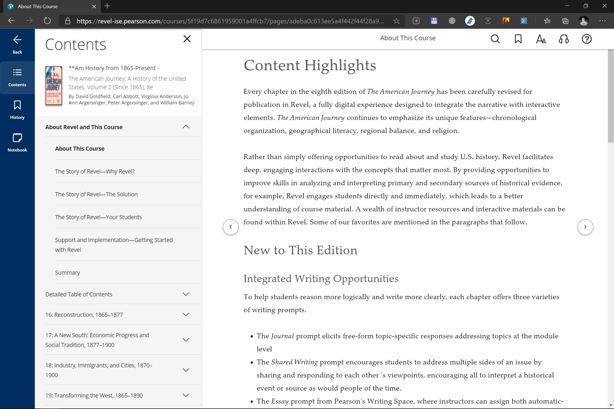

At the beginning of this week, I existed under the _intention_ to go back to school this Fall, but after "meeting" with an especially patient academic advisor from the same community college I dropped out of in 2013\[efn\_note\]Specifically, the same "campus" based in the same mostly-abandoned old mall I also _worked_ full-time in.\[/efn\_note\] on Wednesday, he mentioned just in the last seconds of a 90-minute conversation that I actually had class _that night_ at 6PM, and seemingly all at once, I felt both more anxious and more excited than I had ever been about anything in recent memory. The two days since have been a truly unique experience, so I thought I would fucking _journal_ for you to give myself a bit of a break (yes, I'm already feeling overwhelmed,) so I created the [_Chronicle_ category](http://davidblue.wtf/chronicle) on this goddamned website.

https://twitter.com/NeoYokel/status/1298334207299801091

My anxiety is especially silly considering I only signed up for just **four classes** and also received the wonderful news that I _do not need another math class_ in order to graduate with an Associate of Arts degree in approximately three semesters. You really wanna know what they are? Okay:

1. Composition II
2. Public Speaking
3. American History From 1865
4. Geology

[https://calendar.google.com/calendar/embed?src=9lfkmr0nfgo4sgv7cf27gn6j3iou546l%40import.calendar.google.com&ctz=America%2FChicago](https://calendar.google.com/calendar/embed?src=9lfkmr0nfgo4sgv7cf27gn6j3iou546l%40import.calendar.google.com&ctz=America%2FChicago)

I ended up particularly excited about and engaged in my first assignment for Comp II - it was especially dangerous of my instructor to prompt about my personal writing history:

> Your background as a writer: when did you take Comp I, where? What do you remember about it? Do you write on your own--letters, poetry, fiction, etc? What aspect of the writing process do you enjoy most/least? What type of writing do you enjoy most/least? What are your strengths and weaknesses as a writer? What do you expect to get out of this course (I do not mean in terms of credit or grade)? What do you expect to put into the course?
> 
> The prompt for my first assignment in Composition II: "Introduction of self as writer"

As of this moment, I am fucking 2500 words into the goddamned thing and already feel very sorry for my instructor - so much so that I've included a huge amount of disclaimers like "please feel no _personal_ obligation to actually read this essay in its entirety." It's probably highly telling that I fell so deeply so quickly into it that _I still haven't finished_ even though it was due at midnight on Wednesday. May Gourd save my idiotic soul.

https://twitter.com/NeoYokel/status/1299472928027930627

I'm just going to sprinkle embeds throughout this post that don't have any relevance to the actual content... sorry.

Naturally, my vanity led me to run away with the opportunity to be autobiographical. I think I might eventually adapt the submission to be posted here or on _Extratone_'s Wiki because it's a relatively entertaining review of my public projects in adult life. Therefore, I should probably minimize quoting from it in this particular post beyond this one particularly funny story from my last college writing class experience (Composition I:)

> \[REDACTED\] was my instructor and most definitely the first truly radical Leftist I had ever seen up close.\[efn\_note\]He remains the only teaching figure thus far in life whom I have intentionally (though not necessarily actively) maintained a mutual Facebook friendship of significant value and was quite a profound influence on my perception of academic writing considering how distracted, distant, and wholly over-my-head I was at the time.\[/efn\_note\] He was noticeably late to the first class, into which he glided wearing a dark full-length trench coat and fedora. If memory serves, he began that original three hours with a PowerPoint presentation full of pixelated memes – which were definitely _fringe culture_ in 2012 – and had whipped only the words “WHITE DEVIL” in red ink on the whiteboard\[efn\_note\]Truthfully, I am less than certain this particular detail actually occurred during the very first class, but the jist of the whole was equally outrageous.\[/efn\_note\] by the end of the evening. Tossing in my own quite ignorant late-teen assumptions about the demographics of my fellow students, my punk high school friend and I found that first experience spectacularly surreal and astoundingly bewildering. As I recall, he dropped the class shortly afterward, but I can at least speak for myself when I say that I had never been even _remotely_ as affected by previous classroom encounters of any kind. Looking back, though, the most significant shock was not in fact cultural but _functional_. \[REDACTED\] was the first authority who actually explained a solid handful of institutional systems and processes which had astonishingly, inconceivably, and inexcusably **_never been covered_** throughout a public school career highlighted by a general interest in advanced writing courses: the purpose and abridged history of academic journals, “peer review,” “argument,” and “authority” as academic terms, some sense of the most basic reasons behind academic writing’s relationships with citation as a practice, and additional elements which will undoubtedly continue occurring to me intermittently throughout the rest of my writing life.

There _are_ a bunch of very-insightful bullet points in my notes so far, so I'll include an HTML export of my notes file so far:

["Introduction of self as a writer" Notes](https://www.davidblue.wtf/wp-content/uploads/Introduction-of-self-as-a-writer-Notes.html)[Download](https://www.davidblue.wtf/wp-content/uploads/Introduction-of-self-as-a-writer-Notes.html)

## Process & Tools

While we're on the subject: it took going to college for me to _finally_ give Notion a real try. Since my friend CJ Eller [first told me about it](https://twitter.com/CJEller3/status/1255638639268311049) in late-April\[efn\_note\]The concept of publishing to the web via Notion-to-Static HTML is actually quite interesting as explained in [the blog post he linked](https://azlen.me/blog/new_website/).\[/efn\_note\], I have installed and then shortly uninstalled both the Windows and iOS application _four or five times_. Out of all the notetaking applications I've tried throughout the past ten years, it was/is the only one that makes as overwhelming a first impression as Evernote originally tends to.\[efn\_note\]Though I do _not_ agree that Notion and Evernote's use cases overlap at all significantly (at least so far.)\[/efn\_note\] I both quickly understood why it appears to likewise have a comparatively cultish usership and almost immediately felt the urge to _run away_.\[efn\_note\]As I explained in my [oft-hyperlinked interview with CJ](https://write.as/community/chat-with-david-blue), the software designed for the "tweaker" tends to quickly lead me to act like the drug-related use of the term.\[/efn\_note\]

https://twitter.com/jane\_c\_hu/status/1299406653838643200?s=20

The handful of recommendation listicles for college apps I perused rated Notion as the general best choice for more "detail-obsessed" users, but they also overwhelmingly recommended OneNote, for some reason, which should probably incinerate any chances they had at credibility (see more about that below.) Once I could actually justify to myself the time and attention required to set up one's own Notion workspace, I've found the process relatively engaging and - at least so far - fairly capable for what I think I'd like my school-specific notetaking/documentation workspace to look like. It wasn't until just tonight that I discovered how to use one's student email to get the "[Personal Pro](https://www.notion.so/pricing)" plan for free, which ups the file limit from 5MB to (supposedly) "Unlimited,"\[efn\_note\]I'll let you know what the limits actually are if/when I manage to break something, of course.\[/efn\_note\] and allows one to add unlimited members. I'm pretty sure that means any Notion users among you can stop by **[notion.so/rotund](https://www.notion.so/rotund)**\[efn\_note\]I'd really appreciate if you'd take the time to let me know whether or not you were successful.\[/efn\_note\], or [this public share link](https://www.notion.so/rotund/764a6619ca084d03ac725ac23e8fb167?v=b63e46809c464d888fcbfe1228cefa6e) if you so desire. Despite how obscure my school is in the grand scheme, I found the process of [verifying my school email](https://www.notion.so/students) _literally_ instantaneous. If you'd like to hear more about my experience with Notion, you can literally just watch my notes file progress and/or keep an eye out for my upcoming _[Little Review](https://www.davidblue.wtf/c/software/little/)_.

https://twitter.com/kylegaddo/status/1299484200630919168

Hopping back to Microsoft OneNote for a moment... I was gifted/promised a lifelong Microsoft 365 Business subscription by a client a few years ago, so I have grown accustomed to indulging my curiosity regarding applications in the suite whenever I set out to accomplish something new.\[efn\_note\]For instance: I just discovered [two weeks ago](https://twitter.com/NeoYokel/status/1293975448364482562) that Microsoft Publisher still exists and is even included and _fucking downloaded by default_ with 365 to this day.\[/efn\_note\] I've tried to give OneNote a real fighting chance for _years_ - generously leaving it pinned to the 5th position on my taskbar\[efn\_note\]This is quite relevant considering how dependent my Windows workflow is on using the **Ctrl+**(Number Key) keyboard shortcuts.\[/efn\_note\] after Firefox and before Word - but Notion finally toppled and replaced it today... Only after I'd taken the time to create a new OneNote notebook entitled "Academia" and layed out a "Section" for each of my classes did I actually engage upon the simple task of pasting from my in-class notes in Typora, which all at once reminded me that the damnest quirk of the thing actually makes it totally unusable for me: the fundamental layout design with its movable sections is just impossible to work with, for whatever reason.

https://twitter.com/NeoYokel/status/1299080691158835200

Another really bad piece of software: **_fuckin_ Zoom**. I'll be honest... I had no idea! Though I spent all of July _attending_ Zoom meetings for [_The Information_'s News Summer School](https://www.reddit.com/r/extratown/comments/hlokqh/news_summer_school_the_information/), they were all exclusively view-only and presented by one speaker at a time, for the most part. In just three total class periods actually involving any sort of call-and-response discussion this week, I think I have developed an understanding of how much suffering has been caused most people throughout our collective involuntary remote working/learning/visiting. I promise I'll try my best not to let the rest of the coming semester take away my underlying belief that software _can_ and _will_ eventually reach a point of net equilibrium or net positive in the average human life. Also, I should mention that I am at least thankful Zoom allows one to customize its keyboard shortcuts and that I was met with absolutely zero resistance from either upload size limits or straightedge peers when I uploaded a 25MB PDF file of our Composition II textbook in the chat. My instructor even made a point to leave the meeting open for an extended time after class ended to allow everyone to download the file... and did not once question where I found it.

It has occurred to me that I am almost certainly at significant advantage over most of my peers when it comes to work life digitally realized: compared to my disastrously careless file organization practices in late adolescence, my computer use has flip-flopped entirely. I now inadvertently end up spending _much more time_ organizing file structures and exploring different digital methods of information retention than I should.

_You either die a crustpunk, or live long enough to see yourself become_ _the pedantic NEET_.

In addendum to this post, I think I shall endeavor to write some much more formal and concise guide-esque posts and/or lists around optimization of one's online-only academic workflow, going forward, but for now, let me just refocus on some observations I've had so far:

- I _completely_ forgot how much of a college student's time is taken with entirely unnecessary bullshit... I'm sorry, kids.
- I already have the urge to scream and never look my computer again...
- ...but I should do well to keep in mind how lucky I am that I am not having to go to virtual/online school via just a smartphone, as I suspect far too many of my classmates are.
- Basically... _Holy fuck, this is going to be hard_.
- I almost forgot to mention: thanks to my new status as a student - or at least my newfound possession of a .edu email address - I was able to sign up for Adobe Creative Cloud at a significant discount this week, meaning I will **finally** get the chance to actually _try_ Adobe's Full Big Boy Shit!\[efn\_note\]I have at least made the commitment to learning InDesign, for what it's worth.\[/efn\_note\]
- I actually took the time to set up my student email with [Mailspring](https://github.com/Foundry376/Mailspring/) (the desktop email client I have used for very intermittent, secondary accounts to free up Outlook) via IMAP, which was a briefly nostalgic experience, but a necessary one, no doubt.)\[efn\_note\]Yes, I realize that this connection is _ridiculously_ vulnerable in 2020 and I fully encourage you to compromise its security if only so I can write about it.\[/efn\_note\]

https://soundcloud.com/compaqclub/mailsprung

Unfortunately, I succumbed yesterday to that awful thing I do where I open up Audacity and can't stop myself from _Just Fucking Around_ with sounds.

The vagrant nature of my day-to-day workspace really is going to be quite a hindrance to this whole thing... Laying in bed with my Surface Laptop 2 propped up on my ever-enlarging stomach is far less conducive to virtual classes and even independent homework assignments than it has been to all of the work I've been engaged in these past two years, for whatever reason.

https://twitter.com/NeoYokel/status/1281509655752179713

What I'm _really_ trying to express: _I think I need a "new" computer_. That is... I think I should endeavor to set up a much more stable, dedicated space for work - with a desk, a _real fucking office chair_, perhaps some posters on the walls, etc. After arriving upon this supposition yesterday, I began a _[fuckin' Notion space](https://www.notion.so/rotund/Desktop-Workspace-d371dd0bac4d415baac734e89db0b93d)_ entirely dedicated to this transition, if you are bored, bizarre, or insane enough to take me up on such access. I was astonished to find a [refurbished, quite-powerful-looking, i7-equipped desktop](https://www.bestbuy.com/site/hp-refurbished-compaq-desktop-intel-core-i7-16gb-memory-2tb-hdd-black/6400464.p?skuId=6400464) on Best Buy's website for just $349.99, which is an overdue reminder of just how unnecessarily scummy the personal electronics industry is. No doubt, I will be writing more about the experience in the near future.

Pearson Revel is an impressively modernized method of textbook publication.

Hopefully, I can finally manage to conclude by briefly remarking how good one particular ebook service of the few my school is using this year in comparison to all of the other digital readers I've ever been exposed to. It's called **Revel** (I think) and is a property of [Pearson Education](https://en.wikipedia.org/wiki/Pearson_Education) - a company which I think I'd probably heard of before. Basically, I'd just like to comment how refreshing it is to see a _truly digital textbook experience_ as opposed to a digitized approximation of a printed one - escaping PDFs should honestly be part of somebody's Presidential platform.

https://youtu.be/cY1yRDEfDEM

**Finally**... I would like to leave you with this [gem of a creation](https://youtu.be/cY1yRDEfDEM) of mine which I only made looking for _any_ excuse not to actually be writing about fucking _[Clerks](https://twitter.com/NeoYokel/status/1299018446131339264)_ today. I managed to unconsciously find myself downloading the [Media Kit](https://www.instructure.com/media-resources) of the company who makes the software which runs my school's online learning platform... I may require help sooner than I thought.
