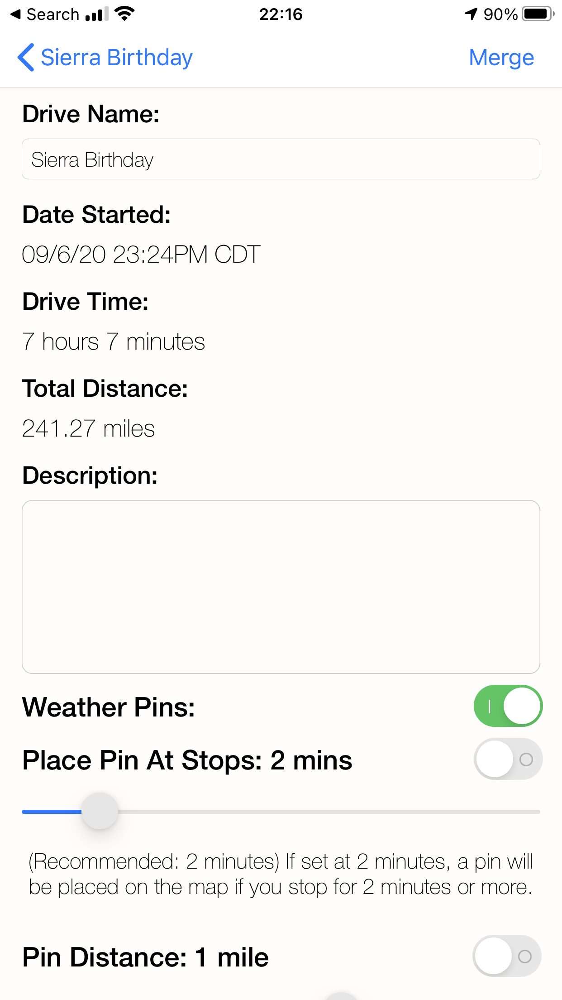
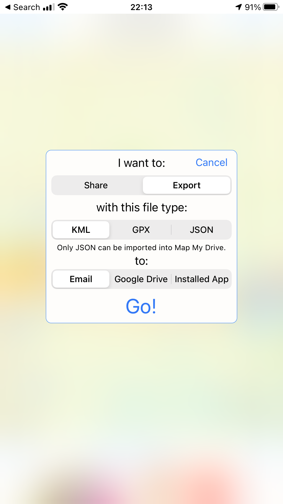
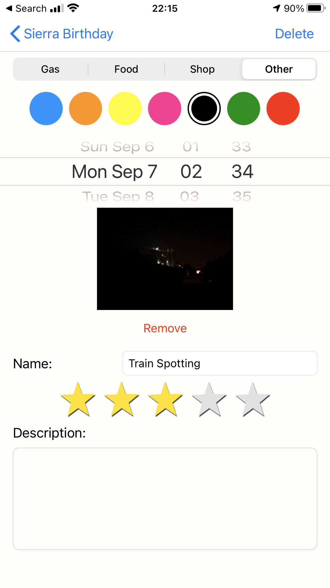
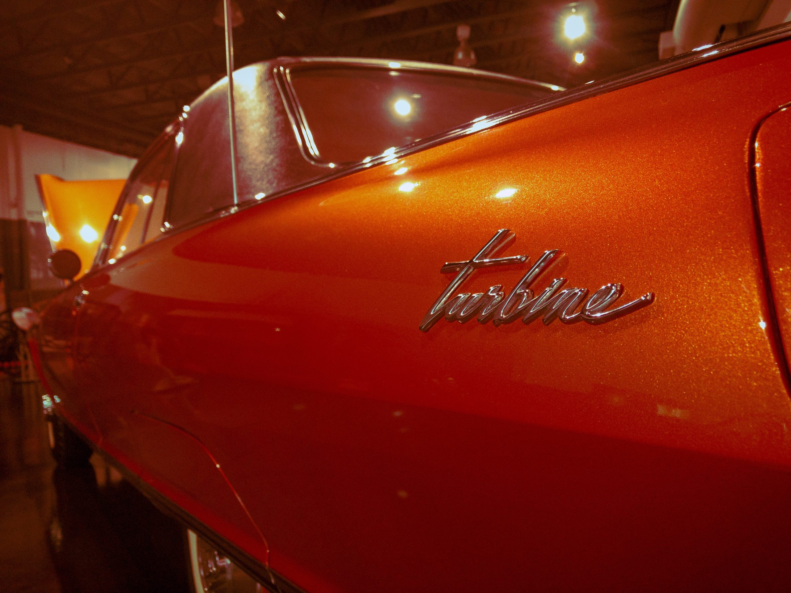
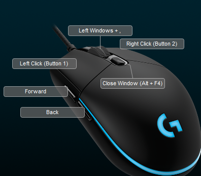
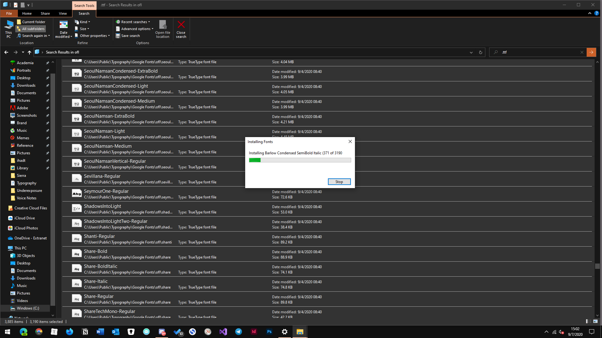

I have traditionally abhored reference to holidays when one reflects on one's recent activities, but this Labor Day also coincided with my girlfriend's birthday, and we made a bit of a holiday of it. Our first unprompted drive West toward Kansas City in the middle of the night for a very long time prompted jostled my memory back to ~ a year ago when I was Uber driving for a living and playing with maps apps between rides. Most notably, **[Map My Drive](https://apps.apple.com/us/app/map-my-drive-classic/id914981872)**, which is one of the few iOS utilities that lets one make truly good use of the handset's GPS hardware.\[efn\_note\]Remember [Google Sci Journal](https://www.davidblue.wtf/google-sci-journal/)? Yeah... Same sort of shit, in my estimation.\[/efn\_note\] As far as I understand it, once a user has enabled tracking, the app drops GPS waypoints at a user-determined frequency which it eventually can aggregate together into a [.KML](https://developers.google.com/kml), [.GPX](https://en.wikipedia.org/wiki/GPS_Exchange_Format) or .JSON file.

- 
    
- 
    
- 
    
- 
    

[Map My Drive](https://apps.apple.com/us/app/map-my-drive-classic/id914981872) is an ingenious iOS app that represents the sort of data creativity iOS development rarely sees.

Were it not for this app, who knows how long it would've taken me in life to discover the existence of the first two, or of services like [Google My Maps](https://www.google.com/mymaps), which allows users to import, annotate, and share route data. So, if I had a following of readers who were deeply obsessed with me recounting my life on WordPress, for whatever gosh darned reason, they'd be able to retrace our journey down to a matter of _inches_, if they wanted.

<iframe src="https://www.google.com/maps/d/embed?mid=1fBeOVf5FAm61TJtAuRFx6ftxnRconR1K" width="640" height="480"></iframe>

Because Sierra loves trains so much, we eventually resolved (in the middle of the night) to cross to the _other_ side of Missouri by morning and visit what I remembered being the most unqiue museum experience of my childhood:\[efn\_note\]Of which there were so... So many. My parents were both 43 when I was born, meaning, I guess, that they were old enough to feel like catching up on a whole lifetime's worth of factual recreation.\[/efn\_note\] St. Louis' **[National Museum of Transportation](https://tnmot.org/)**.

Two things I can't say I expected to ever see _physically_ in my life: one of the [25 largest and most powerful steam locomotives ever built](https://en.wikipedia.org/wiki/Union_Pacific_Big_Boy), and an example of [Chrysler's Turbine Car project](https://youtu.be/b2A5ijU3Ivs) from the 1960s. And yet...

https://www.flickr.com/photos/davidblue/sets/72157715939118122/

https://twitter.com/NeoYokel/status/1304923864309411842

Yes, I'm aware I very much over-edited these images...\[efn\_note\]And by that I mean... I just fucked around with too many Lightroom presets, really\[/efn\_note\] I'll blame it on my new display and my fundamental ignorance regarding color data in modern digital image manipulation. I can almost assure you I'll be Posting more about my escapades as a brand new Adobe Creative Cloud user very soon. For now, just have a peak at this profile picture taken from within [the museum's Monsanto tanker car](https://tnmot.org/collection/monsanto-chemical-company-m-c-h-x-117/), seven years ago:

https://www.facebook.com/photo/?fbid=10200978827850999&set=a.4487710948956&\_\_tn\_\_=%2CO\*F

## Some Other Discoveries

- **[UniChar](https://apps.apple.com/us/app/id880811847?mt=8)** - the iOS Unicode reference app I've been [absolutely obsessed with](https://bilge.world/unichar-for-ios-app-review) since the moment I found out about it - now has (or maybe always has had) **[a web app](https://unichar.app/web/)**!
- I installed [the entire Google Fonts libray](https://github.com/google/fonts) on my PC and still haven't died.
- I finally created [my personal vocabulary page](https://www.notion.so/rotund/ca33ea9588be4b3b9531c62c7d75d284?v=1b814be2d7ba46e19cbf56a0c8fb0e64) (on notion) and will be updating it regularly.
- I didn't actually mention the new branding set I made for this site in the last post... I also don't know if I've ever pointed out that I managed to secure **[behance.com/compaq](https://www.behance.net/compaq)** lol.
- I have found the ultimate mouse button mapping.

Some folks _[actually conversed with me](https://mastodon.social/@DavidBlue/104843391967830863)_ on Mastodon! About _Keyboard Shortcuts_, no less!

<iframe src="https://mastodon.social/@DavidBlue/104843391967830863/embed" class="mastodon-embed" style="max-width: 100%; border: 0" width="400" allowfullscreen="allowfullscreen"></iframe>

My very first residential LED bulb - which I was legitimately thrilled about when I bought it - [just burned out](https://twitter.com/NeoYokel/status/1304242180316332033) on Thursday morning. God bless...

The sound of a passing train from [just off Cement City Rd](https://goo.gl/maps/s6Xjw3Pja7Xutpr48).

## Additions

You'll notice that I have further integrated Notion into my day-to-day life in a big way, and it's being reflected on this God Damned Website. Much _much_ more to come about that.

What happens when you tell your PC to install almost [4000 font files](https://github.com/google/fonts)? I guess we're gonna fucking see!

I gave in to my apparently ~annual ritual to just waste hours away fiddling away with old Windows notification sound files in Audacity and made [this](https://soundcloud.com/chordoslut/windows-operatic):

https://soundcloud.com/chordoslut/windows-operatic

Perhaps _most_ importantly: I actually _[completed something](https://indd.adobe.com/view/221aceb0-aa12-4318-ada4-affee2d293d4)_ in InDesign for the first time! A good first step in my pledge to get a solid grasp on it before the year's out.

<iframe style="border: 1px solid #777;" src="https://indd.adobe.com/embed/221aceb0-aa12-4318-ada4-affee2d293d4?startpage=1&amp;allowFullscreen=true" width="525px" height="371px" frameborder="0" allowfullscreen></iframe>
