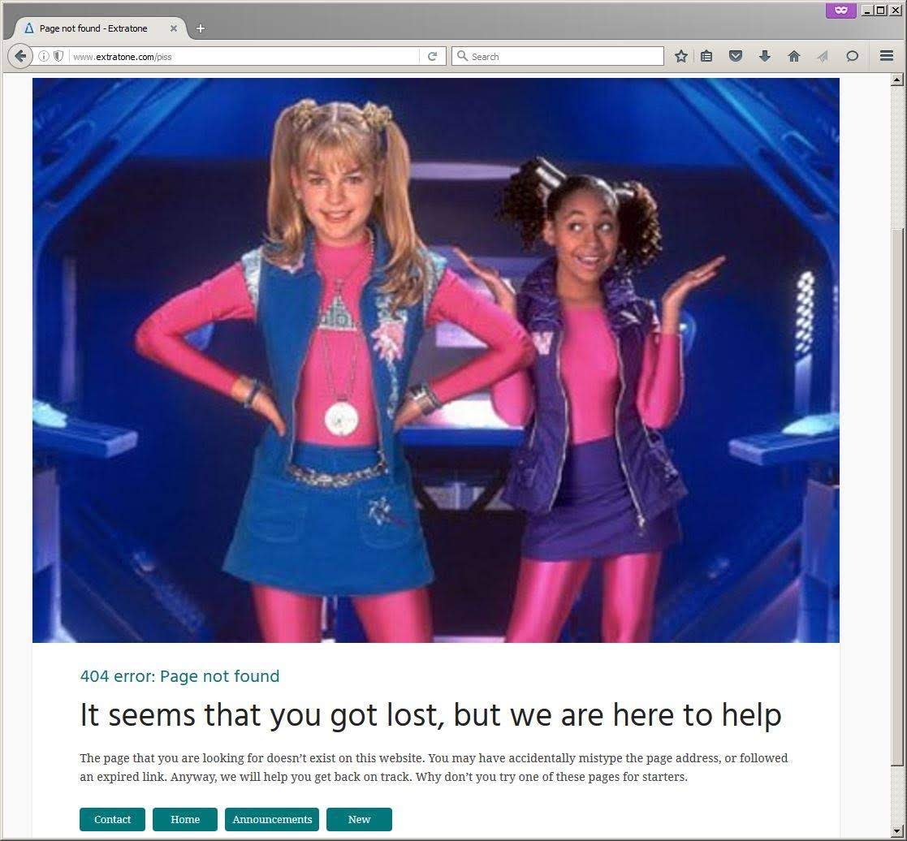
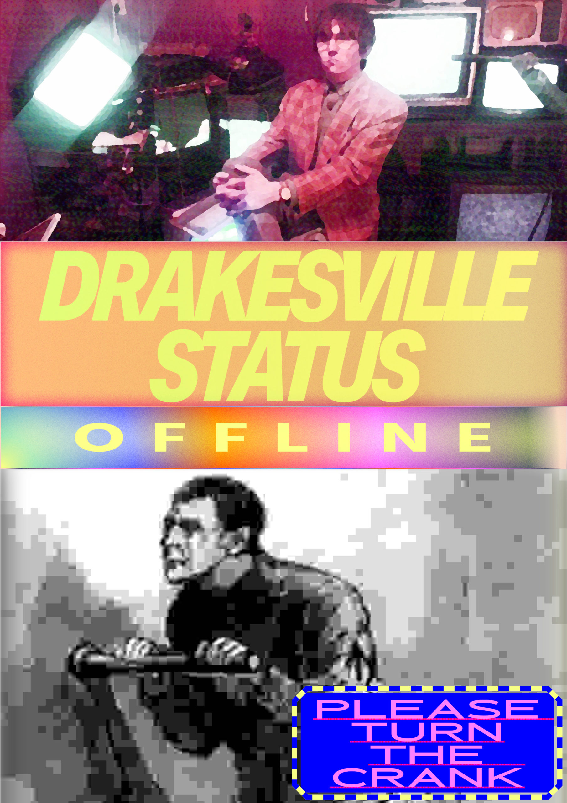

Extratone's two or three joke 404 pages may have legitimately been my favorite part of the website. Since I've now made a personal commitment to learning Adobe InDesign, I thought I might get myself to _actually finish_ my first .indd project by making something almost purely commemorative. \[efn\_note\]There's nothing like reflecting on when you were at all creative and/or funny to get the fluids flowing! It's also wonderful to have those old disdains for "common sense" design principles to draw back out to conceal incompetence beneathe a mask of designed elitism.\[/efn\_note\]

This (compressed to hell) screenshot is all that's left of _Extratone_'s very first 404 page... Heartbreaking.

No, I doubt I will ever replicate such originality again. I have no idea where I came up with the idea of using the _Zenon_ movie poster, but the snapshot of myself with all of the televisions came from [the introduction video](https://youtu.be/K_6EY_ZWqaM) to my pre-_Extratone_ online magazine project, which was shot on the single set we built for _[Children of The Corn 30](https://www.facebook.com/ChildrenoftheCorn30/)_.

https://twitter.com/extratone/status/880254494935662592

I would love to claim that "turn the crank" came from the infamous Vannevar Bush essay, "As We May Think:"

> It is readily possible to construct a machine which will manipulate premises in accordance with formal logic, simply by the clever use of relay circuits. Put a set of premises into such a device and **turn the crank**, and it will readily pass out conclusion after conclusion, all in accordance with logical law, and with no more slips than would be expected of a keyboard adding machine.
> 
> "[As We May Think](https://www.notion.so/rotund/As-We-May-Think-Vannevar-Bush-dfd4a901701b4103a52dfe962083c565)" by Vannevar Bush

The truth is, though, I have it in my hands right now, have been reading it, and can't say whether or not I have before. Regardless, you'll find links to the typefaces I used below as well as a download for the whole InDesign package. Feel free to do whatever with it.

## Typography

- [Aktiv Grotesk](https://fonts.adobe.com/fonts/aktiv-grotesk) Condensed Extrabold Italic
- [Hind](https://fonts.google.com/specimen/Hind) Bold
- [Inconsolata](https://fonts.google.com/specimen/Inconsolata) UltraExpanded Bold

[DOWNLOADS](https://www.notion.so/rotund/Four-Oh-Four-2410a477cd5d483788efe7c3f4181fcd)
