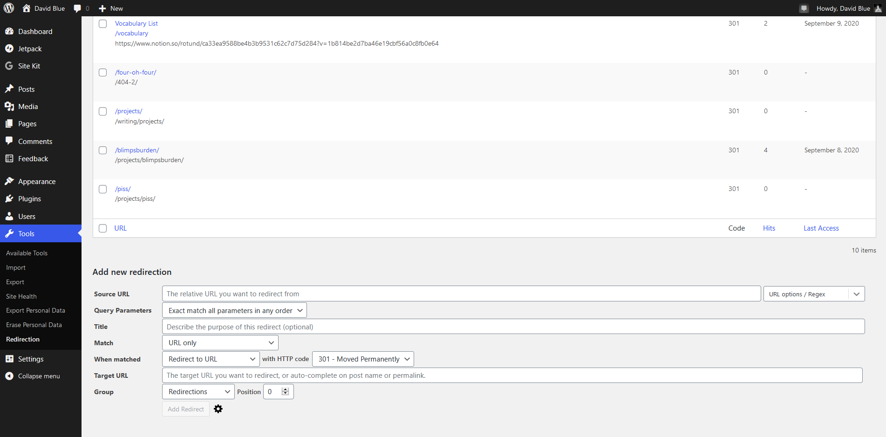
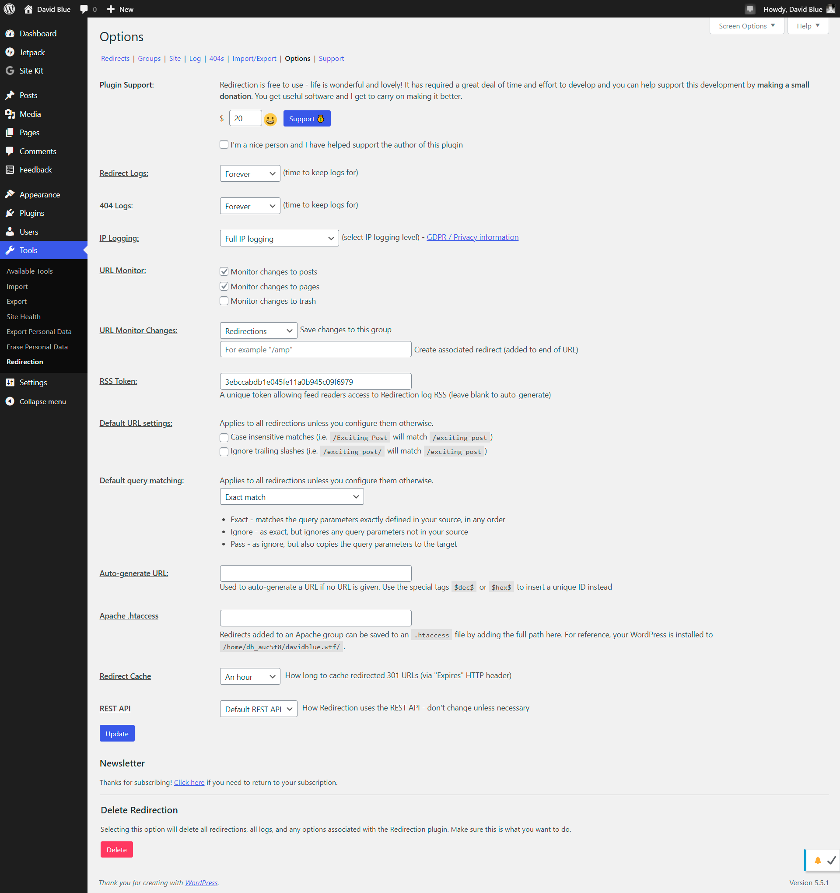

## Can you believe it? A WordPress plugin so clever, it’s actually worth writing about.

I can't say I've ever been compelled to write about something so seemingly petty as a WordPress plugin, before, but Automatic's own John Godley once upon a time created a plugin that now represents a large contributor to WordPress' whole value as a CMS, personally. It's called **[Redirection](https://redirection.me/)**, and it allows the user to point any ole' directory off their domain to point to any _other_ URL, anywhere on the web. (For instance, [davidblue.wtf/**facebook**](https://davidblue.wtf/facebook) will send you directly to my Facebook profile.)

Redirection's List/Directory page and "new redirection" interface.

_Extratone_ originally ran on WordPress, and over time, I made quite extensive use of redirections - to the point where I felt it was necessary to [formally document all of them](https://paper.dropbox.com/doc/Extranet-Redirection--A8Tmy0_yMah9D9XKEofJNNdsAQ-LXgMPObbnVB012NY00x6Z). Honestly, I'm not sure how many users _actually_ made use of the function, but I thought it a particularly clever, _fresh new media_ feature I wish all of my regularly-read digital media properities would adopt.\[efn\_note\]To get super pretentious: I thought it notably reflected _Extratone_'s style guide-bound commitment to assuming our readers web savvy, at the very least.\[/efn\_note\]

That was all before the plugin had its offered its own complete, internal list of all redirections - when each redirection was created by creating a new page in WordPress and selecting a special "page template." The functionality added to Redirection just since then - one of the valuable discoveries I've made thanks to the creation of this experimental WordPress site - was what justified this very post.

Redirection's now extensive Options page within WordPress.

For ye who would seek functionality _beyond_ simple redirects, Redirection offers a plethora - much of which I do not fully understand. Here are some of the advanced options _just within redirects_ from its [plugin page on WordPress.org](https://wordpress.org/plugins/redirection/):

> _**Conditional Redirects**  
> In addition to straightforward URL matching you can redirect based on other conditions:  
> _**Login status** – redirect only if the user is logged in or logged out  
> **WordPress capability** – redirect if the user is able to perform a certain capability  
> **Browser** – redirect if the user is using a certain browser  
> **Referrer** – redirect if the user visited the link from another page  
> **Cookies** – redirect if a particular cookie is set  
> **HTTP headers** – redirect based on a HTTP header  
> **Custom filter** – redirect based on your own WordPress filter  
> **IP address** – redirect if the client IP address matches  
> **Server** – redirect another domain if also hosted on this server  
> **Page type** – redirect if the current page is a 404

Also included is **404 error tracking**, native **Apache server compatibility**, **customizable per-user permissions**, **import/export**, and **[Search Regex](https://searchregex.com/) integration**. Regarding pricing, Godley has this to say: "Yes, it’s really free. There’s no premium version and no need to pay money to get access to features. This is a dedicated redirect management plugin."

My take? You're not making full use of WordPress unless you're actively using this plugin.

#software