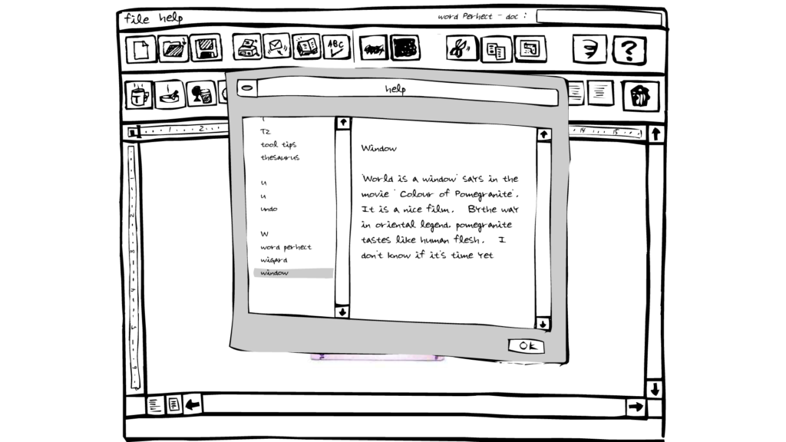
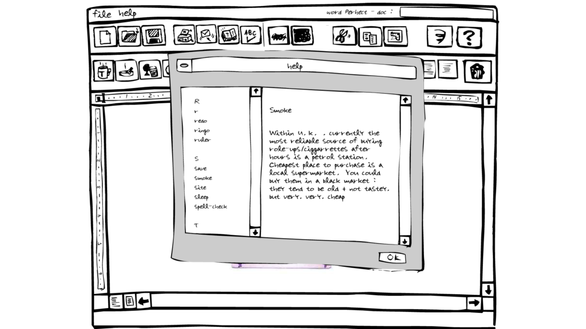
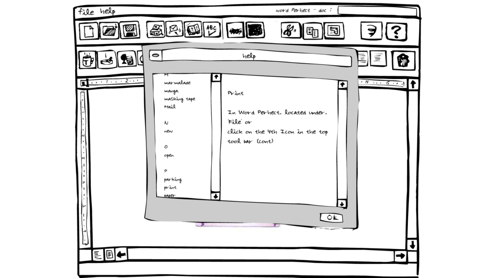
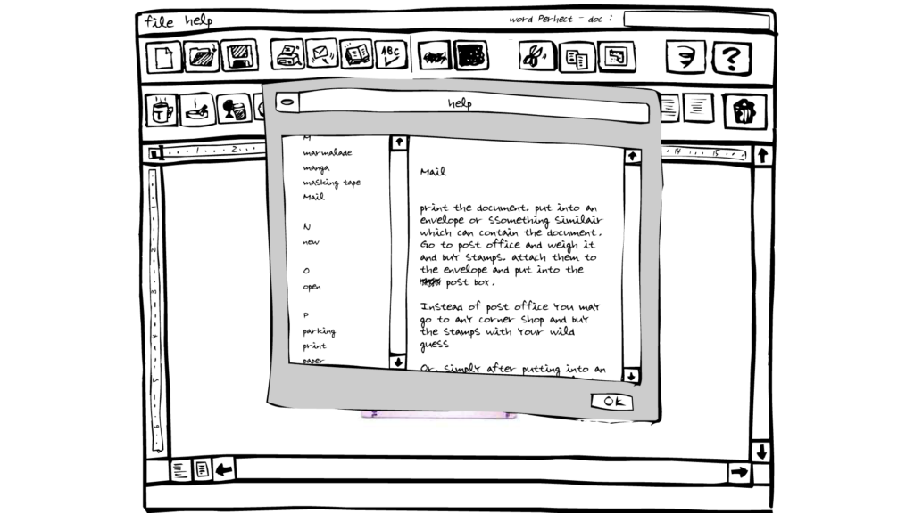
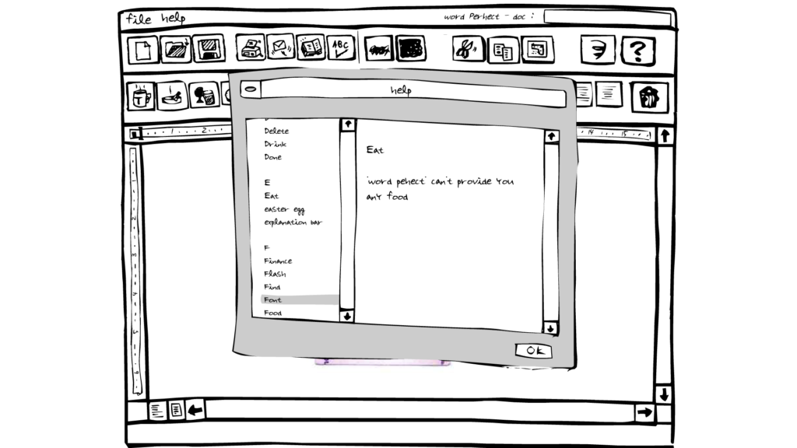

https://vimeo.com/470409059

[A Brief Introduction to WordPerhect](https://www.davidblue.wtf/wp-content/uploads/WordPerhect-Tomoko-Takahashi-Chisenhale-Gallery-2015.pdf)[Download](https://www.davidblue.wtf/wp-content/uploads/WordPerhect-Tomoko-Takahashi-Chisenhale-Gallery-2015.pdf)

I'm currently reading Professor Matthew G. Kirschenbaum's _[Track Changes: A Literary History of Word Processing](http://bit.ly/trackchangesharvard)_, which mentions a whole host of things I would love to share (some I will on this site, I'm sure, in the coming months.) One of them which I could not find any video of on the internet: a project from either 1999 or 2000\[efn\_note\]_Track Changes_ says 1999, [Google](https://g.co/kgs/Aes1Wg) says 2000.\[/efn\_note\], by Japanese artist [Tomoko Takahashi](https://en.wikipedia.org/wiki/Tomoko_Takahashi) called _Word Perhect_. Before I go on, here's the whole passage (from Pg. 205-206:)

> A similar impulse is at work in Tomoko Takahashi’s _WordPerhect_ \[_sic_\] (1999) an online piece (rendered in Flash) that presents the user with a roughly drawn cartoon word processing interface, limned in what appears to be black ink on a white background.88 Typing generates crude, seemingly handwritten, less-than-perfect characters on the screen. Takahashi’s word processor is fully functional, but the interface yields an inversion of the typical user-friendly experience. Clicking on the Mail icon produces the following set of instructions, which appear as a scrap of notepaper “taped” to the screen: “print the document, put into an envelope or something similar \[_sic_\] which can contain the document. Go to post office and weigh it and buy stamps”—and so on, for another hundred words, including further typos and blemishes.
> 
> _Track Changes: A Literary History of Word Processing_, Pg. 205-206

When I went looking for the project, I actually found a re-upload of the Flash application(!) though, of course, I had to cycle through my personal collection of web browsers before I found one which would allow Flash again. (The same option that was supposed to allow it in Chrome did not work in any Chromium-based browsers except for Edge Chromium, which I used.) Other than a [commisions page from e-2.org](https://e-2.org/commissions/wordperhect.html) for the re-upload, I found very little about the project. Here's the description from that page, for the sake of thoroughness:

> As word processing software becomes ever more advanced, correcting syntax and spelling errors, these familiar programmes begin to impose a standardised corporate language onto our writing.  
> Takahashi has produced her own fully functioning online version which undermines this dehumanising process. Reclaiming the initiative back from the software, Word Perhect presents an idiosyncratic hand-drawn interface leading to a set of functioning but strangely altered tools.
> 
> [_Word Perhect_ - e-2.org Commissions Page](https://e-2.org/commissions/wordperhect.html)

When I discover this sort of thing, I always seem to feel this sense of anxiety regarding how much longer they'll be accessible. Before I tried Edge Chromium, I booted up my Windows Whistler Virtual Machine's Internet Explorer, which will still render Google.com, but returned an error on the _Word Perhect_ re-upload. Again... anxious. _I've got to document this **right this moment**!_ I know it's mostly irrational, but - in the middle of class - I whipped out OBS as soon as I got it working and recorded my first-time experiences and published the video to [YouTube](https://youtu.be/KXIJa5Ge_bY) and [Vimeo](https://vimeo.com/470409059).

- 
    
- 
    
- 
    
- 
    
- 
    

Some screenshots of my favorite passages from _Word Perhect_'s Help menu.

Now that I've posted this, my anxiety has been mostly eased. I hope you're able to experience it firsthand, though. I'm working on finding out how to re-upload the Flash application, myself (first finding out if I'm within my IP rights to do so.)

Check [my Notion page on _Word Perhect_](https://www.notion.so/rotund/Word-Perhect-Tomoko-Takahashi-3dc47c17467b47d6bea59872ee1fcc48) for future updates.
