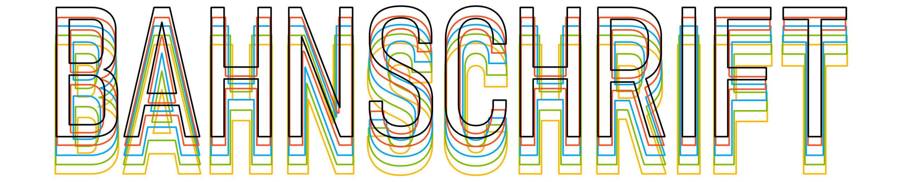
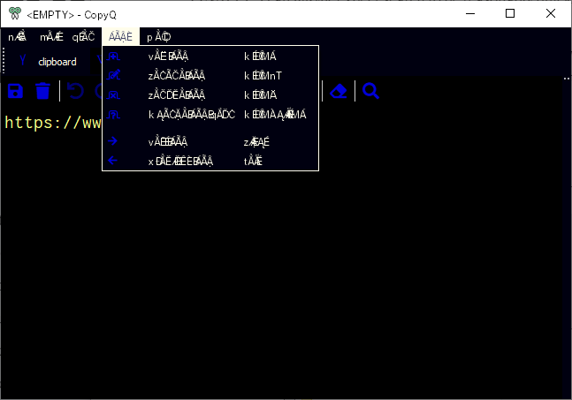
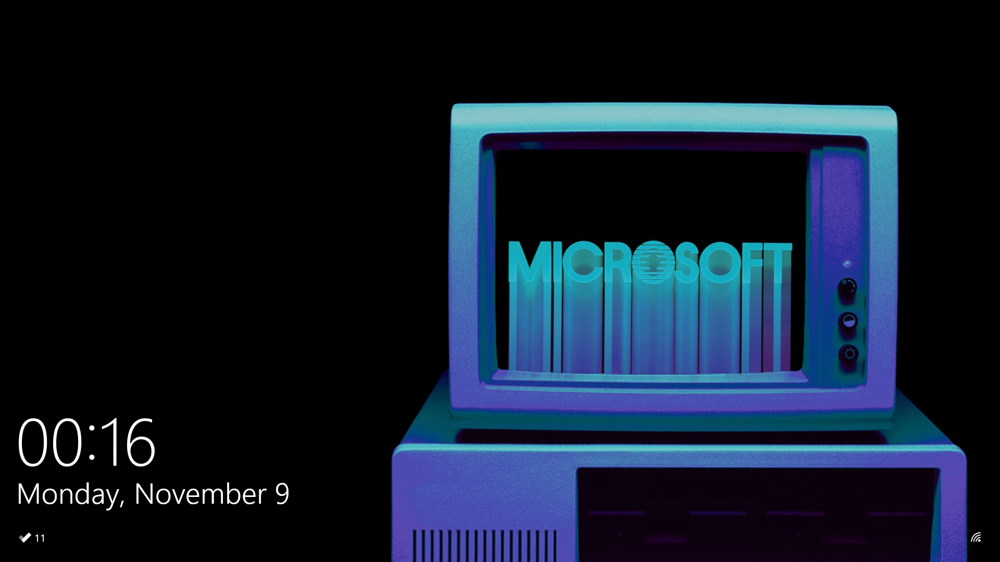
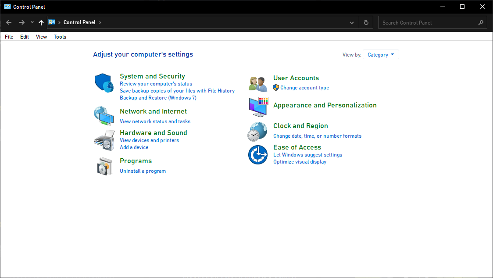
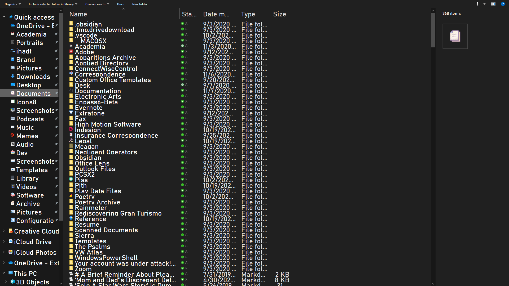
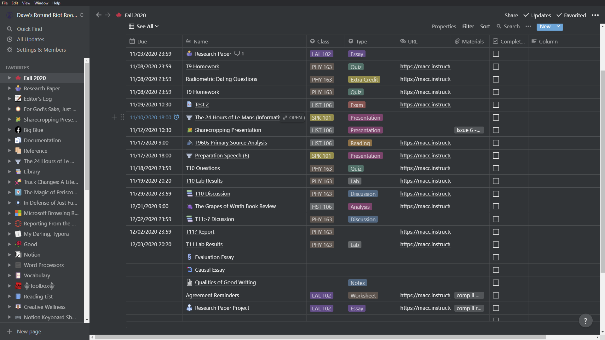
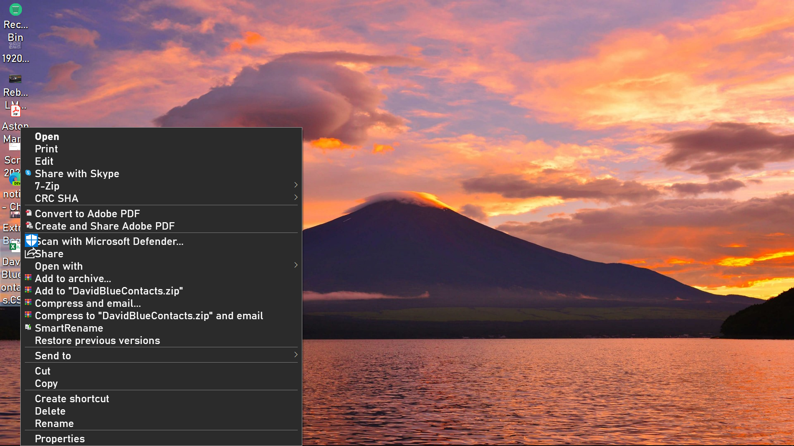
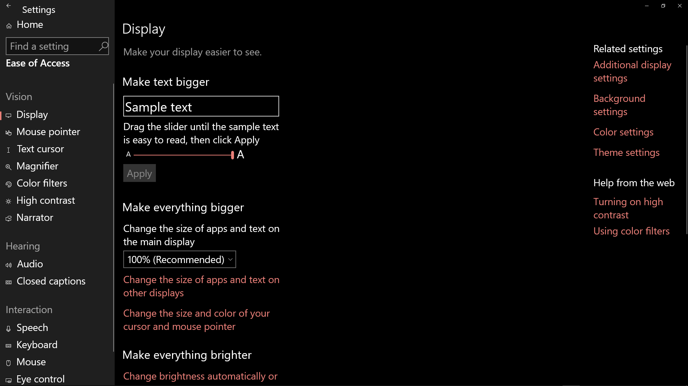
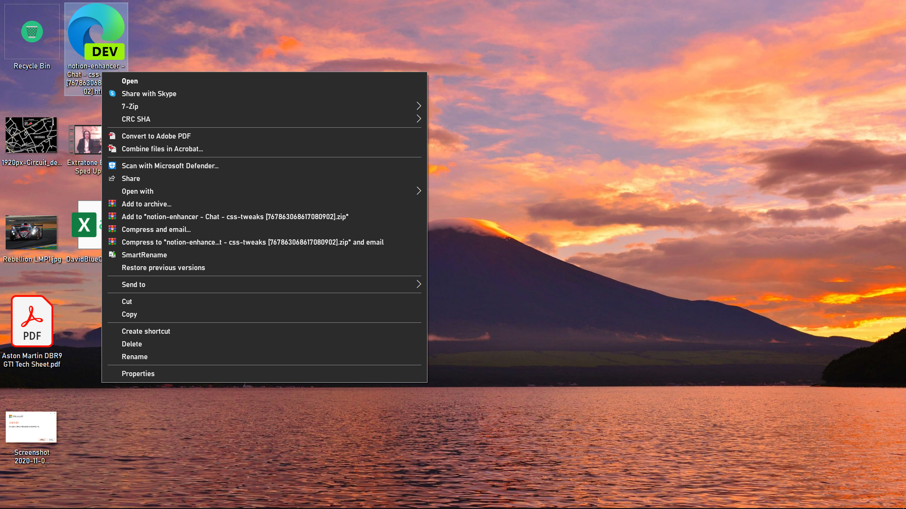

As someone who is always desperately (and yet unconsciously) seeking new and creative ways of avoiding what I _actually intend to be doing_, I have encountered the concept of _Custom System Fonts_ many times over the years, and yet I do not recall any of them resulting in an outcome other than concession. Usually, whatever font you choose is going to look like shit and break stuff.

For instance, when I attempted to change Windows 10's system font to [Acumin Pro](https://fonts.adobe.com/fonts/acumin) (my latest typographical crush) recently, it was gorgeous!... And then I opened [CopyQ](https://hluk.github.io/CopyQ/), my clipboard manager, and saw this:

Broken text in [CopyQ](https://github.com/hluk/CopyQ]).

I probably should've given up there, but instead, I reached out to my latest pet reference, Read It!

https://www.reddit.com/r/Windows10/comments/dohzey/whats\_a\_good\_alternative\_system\_font/

https://www.reddit.com/r/Windows10/comments/dohzey/whats\_a\_good\_alternative\_system\_font/f5obt70?utm\_source=share&utm\_medium=web2x&context=3

## _Bahnschrift_

## _Railroad Writing_

I don't _actually_ know how typography works, but the [Microsoft Documentation page](https://docs.microsoft.com/en-us/typography/font-list/bahnschrift) FatFaceRikky linked should stimulate those of you who do.

> The current version of Bahnschrift began development in 2016. At the time, Google, Apple, Adobe, and Microsoft partnered to develop a common implementation of variable font technology and Bahnschrift was chosen to become Microsoft’s first variable font. To prepare for the transition from static to variable, the Bahnschrift source was completely rebuilt from the ground up by Aaron Bell of Saja Typeworks and was expanded in weight, character set (adding Extended Latin, Greek, and Cyrillic) and manual hinting to ensure high quality rendering on a wide range of devices.
> 
> "Bahnschrift font family" | _[Microsoft](https://docs.microsoft.com/en-us/typography/font-list/bahnschrift) [Docs](https://docs.microsoft.com/en-us/typography/font-list/bahnschrift)_

My lockscreen with Bahnschrift as system font. If you like that desktop background, check out **[this collection](https://www.notion.so/rotund/268b632cfc10493eb1e41f67fed40d95?v=ae6bf793db6b4c35b5ff0504fad961a7https://www.notion.so/rotund/268b632cfc10493eb1e41f67fed40d95?v=ae6bf793db6b4c35b5ff0504fad961a7)** of default Microsoft Desktop Backgrounds extracted from their Windows 10 themes.

- 
    
- 
    
- 
    
- 
    
- 
    
- 
