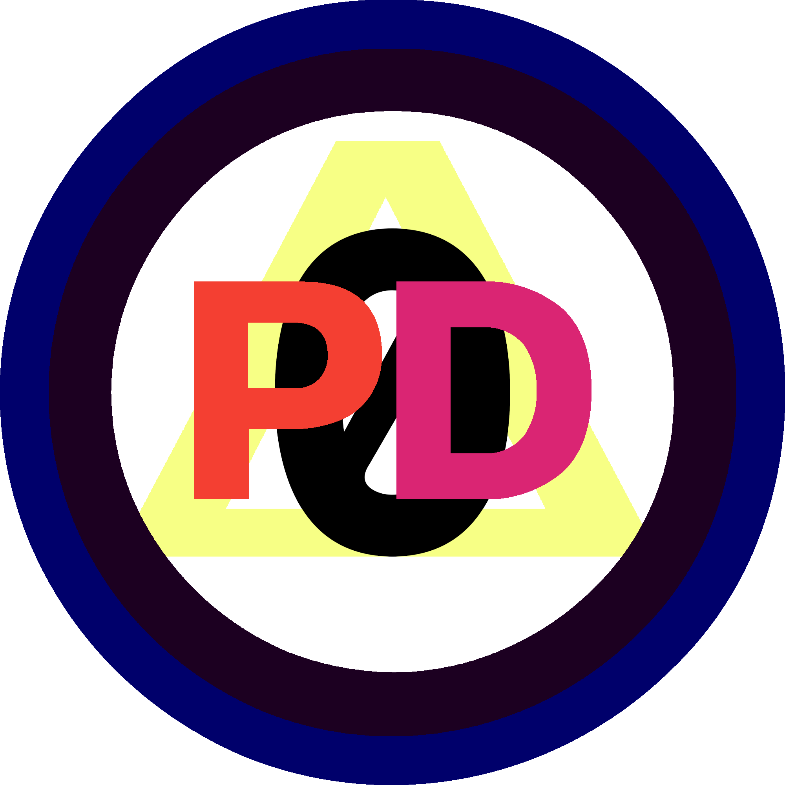
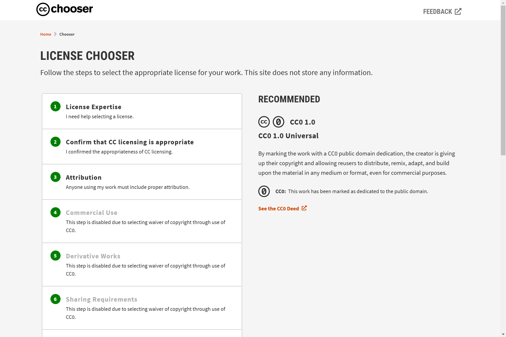

# ]Notes - Drafting my Own Pubic-Domain-Equivalent License



### Title Ideas

1. ***Please Fuck With This (PFWT)*** License

---
## Resources

* The Creative Commons is actually [beta testing a new License Chooser](https://chooser-beta.creativecommons.org/) right now



```html
<p xmlns:cc="http://creativecommons.org/ns#" xmlns:dct="http://purl.org/dc/terms/"><a property="dct:title" rel="cc:attributionURL" href="https://bilge.world">The Psalms</a> by <a rel="cc:attributionURL dct:creator" property="cc:attributionName" href="https://compaq.tech">David Blue</a> is marked with <a href="http://creativecommons.org/publicdomain/zero/1.0?ref=chooser-v1" target="_blank" rel="license noopener noreferrer" style="display:inline-block;">CC0 1.0 Universal</a></p>
```

```txt
The Psalms by David Blue is marked with CC0 1.0 Universal. To view a copy of this license, visit http://creativecommons.org/publicdomain/zero/1.0
```


## References

* [Public-domain-equivalent license](https://www.wikiwand.com/en/Public-domain-equivalent_license)
* [Open-source license](https://www.wikiwand.com/en/Open-source_license)
* "[About The Licenses](https://creativecommons.org/licenses/)" | Creative Commons
*  **[Creative Commons — Attribution 4.0 International — CC BY 4.0](https://creativecommons.org/licenses/by/4.0/)**
* "[Placing documents into the public domain](https://cr.yp.to/publicdomain.html)" | Daniel J. Bernstein 

### [OpenBSD Template](https://cvsweb.openbsd.org/src/share/misc/license.template?rev=HEAD):

```markdown
Below is an example license to be used for new code in OpenBSD,
modeled after the ISC license.

It is important to specify the year of the copyright.  Additional years
should be separated by a comma, e.g.
    Copyright (c) 2003, 2004

If you add extra text to the body of the license, be careful not to
add further restrictions.

/*
 * Copyright (c) YYYY YOUR NAME HERE <user@your.dom.ain>
 *
 * Permission to use, copy, modify, and distribute this software for any
 * purpose with or without fee is hereby granted, provided that the above
 * copyright notice and this permission notice appear in all copies.
 *
 * THE SOFTWARE IS PROVIDED "AS IS" AND THE AUTHOR DISCLAIMS ALL WARRANTIES
 * WITH REGARD TO THIS SOFTWARE INCLUDING ALL IMPLIED WARRANTIES OF
 * MERCHANTABILITY AND FITNESS. IN NO EVENT SHALL THE AUTHOR BE LIABLE FOR
 * ANY SPECIAL, DIRECT, INDIRECT, OR CONSEQUENTIAL DAMAGES OR ANY DAMAGES
 * WHATSOEVER RESULTING FROM LOSS OF USE, DATA OR PROFITS, WHETHER IN AN
 * ACTION OF CONTRACT, NEGLIGENCE OR OTHER TORTIOUS ACTION, ARISING OUT OF
 * OR IN CONNECTION WITH THE USE OR PERFORMANCE OF THIS SOFTWARE.
 */
```